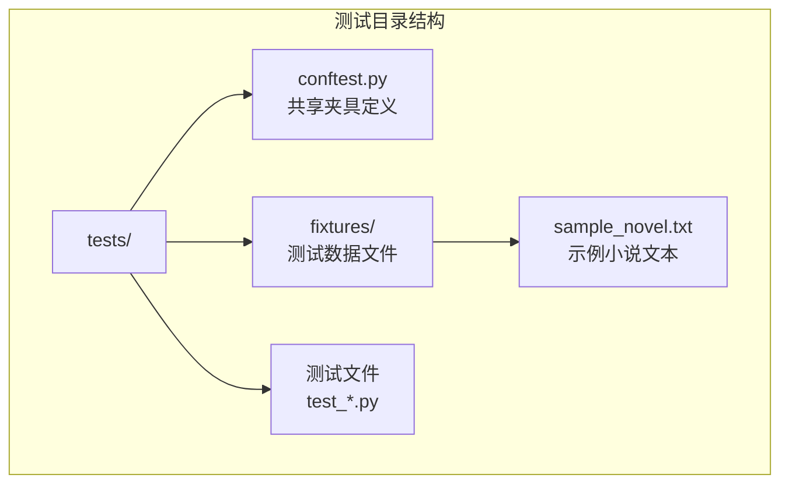
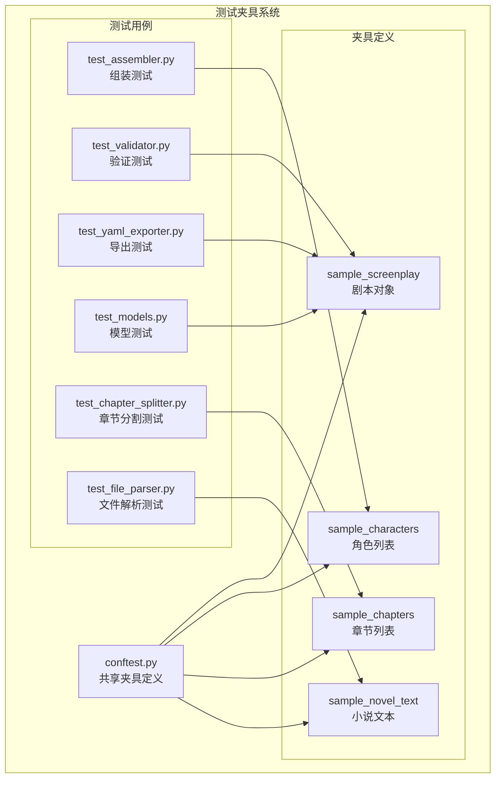
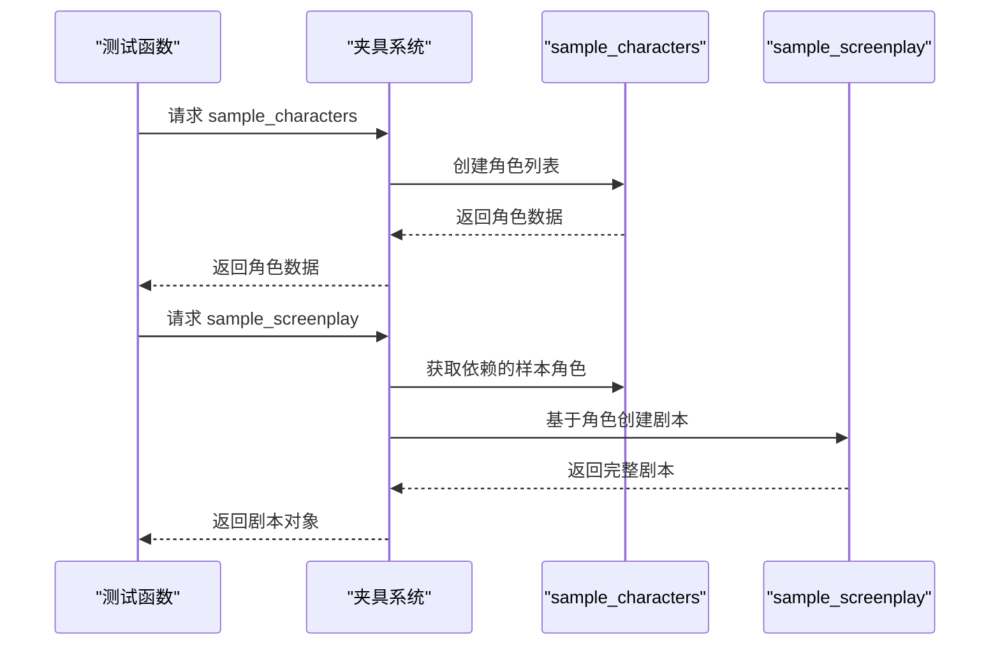
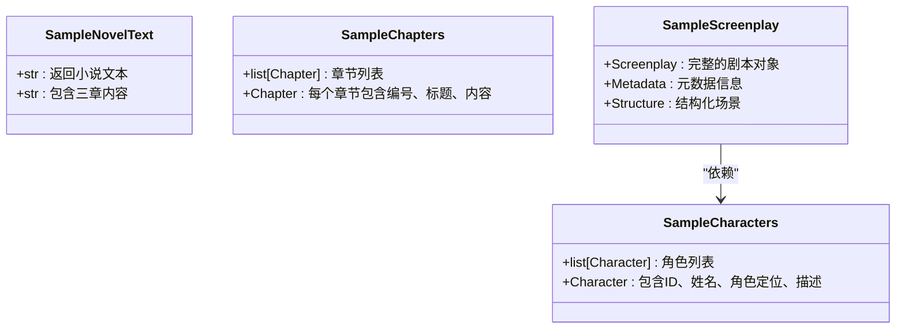
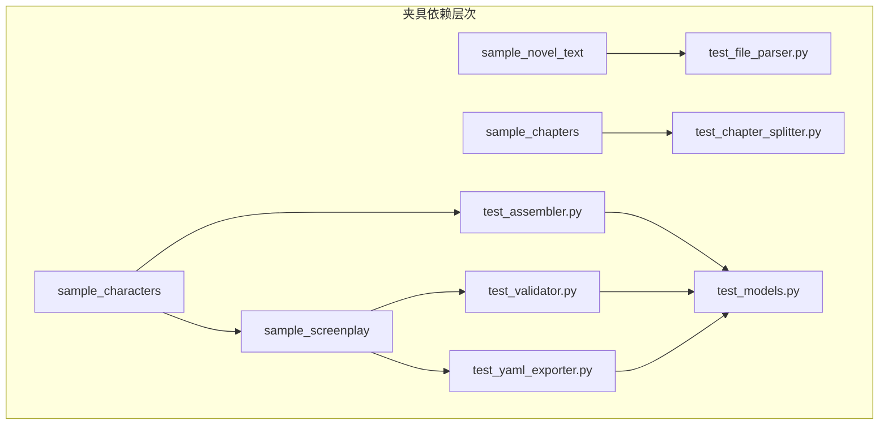

# 测试夹具管理

<cite>
**本文档引用的文件**
- [tests/conftest.py](file://tests/conftest.py)
- [tests/fixtures/sample_novel.txt](file://tests/fixtures/sample_novel.txt)
- [tests/test_assembler.py](file://tests/test_assembler.py)
- [tests/test_validator.py](file://tests/test_validator.py)
- [tests/test_yaml_exporter.py](file://tests/test_yaml_exporter.py)
- [tests/test_models.py](file://tests/test_models.py)
- [tests/test_chapter_splitter.py](file://tests/test_chapter_splitter.py)
- [tests/test_file_parser.py](file://tests/test_file_parser.py)
- [pyproject.toml](file://pyproject.toml)
- [README.md](file://README.md)
</cite>

## 目录
1. [简介](#简介)
2. [项目结构](#项目结构)
3. [核心组件](#核心组件)
4. [架构概览](#架构概览)
5. [详细组件分析](#详细组件分析)
6. [依赖分析](#依赖分析)
7. [性能考虑](#性能考虑)
8. [故障排除指南](#故障排除指南)
9. [结论](#结论)
10. [附录](#附录)

## 简介

本文件详细阐述了项目中的测试夹具管理系统，重点说明了 `conftest.py` 中共享夹具的定义与使用策略。测试夹具是 pytest 的核心功能之一，用于在测试运行期间提供可复用的数据和资源。本文档将深入分析以下方面：

- 共享夹具的定义与作用域管理（函数级、类级、模块级）
- 测试数据的组织结构与命名规范
- 测试夹具的最佳实践（数据隔离、性能优化、可维护性）
- 测试数据的版本控制与更新策略
- 扩展方法与自定义夹具的创建指南

## 项目结构

测试相关文件位于 `tests/` 目录下，采用按功能分层的组织方式：

**图表来源**
- [tests/conftest.py:1-167](file://tests/conftest.py#L1-L167)
- [tests/fixtures/sample_novel.txt:1-50](file://tests/fixtures/sample_novel.txt#L1-L50)

**章节来源**
- [tests/conftest.py:1-167](file://tests/conftest.py#L1-L167)
- [tests/fixtures/sample_novel.txt:1-50](file://tests/fixtures/sample_novel.txt#L1-L50)

## 核心组件

本项目的测试夹具系统主要由以下核心组件构成：

### 共享夹具定义

在 `tests/conftest.py` 中定义了四个核心夹具：

1. **sample_novel_text**: 返回一个包含三章内容的小说文本字符串
2. **sample_chapters**: 返回预分割的章节对象列表
3. **sample_characters**: 返回角色目录列表
4. **sample_screenplay**: 基于角色夹具生成的最小有效剧本对象

### 测试数据文件

- `tests/fixtures/sample_novel.txt`: 包含完整的小说文本内容，用于文件解析相关的测试

### 测试用例中的夹具使用

多个测试文件通过依赖注入的方式使用这些夹具：
- `tests/test_assembler.py`: 使用 `sample_characters` 进行剧本组装测试
- `tests/test_validator.py`: 使用 `sample_screenplay` 进行剧本验证测试
- `tests/test_yaml_exporter.py`: 使用 `sample_screenplay` 进行 YAML 导出测试

**章节来源**
- [tests/conftest.py:23-167](file://tests/conftest.py#L23-L167)
- [tests/test_assembler.py:50-111](file://tests/test_assembler.py#L50-L111)
- [tests/test_validator.py:20-63](file://tests/test_validator.py#L20-L63)
- [tests/test_yaml_exporter.py:11-58](file://tests/test_yaml_exporter.py#L11-L58)

## 架构概览

测试夹具系统的整体架构如下：

**图表来源**
- [tests/conftest.py:23-167](file://tests/conftest.py#L23-L167)
- [tests/test_assembler.py:50-111](file://tests/test_assembler.py#L50-L111)
- [tests/test_validator.py:20-63](file://tests/test_validator.py#L20-L63)
- [tests/test_yaml_exporter.py:11-58](file://tests/test_yaml_exporter.py#L11-L58)
- [tests/test_models.py:1-124](file://tests/test_models.py#L1-L124)
- [tests/test_chapter_splitter.py:1-68](file://tests/test_chapter_splitter.py#L1-L68)
- [tests/test_file_parser.py:1-102](file://tests/test_file_parser.py#L1-L102)

## 详细组件分析

### 夹具生命周期管理

#### 函数级夹具
- **定义位置**: `tests/conftest.py`
- **作用范围**: 每个测试函数执行前创建，测试函数执行后销毁
- **适用场景**: 
  - `sample_novel_text`: 用于需要独立文本副本的测试
  - `sample_chapters`: 用于章节分割相关的测试
- **优势**: 数据隔离性强，避免测试间相互影响

#### 类级夹具
- **定义位置**: `tests/conftest.py`
- **作用范围**: 整个测试类执行期间共享
- **适用场景**: 
  - `sample_characters`: 在多个测试方法中重复使用的角色数据
- **优势**: 减少重复创建成本，提高测试执行效率

#### 模块级夹具
- **定义位置**: `tests/conftest.py`
- **作用范围**: 整个测试模块执行期间共享
- **适用场景**: 
  - `sample_screenplay`: 作为其他测试的基础数据
- **优势**: 支持复杂的依赖关系管理

**图表来源**
- [tests/conftest.py:97-167](file://tests/conftest.py#L97-L167)

**章节来源**
- [tests/conftest.py:23-167](file://tests/conftest.py#L23-L167)

### 测试数据组织结构

#### 夹具目录管理
- **目录结构**: `tests/fixtures/`
- **文件管理**: 单独的测试数据文件，便于版本控制和维护
- **命名规范**: 
  - `sample_novel.txt`: 明确标识为示例小说文本
  - 其他夹具以函数名命名，如 `sample_characters`、`sample_screenplay`

#### 数据结构设计
每个夹具都遵循统一的设计模式：

**图表来源**
- [tests/conftest.py:23-167](file://tests/conftest.py#L23-L167)

**章节来源**
- [tests/conftest.py:23-167](file://tests/conftest.py#L23-L167)

### 夹具使用模式分析

#### 测试装配器测试
- **依赖关系**: 使用 `sample_characters` 进行剧本组装
- **测试重点**: 
  - 基本组装功能验证
  - 场景编号全局一致性
  - 角色出场信息填充
  - 首次出场设置

#### 剧本验证测试
- **依赖关系**: 使用 `sample_screenplay` 进行验证
- **测试重点**:
  - 有效剧本验证
  - 标题为空的错误处理
  - 无幕的错误处理
  - 角色引用无效的错误处理
  - 空场景元素的警告处理

#### YAML 导出测试
- **依赖关系**: 使用 `sample_screenplay` 进行导出
- **测试重点**:
  - YAML 格式有效性
  - 元数据完整性
  - 角色信息保留
  - 场景信息保留
  - 头部注释生成
  - Unicode 字符保留
  - 往返测试（导出-解析-比较）

**章节来源**
- [tests/test_assembler.py:50-111](file://tests/test_assembler.py#L50-L111)
- [tests/test_validator.py:20-63](file://tests/test_validator.py#L20-L63)
- [tests/test_yaml_exporter.py:11-58](file://tests/test_yaml_exporter.py#L11-L58)

## 依赖分析

### 夹具依赖关系图

**图表来源**
- [tests/conftest.py:23-167](file://tests/conftest.py#L23-L167)
- [tests/test_assembler.py:50-111](file://tests/test_assembler.py#L50-L111)
- [tests/test_validator.py:20-63](file://tests/test_validator.py#L20-L63)
- [tests/test_yaml_exporter.py:11-58](file://tests/test_yaml_exporter.py#L11-L58)
- [tests/test_chapter_splitter.py:1-68](file://tests/test_chapter_splitter.py#L1-L68)
- [tests/test_file_parser.py:1-102](file://tests/test_file_parser.py#L1-L102)

### 测试文件间的耦合度分析

从依赖关系可以看出：
- **低耦合**: 大多数测试文件只依赖单一夹具，减少相互影响
- **高内聚**: 相关功能的测试集中在同一文件中
- **清晰的层次**: 基础夹具（文本、章节、角色）被上层夹具（剧本）复用

**章节来源**
- [tests/conftest.py:23-167](file://tests/conftest.py#L23-L167)
- [tests/test_assembler.py:50-111](file://tests/test_assembler.py#L50-L111)
- [tests/test_validator.py:20-63](file://tests/test_validator.py#L20-L63)
- [tests/test_yaml_exporter.py:11-58](file://tests/test_yaml_exporter.py#L11-L58)

## 性能考虑

### 夹具缓存策略

1. **类级夹具复用**
   - `sample_characters` 和 `sample_screenplay` 在类级别共享
   - 避免重复创建大型对象的成本

2. **函数级夹具隔离**
   - `sample_novel_text` 和 `sample_chapters` 在函数级别创建
   - 确保测试间的数据隔离

3. **内存管理**
   - 夹具在测试结束后自动清理
   - 避免内存泄漏

### 性能优化建议

1. **合理选择作用域**
   - 需要共享的大对象使用类级或模块级
   - 需要隔离的小对象使用函数级

2. **延迟初始化**
   - 对于昂贵的对象，考虑按需创建

3. **数据压缩**
   - 对于大量相似数据，考虑使用工厂模式

## 故障排除指南

### 常见问题及解决方案

#### 夹具未找到错误
**症状**: `fixture 'sample_screenplay' not found`
**原因**: 测试文件中引用了不存在的夹具
**解决**: 检查 `conftest.py` 中夹具定义，确保拼写正确

#### 依赖循环错误
**症状**: `pytest_fixture_setup` 错误
**原因**: 夹具之间存在循环依赖
**解决**: 重新设计夹具依赖关系，打破循环

#### 内存不足错误
**症状**: 测试执行过程中内存溢出
**原因**: 夹具创建了过大的对象
**解决**: 
- 使用更小的测试数据
- 考虑使用生成器模式
- 优化对象结构

#### 数据不一致错误
**症状**: 测试结果不稳定
**原因**: 夹具状态被意外修改
**解决**: 
- 确保夹具返回不可变对象
- 使用深拷贝避免共享状态

**章节来源**
- [tests/conftest.py:23-167](file://tests/conftest.py#L23-L167)

## 结论

本项目的测试夹具管理系统展现了良好的工程实践：

1. **清晰的层次结构**: 从基础数据到复杂对象的渐进式设计
2. **合理的生命周期管理**: 根据需求选择合适的夹具作用域
3. **强健的依赖管理**: 清晰的夹具依赖关系，避免循环依赖
4. **良好的可维护性**: 统一的命名规范和组织结构

通过这套夹具系统，项目实现了：
- 测试数据的有效复用
- 测试执行的高效性
- 测试结果的稳定性
- 代码结构的可维护性

## 附录

### 测试夹具最佳实践清单

#### 数据隔离
- 使用函数级夹具进行数据隔离
- 避免夹具之间的状态共享
- 确保测试的独立性

#### 性能优化
- 合理选择夹具作用域
- 避免不必要的对象创建
- 使用缓存机制复用昂贵对象

#### 可维护性
- 统一的命名规范
- 清晰的文档注释
- 简洁的夹具实现

#### 版本控制
- 测试数据文件纳入版本控制
- 定期更新测试数据
- 保持数据与实际业务逻辑同步

### 扩展夹具创建指南

#### 新增夹具步骤
1. 在 `tests/conftest.py` 中定义新的夹具函数
2. 设置合适的夹具作用域
3. 添加必要的依赖关系
4. 编写相应的测试用例
5. 更新测试文档

#### 自定义夹具类型
- **工厂夹具**: 生成不同配置的对象实例
- **参数化夹具**: 基于参数生成不同的测试数据
- **条件夹具**: 根据环境条件返回不同的数据

#### 夹具组合策略
- 使用多个简单夹具组合生成复杂数据
- 避免单个夹具承担过多职责
- 保持夹具的单一职责原则