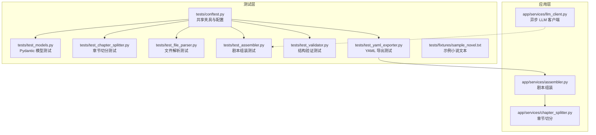
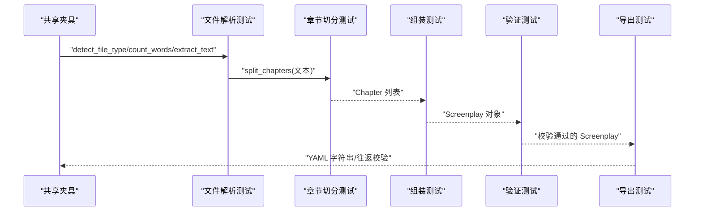
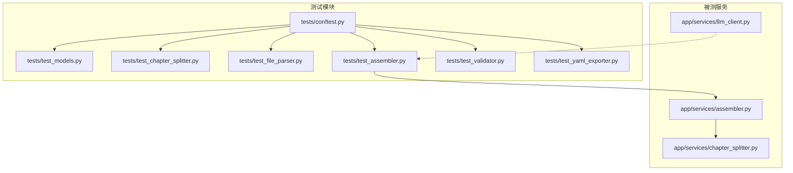

# 测试策略

<cite>
**本文引用的文件**
- [README.md](file://README.md)
- [pyproject.toml](file://pyproject.toml)
- [.gitignore](file://.gitignore)
- [tests/conftest.py](file://tests/conftest.py)
- [tests/test_models.py](file://tests/test_models.py)
- [tests/test_assembler.py](file://tests/test_assembler.py)
- [tests/test_chapter_splitter.py](file://tests/test_chapter_splitter.py)
- [tests/test_file_parser.py](file://tests/test_file_parser.py)
- [tests/test_validator.py](file://tests/test_validator.py)
- [tests/test_yaml_exporter.py](file://tests/test_yaml_exporter.py)
- [tests/fixtures/sample_novel.txt](file://tests/fixtures/sample_novel.txt)
- [app/services/assembler.py](file://app/services/assembler.py)
- [app/services/chapter_splitter.py](file://app/services/chapter_splitter.py)
- [app/services/llm_client.py](file://app/services/llm_client.py)
</cite>

## 目录
1. [引言](#引言)
2. [项目结构](#项目结构)
3. [核心组件](#核心组件)
4. [架构总览](#架构总览)
5. [详细组件分析](#详细组件分析)
6. [依赖分析](#依赖分析)
7. [性能考虑](#性能考虑)
8. [故障排除指南](#故障排除指南)
9. [结论](#结论)
10. [附录](#附录)

## 引言
本测试策略文档面向小说转剧本工具的测试体系与质量保证机制，系统阐述单元测试与集成测试的设计原则、实现方法与覆盖范围；说明测试夹具（fixtures）的使用与管理；给出测试覆盖率的度量建议；提供测试环境搭建与配置要点；解释异步代码的测试策略与最佳实践；并给出持续集成与自动化测试的建议以及测试数据管理与隐私保护的指导。

## 项目结构
测试相关的核心位置与职责如下：
- tests/：集中存放所有测试用例与共享夹具
  - conftest.py：共享夹具与全局测试配置
  - 各功能模块对应的测试文件：按模块划分，覆盖模型、服务层与导出逻辑
  - fixtures/：外部测试夹具（如示例文本）
- app/services/：被测试的服务实现（章节切分、组装、LLM 客户端等）
- pyproject.toml：pytest 配置（测试路径、异步模式、标记等）
- README.md：开发与测试命令、项目结构与处理流水线说明

图表来源
- [tests/conftest.py:1-167](file://tests/conftest.py#L1-L167)
- [tests/test_models.py:1-124](file://tests/test_models.py#L1-L124)
- [tests/test_chapter_splitter.py:1-68](file://tests/test_chapter_splitter.py#L1-L68)
- [tests/test_file_parser.py:1-102](file://tests/test_file_parser.py#L1-L102)
- [tests/test_assembler.py:1-111](file://tests/test_assembler.py#L1-L111)
- [tests/test_validator.py:1-63](file://tests/test_validator.py#L1-L63)
- [tests/test_yaml_exporter.py:1-58](file://tests/test_yaml_exporter.py#L1-L58)
- [tests/fixtures/sample_novel.txt:1-50](file://tests/fixtures/sample_novel.txt#L1-L50)
- [app/services/chapter_splitter.py:1-163](file://app/services/chapter_splitter.py#L1-L163)
- [app/services/assembler.py:1-101](file://app/services/assembler.py#L1-L101)
- [app/services/llm_client.py:1-103](file://app/services/llm_client.py#L1-L103)

章节来源
- [README.md:77-108](file://README.md#L77-L108)
- [pyproject.toml:37-42](file://pyproject.toml#L37-L42)

## 核心组件
- 测试运行与配置
  - pytest 路径与异步模式：通过配置项指定测试目录与自动异步模式，确保异步服务测试可用
  - 标记（markers）：为调用真实 LLM 的测试打上标记，便于选择性执行
- 共享夹具（fixtures）
  - 文本与章节：提供示例小说文本与预切分章节，用于切分与转换流程测试
  - 角色与剧本：提供最小有效角色目录与完整剧本对象，用于组装、验证与导出测试
- 测试覆盖范围
  - 模型层：Pydantic 模型字段默认值、自动时间戳、关系与元素类型
  - 服务层：章节切分（正则与启发式）、文件解析（类型检测、文本抽取、词数统计）、剧本组装（编号、出场角色、首次出场）、结构验证（元数据、角色引用、场景完整性）、YAML 导出（合法性、元数据、字符、场景、头部注释、Unicode 保留、往返一致性）

章节来源
- [pyproject.toml:37-42](file://pyproject.toml#L37-L42)
- [tests/conftest.py:23-167](file://tests/conftest.py#L23-L167)
- [tests/test_models.py:22-124](file://tests/test_models.py#L22-L124)
- [tests/test_chapter_splitter.py:8-68](file://tests/test_chapter_splitter.py#L8-L68)
- [tests/test_file_parser.py:14-102](file://tests/test_file_parser.py#L14-L102)
- [tests/test_assembler.py:49-111](file://tests/test_assembler.py#L49-L111)
- [tests/test_validator.py:19-63](file://tests/test_validator.py#L19-L63)
- [tests/test_yaml_exporter.py:10-58](file://tests/test_yaml_exporter.py#L10-L58)

## 架构总览
测试架构围绕“共享夹具 + 单元/集成测试”的组织方式展开，测试用例通过夹具注入真实业务对象，验证服务层与导出层的行为。

图表来源
- [tests/conftest.py:23-167](file://tests/conftest.py#L23-L167)
- [tests/test_file_parser.py:14-102](file://tests/test_file_parser.py#L14-L102)
- [tests/test_chapter_splitter.py:8-68](file://tests/test_chapter_splitter.py#L8-L68)
- [tests/test_assembler.py:49-111](file://tests/test_assembler.py#L49-L111)
- [tests/test_validator.py:19-63](file://tests/test_validator.py#L19-L63)
- [tests/test_yaml_exporter.py:10-58](file://tests/test_yaml_exporter.py#L10-L58)

## 详细组件分析

### 测试夹具（Fixtures）与管理
- 设计原则
  - 可复用：在 conftest 中集中定义，跨模块共享
  - 明确职责：文本夹具、章节夹具、角色夹具、最小剧本夹具分别服务于不同测试场景
  - 可维护：以小而精的对象为主，避免过度构造复杂状态
- 使用方式
  - 在测试函数形参中声明所需夹具，pytest 自动注入
  - 示例：章节切分测试直接使用夹具提供的章节列表；组装测试使用夹具提供的角色与最小剧本对象
- 管理建议
  - 保持夹具粒度适中，避免单个夹具承担过多职责
  - 对于外部资源（如示例文本），放在 fixtures 目录并明确用途
  - 对于需要临时文件的测试，优先使用 pytest 的 tmp_path 等内置机制

章节来源
- [tests/conftest.py:23-167](file://tests/conftest.py#L23-L167)
- [tests/fixtures/sample_novel.txt:1-50](file://tests/fixtures/sample_novel.txt#L1-L50)

### 单元测试设计与实现
- 模型层测试
  - 关注 Pydantic 模型的默认值、自动字段（时间戳）、关系与元素类型的正确性
  - 通过构造最小对象验证序列化与反序列化的稳定性
- 文件解析测试
  - 类型检测：覆盖 txt、md、markdown、docx、pdf 等常见类型
  - 文本抽取：UTF-8 BOM、Markdown 格式剥离、链接处理、异常路径（不存在、空文件、不支持类型）
  - 词数统计：英文、中文、混合文本与标点处理
- 章节切分测试
  - 正则切分：英文、中文、罗马数字、Markdown 标题、编号段落等多语言与多格式
  - 启发式切分：短文本、段落边界、最少章节数量约束
  - 模型验证：Chapter 对象字段完整性
- 组装测试
  - 全局编号：幕与场景的全局顺序编号
  - 出场角色：从对话元素推断与显式字段校验
  - 首次出场：基于最早出现场景设置角色首次出场
- 验证测试
  - 合法剧本：无错误
  - 缺失元数据（标题）、无幕、无效角色引用、空场景元素、不存在的出场角色等边界与错误场景
- 导出测试
  - YAML 合法性与头部注释
  - 元数据、角色、场景存在性
  - Unicode 保留与往返一致性（YAML -> 解析 -> 数据对比）

章节来源
- [tests/test_models.py:22-124](file://tests/test_models.py#L22-L124)
- [tests/test_file_parser.py:14-102](file://tests/test_file_parser.py#L14-L102)
- [tests/test_chapter_splitter.py:8-68](file://tests/test_chapter_splitter.py#L8-L68)
- [tests/test_assembler.py:49-111](file://tests/test_assembler.py#L49-L111)
- [tests/test_validator.py:19-63](file://tests/test_validator.py#L19-L63)
- [tests/test_yaml_exporter.py:10-58](file://tests/test_yaml_exporter.py#L10-L58)

### 集成测试覆盖范围与场景
- 端到端流程验证
  - 文件解析 → 章节切分 → 角色提取（由 LLM 支持）→ 逐章转换 → 组装 → 验证 → YAML 导出
  - 重点覆盖：多格式输入、章节边界识别、角色引用一致性、连续性摘要传递、编号全局化、导出合法性
- 服务协作验证
  - 组装服务依赖章节切分与角色目录，验证全局编号与出场角色填充逻辑
  - 验证服务对角色引用与场景完整性进行校验
  - 导出服务对最终剧本进行 YAML 生成与往返校验

章节来源
- [README.md:110-117](file://README.md#L110-L117)
- [app/services/assembler.py:18-101](file://app/services/assembler.py#L18-L101)
- [app/services/chapter_splitter.py:42-163](file://app/services/chapter_splitter.py#L42-L163)

### 异步代码测试策略与最佳实践
- 异步模式
  - pytest 配置启用自动异步模式，确保异步服务测试可正常运行
- 异步 LLM 客户端测试
  - 使用标记区分真实 LLM 调用测试与非真实调用测试，避免 CI 中频繁外部请求
  - 对重试、超时、JSON 解析与关闭连接等行为进行断言
- 最佳实践
  - 为异步函数提供同步包装或在测试中使用事件循环
  - 对网络异常与超时进行模拟与断言，确保重试逻辑生效
  - 在测试中清理资源（如关闭底层 HTTP 客户端）

章节来源
- [pyproject.toml:37-42](file://pyproject.toml#L37-L42)
- [app/services/llm_client.py:18-103](file://app/services/llm_client.py#L18-L103)

### 测试数据准备与模拟对象
- 测试数据
  - 使用夹具提供稳定、可重复的数据源（示例文本、章节、角色、最小剧本）
  - 对于文件解析测试，使用 tmp_path 生成临时文件，避免污染工作区
- 模拟对象
  - 对外部依赖（如 LLM API）使用标记控制是否真实调用
  - 在需要时对 LLM 客户端返回值进行模拟，验证组装与导出流程

章节来源
- [tests/conftest.py:23-167](file://tests/conftest.py#L23-L167)
- [tests/test_file_parser.py:35-81](file://tests/test_file_parser.py#L35-L81)
- [pyproject.toml:40-42](file://pyproject.toml#L40-L42)

### 测试覆盖率要求与度量方法
- 覆盖率目标建议
  - 行覆盖率：≥80%
  - 分支覆盖率：≥70%
  - 指标采集：使用 pytest 与覆盖率工具（如 coverage.py 或 pytest-cov）在 CI 中统一采集
- 度量与报告
  - 在本地与 CI 中均输出 HTML 报告，定期审查未覆盖路径
  - 对关键路径（LLM 调用、文件解析、章节切分、组装与导出）进行重点保障

[本节为通用指导，无需特定文件引用]

### 测试环境搭建与配置
- 依赖安装
  - 开发依赖包含 pytest、pytest-asyncio、ruff，满足测试与代码规范需求
- 运行命令
  - 运行全部测试、代码检查与自动修复 lint 问题
- 缓存与忽略
  - .gitignore 中已忽略 pytest 缓存、覆盖率产物等，避免污染仓库

章节来源
- [pyproject.toml:27-32](file://pyproject.toml#L27-L32)
- [README.md:152-163](file://README.md#L152-L163)
- [.gitignore:25-29](file://.gitignore#L25-L29)

### 测试调试与故障排除
- 常见问题
  - LLM 相关测试失败：检查 API Key、基础 URL、模型名称与超时配置；必要时使用标记跳过真实调用
  - 文件解析异常：确认文件编码（UTF-8 BOM）、文件是否存在、类型是否受支持
  - 章节切分异常：检查文本是否包含足够章节标识或段落边界
- 排查步骤
  - 逐步缩小范围：先验证模型与夹具，再验证服务层，最后验证导出层
  - 使用断言定位：对中间产物（如章节列表、角色目录、组装后的场景）进行断言
  - 日志与重试：关注 LLM 客户端日志与重试次数

章节来源
- [app/services/llm_client.py:18-103](file://app/services/llm_client.py#L18-L103)
- [tests/test_file_parser.py:35-81](file://tests/test_file_parser.py#L35-L81)
- [tests/test_chapter_splitter.py:8-68](file://tests/test_chapter_splitter.py#L8-L68)

### 持续集成与自动化测试建议
- CI 工作流建议
  - 任务拆分：代码检查（ruff）、单元测试（含异步模式）、覆盖率报告、构建打包
  - 条件执行：仅在变更涉及相关目录时触发对应任务
  - 缓存优化：缓存虚拟环境与依赖，缩短构建时间
- 测试策略
  - 对真实 LLM 的测试使用标记隔离，可在 PR 中禁用或仅在主分支执行
  - 对导出与往返测试加入回归检查，防止 Schema 变更导致的不兼容

章节来源
- [pyproject.toml:27-32](file://pyproject.toml#L27-L32)
- [pyproject.toml:40-42](file://pyproject.toml#L40-L42)

### 测试数据管理与隐私保护
- 数据隔离
  - 使用 tmp_path 与 fixtures 目录管理测试数据，避免污染生产数据
- 敏感信息
  - 在测试中避免使用真实 API Key；如需真实调用，使用 CI 变量并在本地禁用
- 数据最小化
  - 仅提供测试必需的最小数据集，减少对外部资源的依赖

章节来源
- [tests/fixtures/sample_novel.txt:1-50](file://tests/fixtures/sample_novel.txt#L1-L50)
- [pyproject.toml:40-42](file://pyproject.toml#L40-L42)

## 依赖分析
测试与被测模块之间的依赖关系如下：

图表来源
- [tests/conftest.py:1-167](file://tests/conftest.py#L1-L167)
- [tests/test_models.py:1-124](file://tests/test_models.py#L1-L124)
- [tests/test_chapter_splitter.py:1-68](file://tests/test_chapter_splitter.py#L1-L68)
- [tests/test_file_parser.py:1-102](file://tests/test_file_parser.py#L1-L102)
- [tests/test_assembler.py:1-111](file://tests/test_assembler.py#L1-L111)
- [tests/test_validator.py:1-63](file://tests/test_validator.py#L1-L63)
- [tests/test_yaml_exporter.py:1-58](file://tests/test_yaml_exporter.py#L1-L58)
- [app/services/chapter_splitter.py:1-163](file://app/services/chapter_splitter.py#L1-L163)
- [app/services/assembler.py:1-101](file://app/services/assembler.py#L1-L101)
- [app/services/llm_client.py:1-103](file://app/services/llm_client.py#L1-L103)

## 性能考虑
- 测试执行效率
  - 使用标记隔离真实 LLM 调用，减少 CI 时间
  - 对文件解析与章节切分等 IO 密集型测试，尽量使用小样本数据
- 覆盖率与性能平衡
  - 在保证关键路径覆盖率的前提下，避免过度构造复杂数据导致测试时间过长

[本节为通用指导，无需特定文件引用]

## 故障排除指南
- LLM 相关失败
  - 检查配置项与网络连通性；必要时降级为非真实调用测试
- 文件解析失败
  - 核对文件编码、类型与内容；确认异常路径断言覆盖
- 章节切分异常
  - 检查文本是否包含章节标识；必要时调整正则或启用启发式切分
- 组装与导出异常
  - 逐层断言中间产物；核对编号与角色引用一致性

章节来源
- [app/services/llm_client.py:18-103](file://app/services/llm_client.py#L18-L103)
- [tests/test_file_parser.py:35-81](file://tests/test_file_parser.py#L35-L81)
- [tests/test_chapter_splitter.py:8-68](file://tests/test_chapter_splitter.py#L8-L68)
- [tests/test_assembler.py:49-111](file://tests/test_assembler.py#L49-L111)
- [tests/test_yaml_exporter.py:10-58](file://tests/test_yaml_exporter.py#L10-L58)

## 结论
本项目测试体系以 pytest 为核心，结合共享夹具与模块化测试文件，覆盖模型、服务与导出全流程。通过标记隔离真实 LLM 调用、严格的异常路径断言与最小数据集策略，既保证了测试稳定性，也兼顾了可维护性。建议在 CI 中引入覆盖率与代码检查，并持续完善关键路径的回归测试，以保障系统的长期质量与可靠性。

## 附录
- 开发与测试命令参考
  - 运行全部测试、代码检查与自动修复 lint 问题
- 项目结构与处理流水线参考
  - 上传文件 → 文本提取 → 章节切分 → 角色提取 → 逐章转换 → 组装 → 验证 → YAML 导出

章节来源
- [README.md:152-163](file://README.md#L152-L163)
- [README.md:110-117](file://README.md#L110-L117)