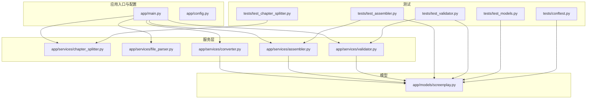
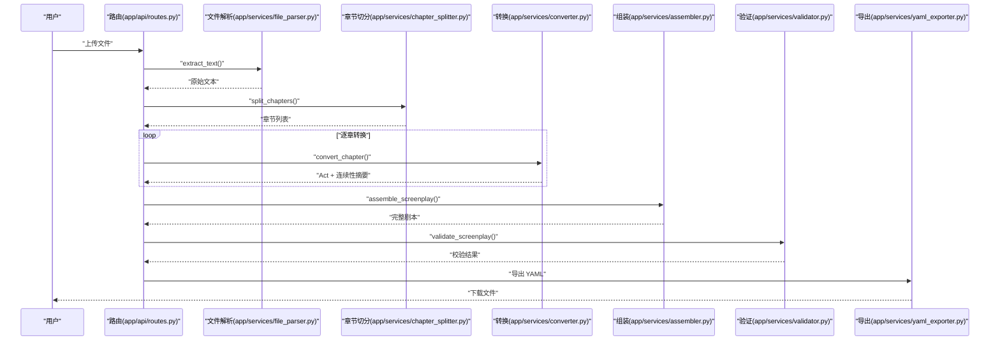
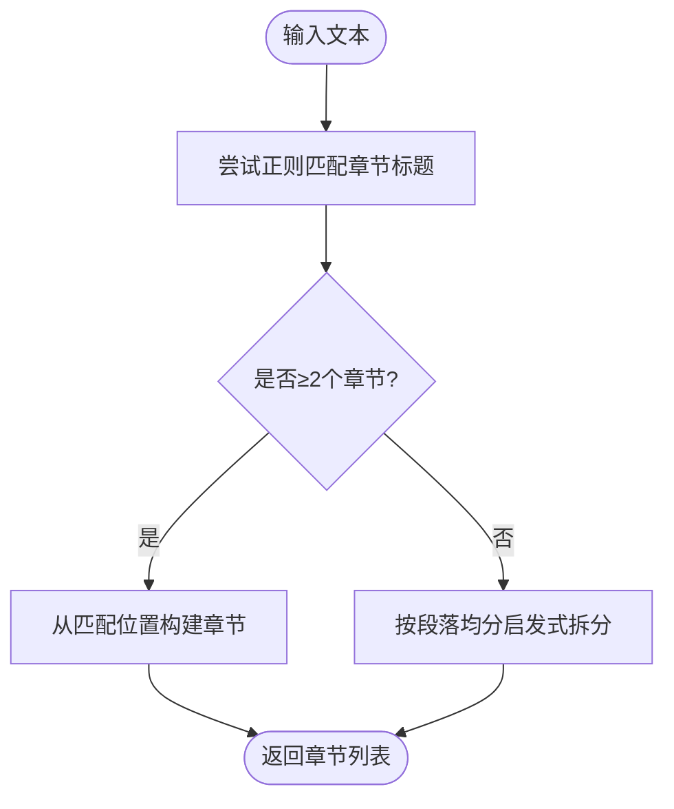
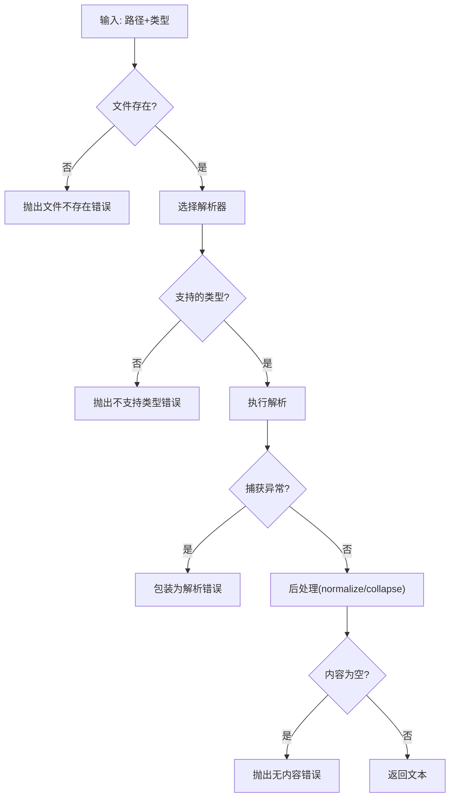
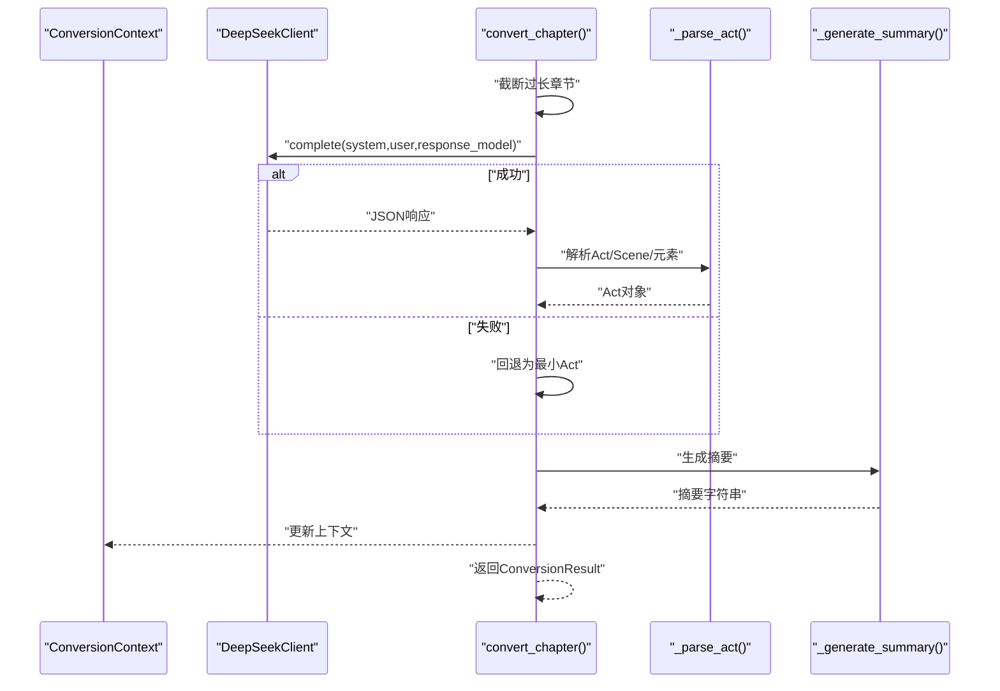
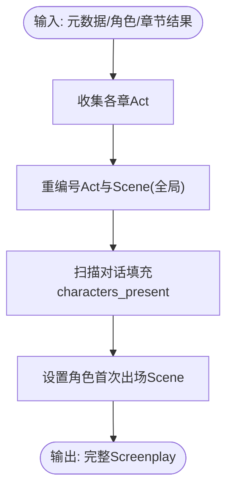
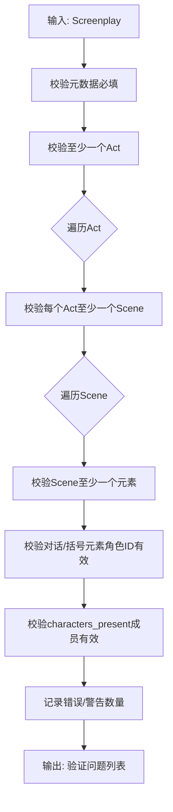
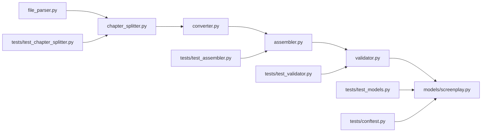

# 测试覆盖率

<cite>
**本文档引用的文件**
- [pyproject.toml](file://pyproject.toml)
- [README.md](file://README.md)
- [tests/conftest.py](file://tests/conftest.py)
- [app/main.py](file://app/main.py)
- [app/config.py](file://app/config.py)
- [app/models/screenplay.py](file://app/models/screenplay.py)
- [app/services/assembler.py](file://app/services/assembler.py)
- [app/services/chapter_splitter.py](file://app/services/chapter_splitter.py)
- [app/services/validator.py](file://app/services/validator.py)
- [app/services/converter.py](file://app/services/converter.py)
- [app/services/file_parser.py](file://app/services/file_parser.py)
- [tests/test_assembler.py](file://tests/test_assembler.py)
- [tests/test_chapter_splitter.py](file://tests/test_chapter_splitter.py)
- [tests/test_validator.py](file://tests/test_validator.py)
- [tests/test_models.py](file://tests/test_models.py)
</cite>

## 目录
1. [简介](#简介)
2. [项目结构](#项目结构)
3. [核心组件](#核心组件)
4. [架构总览](#架构总览)
5. [详细组件分析](#详细组件分析)
6. [依赖分析](#依赖分析)
7. [性能考量](#性能考量)
8. [故障排查指南](#故障排查指南)
9. [结论](#结论)
10. [附录](#附录)

## 简介
本文件聚焦于项目的测试覆盖率分析与度量，目标是：
- 明确当前测试覆盖率的统计方法与工具使用现状（pytest 与 pytest-asyncio）
- 量化关键代码路径的覆盖率要求与目标（核心业务逻辑、数据验证、异常处理）
- 识别未覆盖代码并提出针对性补测策略（边缘与边界条件）
- 制定覆盖率提升的优先级与实施建议（新增测试用例设计）
- 在持续集成中建立覆盖率监控与告警机制
- 给出测试质量度量指标与改进建议（复杂度与测试效率平衡）
- 提供覆盖率报告的解读与分析方法

## 项目结构
项目采用“按功能域分层”的组织方式，核心模块位于 app/ 下，测试集中于 tests/。主要模块包括：
- 应用入口与配置：app/main.py、app/config.py
- 数据模型：app/models/screenplay.py（Pydantic 模型）
- 服务层：章节切分、文件解析、转换、组装、验证等
- 测试夹具与用例：tests/conftest.py、tests/*.py

图表来源
- [app/main.py:1-46](file://app/main.py#L1-L46)
- [app/config.py:1-45](file://app/config.py#L1-L45)
- [app/models/screenplay.py:1-167](file://app/models/screenplay.py#L1-L167)
- [app/services/chapter_splitter.py:1-163](file://app/services/chapter_splitter.py#L1-L163)
- [app/services/file_parser.py:1-187](file://app/services/file_parser.py#L1-L187)
- [app/services/converter.py:1-218](file://app/services/converter.py#L1-L218)
- [app/services/assembler.py:1-101](file://app/services/assembler.py#L1-L101)
- [app/services/validator.py:1-111](file://app/services/validator.py#L1-L111)
- [tests/conftest.py:1-167](file://tests/conftest.py#L1-L167)
- [tests/test_assembler.py:1-111](file://tests/test_assembler.py#L1-L111)
- [tests/test_chapter_splitter.py:1-68](file://tests/test_chapter_splitter.py#L1-L68)
- [tests/test_validator.py:1-63](file://tests/test_validator.py#L1-L63)
- [tests/test_models.py:1-124](file://tests/test_models.py#L1-L124)

章节来源
- [README.md:77-108](file://README.md#L77-L108)
- [pyproject.toml:37-42](file://pyproject.toml#L37-L42)

## 核心组件
- 应用入口与生命周期：负责启动时创建目录、挂载静态资源、注册路由，并通过 lifespan 确保运行时目录存在。
- 配置管理：基于 pydantic-settings 的 Settings 类，提供 API 密钥、上传/输出目录、LLM 参数等配置项。
- 数据模型：以 Pydantic 模型定义 YAML Schema 的根对象与各层级结构，确保序列化、反序列化与校验一致性。
- 服务层：
  - 章节切分：两阶段策略（正则+启发式），支持中英文章节标题与中文“一、”式标题等模式。
  - 文件解析：统一接口提取 txt/md/docx/pdf 文本，内置错误类型与编码/格式处理。
  - 转换引擎：异步调用 LLM 完成章节到剧本的转换，包含连续性上下文传递与降级策略。
  - 组装服务：将各章转换结果合并为完整剧本，重编号、填充出场角色、设置首次出场。
  - 验证服务：对元数据、结构编号、角色引用、场景元素完整性进行校验。

章节来源
- [app/main.py:14-46](file://app/main.py#L14-L46)
- [app/config.py:9-44](file://app/config.py#L9-L44)
- [app/models/screenplay.py:17-167](file://app/models/screenplay.py#L17-L167)
- [app/services/chapter_splitter.py:42-163](file://app/services/chapter_splitter.py#L42-L163)
- [app/services/file_parser.py:16-187](file://app/services/file_parser.py#L16-L187)
- [app/services/converter.py:36-218](file://app/services/converter.py#L36-L218)
- [app/services/assembler.py:18-101](file://app/services/assembler.py#L18-L101)
- [app/services/validator.py:11-111](file://app/services/validator.py#L11-L111)

## 架构总览
下图展示从上传到导出的端到端流程，以及测试覆盖的关键节点。

图表来源
- [app/main.py:1-46](file://app/main.py#L1-L46)
- [app/services/file_parser.py:16-187](file://app/services/file_parser.py#L16-L187)
- [app/services/chapter_splitter.py:42-163](file://app/services/chapter_splitter.py#L42-L163)
- [app/services/converter.py:36-218](file://app/services/converter.py#L36-L218)
- [app/services/assembler.py:18-101](file://app/services/assembler.py#L18-L101)
- [app/services/validator.py:11-111](file://app/services/validator.py#L11-L111)

## 详细组件分析

### 章节切分服务（chapter_splitter）
- 关键逻辑：正则匹配多种章节标题模式；若未检测到足够章节，则退化为按段落均分的启发式策略。
- 边界与异常：空文本、极短文本、无章节标题文本、CJK 与西文混合标题等。
- 测试覆盖：已覆盖英文/中文/罗马数字标题、内容保留、无标题文本的启发式拆分、段落边界处理、Chapter 模型字段。

图表来源
- [app/services/chapter_splitter.py:42-163](file://app/services/chapter_splitter.py#L42-L163)
- [tests/test_chapter_splitter.py:8-68](file://tests/test_chapter_splitter.py#L8-L68)

章节来源
- [app/services/chapter_splitter.py:42-163](file://app/services/chapter_splitter.py#L42-L163)
- [tests/test_chapter_splitter.py:8-68](file://tests/test_chapter_splitter.py#L8-L68)

### 文件解析服务（file_parser）
- 关键逻辑：统一入口 extract_text，按类型分派具体解析器；失败时抛出自定义异常；后处理规范化空白与 Unicode。
- 边界与异常：文件不存在、不支持的扩展名、解码失败、PDF 无页/无法提取文本、解析后为空。
- 测试覆盖：txt/md/docx/pdf 解析、错误分支、编码处理、后处理效果、类型检测。

图表来源
- [app/services/file_parser.py:16-187](file://app/services/file_parser.py#L16-L187)

章节来源
- [app/services/file_parser.py:16-187](file://app/services/file_parser.py#L16-L187)

### 转换引擎（converter）
- 关键逻辑：构造提示词、调用 LLM、解析响应为 Act/Scene/元素、生成连续性摘要、更新上下文。
- 异常与降级：LLM 调用失败时回退为最小 Act；摘要生成失败时回退为最后场景描述。
- 测试覆盖：当前测试集中在模型与服务层，转换引擎的异步与 LLM 集成建议补充。

图表来源
- [app/services/converter.py:36-218](file://app/services/converter.py#L36-L218)

章节来源
- [app/services/converter.py:36-218](file://app/services/converter.py#L36-L218)

### 组装服务（assembler）
- 关键逻辑：全局重编号、填充 characters_present、设置角色首次出场。
- 测试覆盖：基本组装、全局编号、characters_present 推断与校验、first_appearance 设置。

图表来源
- [app/services/assembler.py:18-101](file://app/services/assembler.py#L18-L101)
- [tests/test_assembler.py:49-111](file://tests/test_assembler.py#L49-L111)

章节来源
- [app/services/assembler.py:18-101](file://app/services/assembler.py#L18-L101)
- [tests/test_assembler.py:49-111](file://tests/test_assembler.py#L49-L111)

### 验证服务（validator）
- 关键逻辑：校验元数据必填、结构编号连续性、场景元素非空、角色引用有效性、characters_present 有效性。
- 测试覆盖：有效剧本、空标题、无 Acts、无效角色引用、空场景元素、无效 characters_present。

图表来源
- [app/services/validator.py:11-111](file://app/services/validator.py#L11-L111)
- [tests/test_validator.py:19-63](file://tests/test_validator.py#L19-L63)

章节来源
- [app/services/validator.py:11-111](file://app/services/validator.py#L11-L111)
- [tests/test_validator.py:19-63](file://tests/test_validator.py#L19-L63)

### 数据模型（models/screenplay）
- 关键逻辑：以 Pydantic 定义元数据、角色、场景元素（动作/对白/括号/过渡/备注）、场景、Act、结构与根对象。
- 测试覆盖：模型字段默认值、可选字段、Discriminated Union 的元素类型、嵌套结构创建与断言。

章节来源
- [app/models/screenplay.py:17-167](file://app/models/screenplay.py#L17-L167)
- [tests/test_models.py:22-124](file://tests/test_models.py#L22-L124)

## 依赖分析
- 组件内聚与耦合：
  - services/assembler 依赖 models/screenplay 与 converter 的 ConversionResult
  - services/validator 依赖 models/screenplay 的各类模型
  - services/converter 依赖 prompts、llm_client 与 chapter_splitter 的 Chapter
  - services/file_parser 与 services/chapter_splitter 为上游输入准备
- 外部依赖：
  - FastAPI、pydantic、ruamel.yaml、pdfplumber、python-docx、httpx、openai 等
- 测试夹具：
  - tests/conftest.py 提供 sample_novel_text、sample_chapters、sample_characters、sample_screenplay 等共享 fixture

图表来源
- [app/services/file_parser.py:16-187](file://app/services/file_parser.py#L16-L187)
- [app/services/chapter_splitter.py:42-163](file://app/services/chapter_splitter.py#L42-L163)
- [app/services/converter.py:36-218](file://app/services/converter.py#L36-L218)
- [app/services/assembler.py:18-101](file://app/services/assembler.py#L18-L101)
- [app/services/validator.py:11-111](file://app/services/validator.py#L11-L111)
- [app/models/screenplay.py:17-167](file://app/models/screenplay.py#L17-L167)
- [tests/test_assembler.py:49-111](file://tests/test_assembler.py#L49-L111)
- [tests/test_chapter_splitter.py:8-68](file://tests/test_chapter_splitter.py#L8-L68)
- [tests/test_validator.py:19-63](file://tests/test_validator.py#L19-L63)
- [tests/test_models.py:22-124](file://tests/test_models.py#L22-L124)
- [tests/conftest.py:23-167](file://tests/conftest.py#L23-L167)

## 性能考量
- 测试执行性能：
  - 使用 pytest-asyncio 支持异步测试；建议将涉及外部 LLM 的测试标记为可选，避免 CI 中阻塞。
  - 对 heavy I/O（如 PDF/DOCX）测试，建议使用小样本或 mock。
- 代码复杂度与测试效率：
  - 通过 Pydantic 模型减少手工校验逻辑，提高测试稳定性。
  - 将解析与转换的异常路径纳入测试，有助于降低运行期开销与失败概率。
- 覆盖率与性能平衡：
  - 关键路径（章节切分、文件解析、验证）应优先达到高覆盖率，其余路径以“异常/边界”为主。

## 故障排查指南
- 常见问题与定位：
  - 文件解析失败：检查文件是否存在、编码是否受支持、PDF 是否可提取文本。
  - 章节切分异常：确认输入文本是否包含章节标题，或退化策略是否按预期工作。
  - 转换失败：关注 LLM 返回结构与异常降级逻辑。
  - 组装/验证失败：核对角色 ID 一致性、场景元素完整性与编号连续性。
- 建议的测试策略：
  - 为每个异常分支添加单测，覆盖“空内容、非法类型、解码失败、网络超时”等。
  - 使用 fixtures 提供边界输入（极短文本、CJK 混排、特殊标点、大量换行等）。

章节来源
- [app/services/file_parser.py:11-187](file://app/services/file_parser.py#L11-L187)
- [app/services/chapter_splitter.py:66-163](file://app/services/chapter_splitter.py#L66-L163)
- [app/services/converter.py:66-84](file://app/services/converter.py#L66-L84)
- [app/services/validator.py:29-111](file://app/services/validator.py#L29-L111)

## 结论
- 当前测试覆盖了核心数据模型、章节切分、组装与验证等关键路径，但缺少对转换引擎与文件解析异常路径的系统性覆盖。
- 建议优先补齐异常与边界测试，再逐步扩展到异步与外部依赖场景。
- 在 CI 中引入覆盖率阈值与告警，确保回归不回退。

## 附录

### 测试覆盖率统计与工具使用现状
- 工具与配置：
  - 使用 pytest 作为测试运行器，支持 asyncio_mode，测试目录为 tests/。
  - 未发现显式的 pytest-cov 配置文件或命令行参数，建议在本地与 CI 中启用覆盖率统计。
- 报告生成建议：
  - 本地：pytest tests/ --cov=app --cov-report=term-missing --cov-report=html
  - CI：pytest tests/ --cov=app --cov-report=xml --cov-report=term-missing
- 标记与隔离：
  - 可利用现有 live 标记隔离真实 LLM 调用测试，避免 CI 成本过高。

章节来源
- [pyproject.toml:37-42](file://pyproject.toml#L37-L42)
- [README.md:152-163](file://README.md#L152-L163)

### 关键代码路径的覆盖率目标
- 核心业务逻辑（高优先级）：
  - 章节切分：正则匹配、启发式拆分、段落边界处理、Chapter 模型字段
  - 文件解析：类型检测、编码处理、后处理、错误包装
  - 组装：全局重编号、characters_present 推断、first_appearance 设置
  - 验证：元数据必填、编号连续性、角色引用、场景元素完整性
- 数据验证（高优先级）：
  - Pydantic 字段默认值与可选字段、Discriminated Union 分发
- 异常处理（高优先级）：
  - 文件解析异常、章节切分退化、转换降级、验证警告/错误
- 边界条件（中优先级）：
  - 极短文本、CJK 混排、大量换行、特殊标点、PDF/DOCX 解析失败

### 未覆盖代码的识别与分析方法
- 使用覆盖率报告定位未命中分支与函数：
  - 关注“未覆盖的 if/else 分支”、“except 子句”、“for/while 循环首尾”
  - 对异常路径（raise/try/except）逐一设计用例
- 边界条件测试清单：
  - 输入为空/None、长度为 0、仅包含空白、仅包含换行
  - CJK 与拉丁字符混排、全角/半角符号、制表符
  - 文件类型缺失、编码不可解、PDF 无文本、DOCX 表格为空

### 覆盖率提升策略与优先级
- 优先级建议：
  1) 核心验证与模型：确保所有字段校验与异常分支覆盖
  2) 文件解析与章节切分：补齐异常与边界用例
  3) 组装与转换：补充降级与连续性上下文用例
- 新增测试用例设计要点：
  - 使用 tests/conftest.py 中的 fixtures 扩展更多边界输入
  - 为每个服务模块编写独立的单元测试文件，保持职责单一
  - 对异步函数使用 pytest.mark.asyncio 标记并正确 await

### 持续集成中的覆盖率监控与告警
- 建议步骤：
  - 在 CI 中启用 pytest --cov=app --cov-report=xml
  - 设置覆盖率阈值（如函数行覆盖率 ≥ 80%，分支覆盖率 ≥ 60%）
  - 当覆盖率下降时触发告警邮件或评论
- 可选实践：
  - 将覆盖率报告上传至制品库，便于审计与对比

### 测试质量度量指标与改进建议
- 指标建议：
  - 函数/行/分支覆盖率
  - 关键路径覆盖率（章节切分、文件解析、验证）
  - 复杂度与测试数比值（避免过度测试）
- 改进建议：
  - 通过 Pydantic 模型减少重复校验逻辑
  - 将外部依赖（LLM、PDF/DOCX）mock 化，提升测试稳定性
  - 使用 fixtures 统一构造边界输入，减少重复代码

### 覆盖率报告的解读与分析方法
- 解读要点：
  - 查看“Missing”行号，定位未覆盖分支
  - 关注“部分覆盖”的函数，补充其内部分支用例
  - 对异常路径进行专项回归测试
- 分析方法：
  - 将覆盖率报告与变更集关联，追踪回归风险
  - 对热点模块（验证、解析、切分）单独建立基线