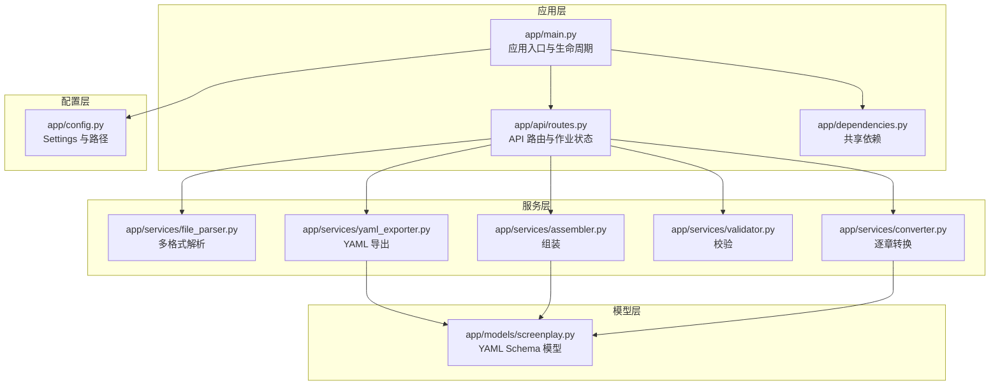
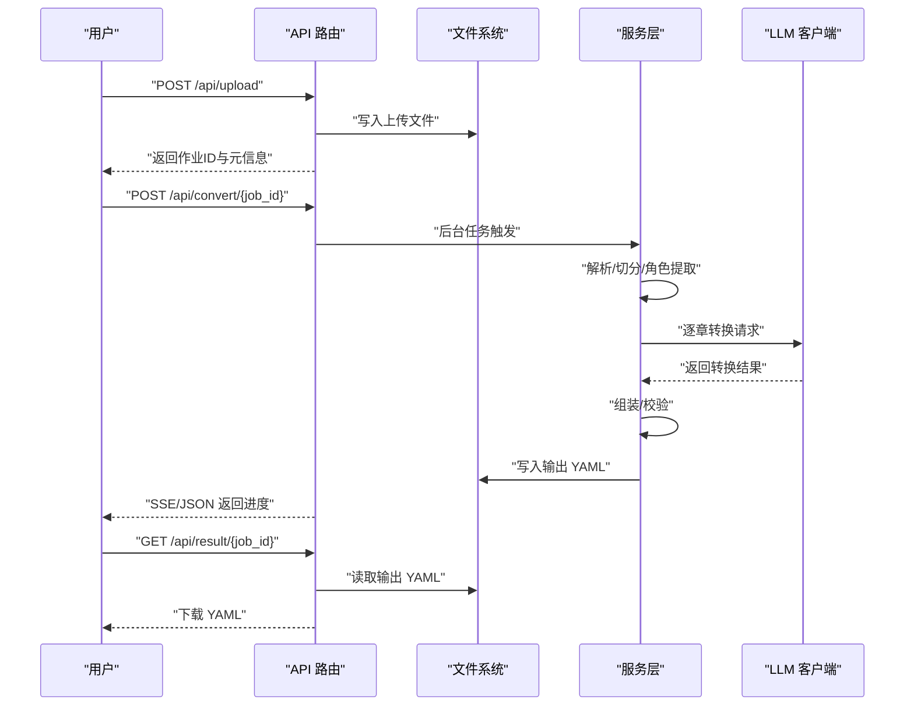
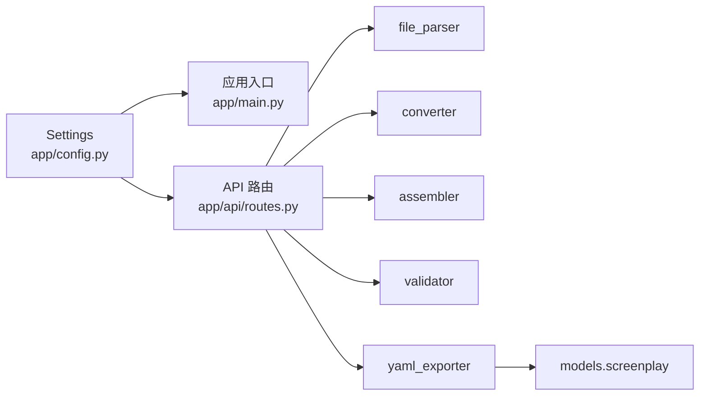

# 备份恢复

<cite>
**本文引用的文件**
- [README.md](file://README.md)
- [pyproject.toml](file://pyproject.toml)
- [app/config.py](file://app/config.py)
- [app/main.py](file://app/main.py)
- [app/dependencies.py](file://app/dependencies.py)
- [app/api/routes.py](file://app/api/routes.py)
- [app/services/file_parser.py](file://app/services/file_parser.py)
- [app/services/converter.py](file://app/services/converter.py)
- [app/services/assembler.py](file://app/services/assembler.py)
- [app/services/validator.py](file://app/services/validator.py)
- [app/services/yaml_exporter.py](file://app/services/yaml_exporter.py)
- [app/models/screenplay.py](file://app/models/screenplay.py)
- [docs/YAML_SCHEMA.md](file://docs/YAML_SCHEMA.md)
- [tests/fixtures/sample_novel.txt](file://tests/fixtures/sample_novel.txt)
</cite>

## 目录
1. [简介](#简介)
2. [项目结构](#项目结构)
3. [核心组件](#核心组件)
4. [架构总览](#架构总览)
5. [详细组件分析](#详细组件分析)
6. [依赖分析](#依赖分析)
7. [性能考虑](#性能考虑)
8. [故障排查指南](#故障排查指南)
9. [结论](#结论)
10. [附录](#附录)

## 简介
本指南面向小说转剧本工具的运维与平台团队，提供一套完整的数据保护与灾难恢复方案。该工具以 FastAPI 提供 Web 服务，核心处理链路包括文件上传、文本解析、章节切分、角色提取、逐章转换、组装、校验与 YAML 导出。运行时数据主要落盘于本地文件系统（上传文件与输出文件），并使用内存字典维护转换作业状态。本指南围绕以下目标展开：
- 明确配置文件与环境变量的备份范围与方法
- 确保环境迁移的完整性（含 LLM API 凭据）
- 制定运行时数据（上传文件、中间/最终结果）的备份策略
- 说明数据库（如无）的替代方案与扩展建议
- 制定灾难恢复计划（RTO/RPO）、加密与存储安全
- 提供恢复流程与数据完整性验证步骤
- 配置定期备份、自动化与监控告警
- 制定归档与长期保存策略
- 提供备份恢复测试与演练方案

## 项目结构
项目采用“按功能域分层”的组织方式：应用入口、配置、API 路由、服务层（解析/转换/组装/校验/导出）、模型定义与文档。数据落盘位置由配置驱动，默认位于本地 DATA_DIR。

图表来源
- [app/main.py:1-46](file://app/main.py#L1-L46)
- [app/api/routes.py:1-313](file://app/api/routes.py#L1-L313)
- [app/config.py:1-45](file://app/config.py#L1-L45)
- [app/services/file_parser.py:1-187](file://app/services/file_parser.py#L1-L187)
- [app/services/converter.py:1-218](file://app/services/converter.py#L1-L218)
- [app/services/assembler.py:1-101](file://app/services/assembler.py#L1-L101)
- [app/services/validator.py:1-111](file://app/services/validator.py#L1-L111)
- [app/services/yaml_exporter.py:1-57](file://app/services/yaml_exporter.py#L1-L57)
- [app/models/screenplay.py:1-167](file://app/models/screenplay.py#L1-L167)

章节来源
- [README.md:77-108](file://README.md#L77-L108)
- [app/main.py:14-21](file://app/main.py#L14-L21)
- [app/config.py:33-41](file://app/config.py#L33-L41)

## 核心组件
- 配置与路径
  - Settings 从 .env 加载密钥与基础 URL，同时定义运行时数据目录与上传/输出子目录。
  - 应用启动时确保上传与输出目录存在。
- API 与作业状态
  - 上传文件写入上传目录；转换过程在内存字典中维护作业状态；最终结果写入输出目录并提供下载。
- 数据处理链路
  - 解析：多格式文本提取与清洗
  - 转换：基于 LLM 的逐章转换，维持场景连续性
  - 组装：全局编号、角色首次出场、场景角色列表
  - 校验：交叉引用、编号、完整性
  - 导出：ruamel.yaml 保持顺序与注释

章节来源
- [app/config.py:9-44](file://app/config.py#L9-L44)
- [app/main.py:14-21](file://app/main.py#L14-L21)
- [app/api/routes.py:68-112](file://app/api/routes.py#L68-L112)
- [app/api/routes.py:208-313](file://app/api/routes.py#L208-L313)
- [app/services/file_parser.py:16-56](file://app/services/file_parser.py#L16-L56)
- [app/services/converter.py:36-84](file://app/services/converter.py#L36-L84)
- [app/services/assembler.py:18-51](file://app/services/assembler.py#L18-L51)
- [app/services/validator.py:11-111](file://app/services/validator.py#L11-L111)
- [app/services/yaml_exporter.py:14-57](file://app/services/yaml_exporter.py#L14-L57)

## 架构总览
下图展示从用户上传到 YAML 下载的完整数据流，以及关键落盘点。

图表来源
- [app/api/routes.py:68-112](file://app/api/routes.py#L68-L112)
- [app/api/routes.py:114-129](file://app/api/routes.py#L114-L129)
- [app/api/routes.py:131-166](file://app/api/routes.py#L131-L166)
- [app/api/routes.py:168-199](file://app/api/routes.py#L168-L199)
- [app/api/routes.py:208-313](file://app/api/routes.py#L208-L313)
- [app/services/file_parser.py:16-56](file://app/services/file_parser.py#L16-L56)
- [app/services/converter.py:36-84](file://app/services/converter.py#L36-L84)
- [app/services/assembler.py:18-51](file://app/services/assembler.py#L18-L51)
- [app/services/validator.py:11-111](file://app/services/validator.py#L11-L111)
- [app/services/yaml_exporter.py:14-57](file://app/services/yaml_exporter.py#L14-L57)

## 详细组件分析

### 配置与环境变量备份
- 关键配置项
  - LLM 凭据：DEEPSEEK_API_KEY、DEEPSEEK_BASE_URL、DEEPSEEK_MODEL
  - 应用参数：MAX_UPLOAD_SIZE_MB、DATA_DIR
  - LLM 参数：max_tokens_per_chunk、max_output_tokens、llm_temperature、llm_timeout
- 备份范围
  - .env 文件（含上述变量）
  - pyproject.toml 中的项目元信息与可选依赖
- 迁移要点
  - 在新环境复制 .env 并调整 DATA_DIR
  - 确保依赖安装（pip install -e ".[dev]"）

章节来源
- [app/config.py:9-44](file://app/config.py#L9-L44)
- [README.md:48-60](file://README.md#L48-L60)
- [pyproject.toml:8-32](file://pyproject.toml#L8-L32)

### 运行时数据备份策略
- 数据类型与落盘位置
  - 上传文件：{DATA_DIR}/uploads/{job_id}_{原始文件名}
  - 输出文件：{DATA_DIR}/outputs/{job_id}.yaml
- 备份策略
  - 全量备份：周期性打包上传与输出目录
  - 增量备份：基于时间戳或变更检测
  - 归档：历史作业按月/季度归档压缩
- 存储安全
  - 对敏感文件（.env、上传原文）进行访问控制与最小权限
  - 传输与静态存储建议启用加密（TLS/HTTPS、对象存储加密）

章节来源
- [app/config.py:33-41](file://app/config.py#L33-L41)
- [app/main.py:17-19](file://app/main.py#L17-L19)
- [app/api/routes.py:85-112](file://app/api/routes.py#L85-L112)
- [app/api/routes.py:304-308](file://app/api/routes.py#L304-L308)

### 数据处理与中间结果
- 内存作业状态
  - _jobs 字典保存每个作业的文件路径、状态、校验结果与 YAML 内容
  - 重启后会丢失，需结合持久化输出文件与日志进行恢复
- 中间产物
  - 解析后的纯文本用于词数统计
  - 角色目录与逐章转换结果在内存中累积，最终统一导出

章节来源
- [app/api/routes.py:30-49](file://app/api/routes.py#L30-L49)
- [app/api/routes.py:208-313](file://app/api/routes.py#L208-L313)

### 数据模型与导出
- 模型定义
  - Metadata、Character、Scene、Act、Structure、ScreenplayNote 等构成 YAML 结构
- 导出行为
  - ruamel.yaml 保持顺序、块样式、Unicode 与注释
  - 导出字符串包含头部注释与时间戳

章节来源
- [app/models/screenplay.py:17-167](file://app/models/screenplay.py#L17-L167)
- [app/services/yaml_exporter.py:14-57](file://app/services/yaml_exporter.py#L14-L57)
- [docs/YAML_SCHEMA.md:25-34](file://docs/YAML_SCHEMA.md#L25-L34)

### 校验与完整性
- 校验规则
  - 标题必填、至少一 Act/Scene/Element
  - 角色引用一致性、编号连续性
- 建议的完整性验证
  - 下载后再次导入并执行校验
  - 对比角色目录与场景内引用

章节来源
- [app/services/validator.py:11-111](file://app/services/validator.py#L11-L111)
- [docs/YAML_SCHEMA.md:318-328](file://docs/YAML_SCHEMA.md#L318-L328)

### 数据库（如无）与扩展建议
- 现状
  - 未发现数据库依赖；使用内存字典维护作业状态
- 扩展建议（如引入数据库）
  - 选择轻量级嵌入式数据库或云数据库
  - 事务与主从复制、定期快照与 WAL 备份
  - 通过迁移脚本管理模式演进

章节来源
- [pyproject.toml:13-25](file://pyproject.toml#L13-L25)

## 依赖分析
- 组件耦合
  - API 路由依赖配置与服务层；服务层依赖模型与 LLM 客户端
  - 配置集中于 Settings，路径派生于其属性
- 外部依赖
  - LLM 服务（DeepSeek API）
  - 文件解析库（python-docx、pdfplumber）
  - YAML 序列化（ruamel.yaml）

图表来源
- [app/config.py:9-44](file://app/config.py#L9-L44)
- [app/main.py:1-46](file://app/main.py#L1-L46)
- [app/api/routes.py:1-313](file://app/api/routes.py#L1-L313)
- [app/services/file_parser.py:1-187](file://app/services/file_parser.py#L1-L187)
- [app/services/converter.py:1-218](file://app/services/converter.py#L1-L218)
- [app/services/assembler.py:1-101](file://app/services/assembler.py#L1-L101)
- [app/services/validator.py:1-111](file://app/services/validator.py#L1-L111)
- [app/services/yaml_exporter.py:1-57](file://app/services/yaml_exporter.py#L1-L57)
- [app/models/screenplay.py:1-167](file://app/models/screenplay.py#L1-L167)

## 性能考虑
- 上传限制
  - MAX_UPLOAD_SIZE_MB 控制单文件大小，避免内存压力与磁盘 IO 波峰
- LLM 调用
  - 通过滑动窗口与连续性摘要减少上下文长度
  - 合理设置温度与超时，平衡质量与延迟
- I/O 优化
  - 优先顺序写入与同步刷盘，减少碎片
  - 对大文件解析采用流式处理（当前实现已按需读取）

章节来源
- [app/config.py:24-32](file://app/config.py#L24-L32)
- [app/services/converter.py:53-57](file://app/services/converter.py#L53-L57)
- [app/api/routes.py:81-84](file://app/api/routes.py#L81-L84)

## 故障排查指南
- 常见问题
  - 上传失败：检查文件类型、大小限制与编码
  - 转换异常：关注 LLM 客户端连接与超时
  - 下载为空：确认转换是否完成且输出文件存在
- 日志与状态
  - SSE/JSON 接口可追踪转换阶段与进度
  - 校验结果可用于定位角色引用与编号问题
- 恢复建议
  - 若内存作业丢失，依据输出目录重建作业状态
  - 对异常作业重新触发转换并记录差异

章节来源
- [app/api/routes.py:68-112](file://app/api/routes.py#L68-L112)
- [app/api/routes.py:131-166](file://app/api/routes.py#L131-L166)
- [app/api/routes.py:208-313](file://app/api/routes.py#L208-L313)
- [app/services/validator.py:11-111](file://app/services/validator.py#L11-L111)

## 结论
本指南明确了小说转剧本工具的数据保护与恢复策略：以 .env 与 DATA_DIR 为核心备份对象，结合全量/增量备份、归档与加密存储；通过校验与导出流程保障数据完整性；在无数据库场景下，以文件系统作为主要持久化介质。建议尽快建立自动化备份与监控告警体系，并定期开展恢复演练，确保满足业务 RTO/RPO 目标。

## 附录

### 灾难恢复计划（DRP）
- RTO/RPO 目标
  - RTO：从故障发生到业务可用的时间目标（建议：小时级）
  - RPO：允许丢失的数据量目标（建议：天级以内）
- 恢复流程
  - 环境准备：安装依赖、复制 .env、初始化 DATA_DIR
  - 数据恢复：还原上传与输出目录、重建作业状态（如需要）
  - 验证：下载 YAML 并执行校验，核对角色与编号
- 人员与职责
  - 运维负责备份与恢复操作
  - 产品负责验证与验收

### 备份与归档策略
- 频率
  - 全量：每周一次
  - 增量：每日一次
- 归档
  - 历史作业按季度归档压缩，保留最近一年
- 存储
  - 本地热备 + 远程冷备，启用对象存储加密

### 监控与告警
- 指标
  - 备份成功率、备份耗时、数据总量、恢复时间
- 工具
  - 定时任务 + 日志采集 + 告警平台
- 建议
  - 对失败事件即时通知并自动重试

### 测试与演练
- 内容
  - 定期模拟故障与恢复演练，覆盖上传、转换、导出、校验全流程
- 验收
  - 恢复后数据一致性、完整性与性能达标