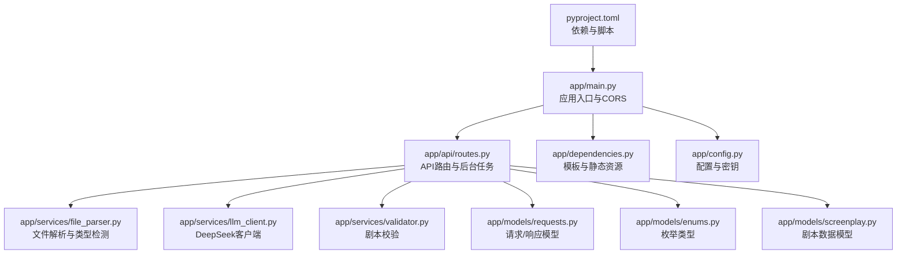
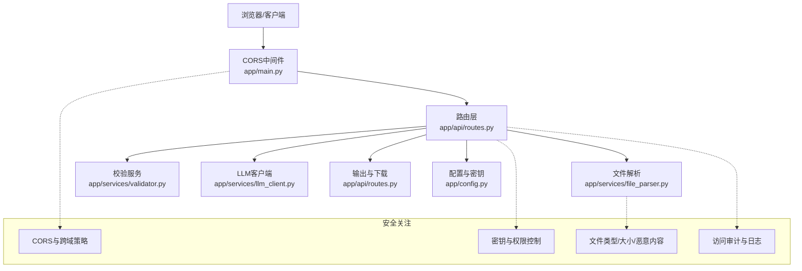
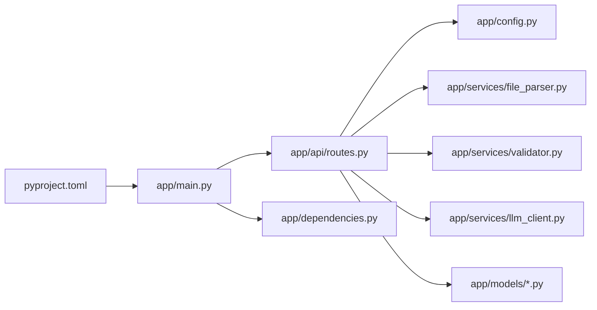

# 安全加固

<cite>
**本文引用的文件**
- [app/main.py](file://app/main.py)
- [app/config.py](file://app/config.py)
- [app/api/routes.py](file://app/api/routes.py)
- [app/dependencies.py](file://app/dependencies.py)
- [app/services/llm_client.py](file://app/services/llm_client.py)
- [app/services/file_parser.py](file://app/services/file_parser.py)
- [app/services/validator.py](file://app/services/validator.py)
- [app/models/requests.py](file://app/models/requests.py)
- [app/models/enums.py](file://app/models/enums.py)
- [app/models/screenplay.py](file://app/models/screenplay.py)
- [pyproject.toml](file://pyproject.toml)
- [README.md](file://README.md)
- [docs/YAML_SCHEMA.md](file://docs/YAML_SCHEMA.md)
</cite>

## 目录
1. [引言](#引言)
2. [项目结构](#项目结构)
3. [核心组件](#核心组件)
4. [架构总览](#架构总览)
5. [详细组件分析](#详细组件分析)
6. [依赖分析](#依赖分析)
7. [性能考虑](#性能考虑)
8. [故障排查指南](#故障排查指南)
9. [结论](#结论)
10. [附录](#附录)

## 引言
本指南面向“小说转剧本工具”的安全加固与运维实践，聚焦以下方面：API密钥管理（轮换、权限控制、访问审计）、文件上传安全（类型校验、大小限制、恶意内容检测）、CORS与跨域安全（含CSRF防护）、身份认证与授权（JWT与会话控制）、HTTPS与TLS证书管理、输入验证与SQL注入防护、DDoS与速率限制、安全审计与入侵检测、以及安全扫描与渗透测试建议。文档在不暴露具体代码的前提下，结合仓库现有实现进行系统化梳理，并给出可操作的加固建议。

## 项目结构
该应用采用FastAPI作为后端框架，围绕“上传-转换-导出”流程组织模块，主要目录与职责如下：
- app/main.py：应用入口、生命周期管理、CORS中间件、静态资源挂载、路由注册
- app/config.py：基于pydantic-settings的配置加载（含DeepSeek API密钥、上传大小、数据目录等）
- app/api/routes.py：业务API（上传、转换、状态查询、结果下载）与后台任务编排
- app/services/*：服务层（LLM客户端、文件解析、校验、章节拆分、角色抽取、YAML导出等）
- app/models/*：Pydantic模型（请求/响应、枚举、剧本结构）
- app/dependencies.py：模板与静态资源路径共享依赖
- pyproject.toml：项目元信息、依赖与脚本入口

图表来源
- [app/main.py:1-46](file://app/main.py#L1-L46)
- [app/api/routes.py:1-313](file://app/api/routes.py#L1-L313)
- [app/services/file_parser.py:1-187](file://app/services/file_parser.py#L1-L187)
- [app/services/llm_client.py:1-103](file://app/services/llm_client.py#L1-L103)
- [app/services/validator.py:1-111](file://app/services/validator.py#L1-L111)
- [app/models/requests.py:1-41](file://app/models/requests.py#L1-L41)
- [app/models/enums.py:1-83](file://app/models/enums.py#L1-L83)
- [app/models/screenplay.py:1-167](file://app/models/screenplay.py#L1-L167)
- [app/dependencies.py:1-9](file://app/dependencies.py#L1-L9)
- [app/config.py:1-45](file://app/config.py#L1-L45)
- [pyproject.toml:1-47](file://pyproject.toml#L1-L47)

章节来源
- [app/main.py:1-46](file://app/main.py#L1-L46)
- [app/config.py:1-45](file://app/config.py#L1-L45)
- [app/api/routes.py:1-313](file://app/api/routes.py#L1-L313)
- [app/dependencies.py:1-9](file://app/dependencies.py#L1-L9)
- [pyproject.toml:1-47](file://pyproject.toml#L1-L47)

## 核心组件
- 应用入口与CORS
  - 在应用启动时创建上传与输出目录；启用CORS中间件，默认允许任意源、方法与头，未做源白名单限制。
  - 静态资源挂载与路由注册。
- 配置与密钥
  - 使用pydantic-settings从环境变量或.env文件加载配置，包含DeepSeek API密钥、基础URL、模型名、最大上传大小、数据目录与LLM参数。
- API路由与作业管理
  - 上传接口支持txt、md、docx、pdf类型检测与大小限制；转换接口支持用户自定义API Key覆盖全局密钥；使用内存字典维护作业状态。
- 文件解析与校验
  - 解析器支持多种格式文本提取与编码容错；校验器对剧本结构完整性进行检查。
- LLM客户端
  - 基于AsyncOpenAI封装，支持重试、超时与结构化输出解析。

章节来源
- [app/main.py:23-39](file://app/main.py#L23-L39)
- [app/config.py:9-44](file://app/config.py#L9-L44)
- [app/api/routes.py:68-128](file://app/api/routes.py#L68-L128)
- [app/services/file_parser.py:16-56](file://app/services/file_parser.py#L16-L56)
- [app/services/validator.py:11-111](file://app/services/validator.py#L11-L111)
- [app/services/llm_client.py:18-103](file://app/services/llm_client.py#L18-L103)

## 架构总览
下图展示从客户端到服务端的关键交互路径与安全关注点。

图表来源
- [app/main.py:23-39](file://app/main.py#L23-L39)
- [app/api/routes.py:68-128](file://app/api/routes.py#L68-L128)
- [app/services/file_parser.py:16-56](file://app/services/file_parser.py#L16-L56)
- [app/services/validator.py:11-111](file://app/services/validator.py#L11-L111)
- [app/services/llm_client.py:18-103](file://app/services/llm_client.py#L18-L103)
- [app/config.py:9-44](file://app/config.py#L9-L44)

## 详细组件分析

### CORS与跨域安全
现状
- CORS中间件默认允许任意源、方法与头，未配置allow_origins白名单，存在跨站风险。
- 未设置credentials、ExposeHeaders、MaxAge等细粒度控制，可能引发CSRF与敏感信息泄露。

加固建议
- 明确可信前端域名加入allow_origins白名单，避免使用通配符。
- 设置allow_credentials为False（若无需携带Cookie），如需则严格限定origins。
- 指定明确的allow_headers与expose_headers，最小化暴露范围。
- 启用Vary: Origin响应头，避免缓存污染。
- 对关键接口增加CSRF Token校验或SameSite Cookie策略（需配合会话层）。

章节来源
- [app/main.py:30-35](file://app/main.py#L30-L35)

### API密钥管理（轮换、权限控制、访问审计）
现状
- 全局密钥通过配置加载；转换接口允许用户传入自定义API Key，覆盖全局密钥。
- 未实现密钥轮换、权限分级、访问审计与异常告警。

加固建议
- 密钥轮换
  - 使用密钥版本号与过期时间字段，定期轮换并禁用旧版本。
  - 在配置中引入密钥轮换窗口与自动切换逻辑。
- 权限控制
  - 为不同用户/租户分配独立密钥与额度配额，接口层按密钥维度鉴权与限流。
  - 对外部LLM调用增加签名或回调校验，防止凭据滥用。
- 访问审计
  - 记录每次LLM调用的摘要（模型、耗时、错误码、用户标识），落盘或上报集中审计平台。
  - 对失败率、异常响应体进行阈值监控与告警。

章节来源
- [app/config.py:18-22](file://app/config.py#L18-L22)
- [app/api/routes.py:122-124](file://app/api/routes.py#L122-L124)
- [app/services/llm_client.py:21-29](file://app/services/llm_client.py#L21-L29)

### 文件上传安全（类型、大小、恶意内容）
现状
- 类型检测基于扩展名映射，未做MIME嗅探与内容二次校验。
- 大小限制以字节为单位，但未限制并发上传数量与总带宽。
- 未对上传文件进行病毒/恶意内容扫描与沙箱隔离。

加固建议
- 类型与内容双重校验
  - 扩展名映射仅作初筛，结合MIME类型与Magic Header进行二次确认。
  - 对docx/pdf等二进制格式，使用可信解析库进行结构合法性检查。
- 大小与并发控制
  - 除单文件大小上限外，增加每用户/每IP的并发数与QPS限制。
  - 对大文件采用分块上传与断点续传，结合进度校验。
- 恶意内容检测
  - 集成轻量级文件特征检测（如YARA规则）与杀毒引擎扫描。
  - 将上传目录与解析目录分离，解析过程在受限环境中执行。

章节来源
- [app/api/routes.py:68-111](file://app/api/routes.py#L68-L111)
- [app/services/file_parser.py:164-177](file://app/services/file_parser.py#L164-L177)
- [app/config.py:24](file://app/config.py#L24)

### 身份认证与授权（JWT与会话控制）
现状
- 未实现登录/注册、JWT签发与刷新、会话持久化与失效控制。

加固建议
- 登录与令牌
  - 提供标准登录接口，返回短期JWT与刷新令牌；刷新令牌存储在HttpOnly Cookie中。
  - JWT声明中包含用户ID、租户ID、权限集合与到期时间。
- 授权与会话
  - 基于RBAC在路由层或依赖中校验权限；对敏感操作（如批量转换、导出历史）要求更高权限。
  - 实现会话黑名单与强制注销；支持多设备登录与踢人。
- CSRF防护
  - 关闭CORS credentials或启用CSRF Token；对关键POST/DELETE接口要求同源或Token校验。

章节来源
- [app/main.py:30-35](file://app/main.py#L30-L35)

### HTTPS与TLS证书管理
现状
- 开发运行通过Uvicorn直接启动，未涉及生产级TLS配置。

加固建议
- 证书与密钥
  - 使用Let’s Encrypt或企业CA签发证书；私钥妥善保管，限制读取权限。
  - 自动续期与健康检查，异常告警。
- TLS策略
  - 禁用弱密码套件与协议版本，启用OCSP Stapling与HSTS。
  - 反向代理统一终止TLS，后端走内网明文或受控隧道。

章节来源
- [app/main.py:42-45](file://app/main.py#L42-L45)

### 输入验证与SQL注入防护
现状
- 未直接使用数据库；所有数据以文件形式存储于本地目录。

加固建议
- 输入验证
  - 对所有外部输入（文件名、路径、参数）进行白名单校验与长度限制。
  - 使用Pydantic模型进行强类型校验，避免类型混淆。
- SQL注入防护
  - 若未来接入数据库，一律使用ORM/参数化查询，禁止动态拼接SQL。
  - 为数据库账户分配最小权限，启用只读账号用于查询。

章节来源
- [app/models/requests.py:6-41](file://app/models/requests.py#L6-L41)
- [app/models/screenplay.py:161-167](file://app/models/screenplay.py#L161-L167)

### DDoS防护与速率限制
现状
- 未实现速率限制与DDoS防护。

加固建议
- 速率限制
  - 基于IP/用户/Key维度实施滑动窗口限流；区分上传、转换、下载不同阈值。
  - 对异常行为（短时间高并发、异常文件类型）触发临时封禁。
- DDoS防护
  - 使用CDN/WAF前置防护，开启CC攻击防护与爬虫识别。
  - 对静态资源启用缓存与压缩，降低后端压力。

章节来源
- [app/api/routes.py:68-128](file://app/api/routes.py#L68-L128)

### 安全审计日志与入侵检测
现状
- 日志记录集中在转换异常与校验统计，缺少访问与操作审计。

加固建议
- 审计日志
  - 记录登录/登出、密钥变更、批量转换、导出历史、文件删除等关键事件。
  - 包含时间戳、用户ID、IP、UA、目标资源、结果状态与异常堆栈。
- 入侵检测
  - 集成SIEM或日志分析平台，对异常模式（高频失败、异常路径、大文件尝试）报警。
  - 定期审查日志与合规性。

章节来源
- [app/api/routes.py:210-217](file://app/api/routes.py#L210-L217)
- [app/services/validator.py:105-108](file://app/services/validator.py#L105-L108)

### 安全扫描与渗透测试
建议
- 代码与依赖
  - 使用Ruff、Bandit、SemGrep进行静态扫描；依赖扫描使用pip-audit/safety。
- 运行时安全
  - 容器镜像最小化，非root运行；Secrets管理使用KMS/Hashi Vault。
- 渗透测试
  - 定期对生产环境进行黑盒/灰盒渗透测试，覆盖上传、CORS、密钥、会话与敏感接口。

章节来源
- [pyproject.toml:28-42](file://pyproject.toml#L28-L42)

## 依赖分析
- 外部依赖
  - FastAPI/Uvicorn：Web框架与ASGI服务器
  - OpenAI兼容客户端：调用第三方LLM
  - Pydantic/Settings：配置与模型校验
  - 文档/PDF解析库：文件解析能力
- 内部耦合
  - 路由层依赖配置、服务层与模型；服务层依赖配置与模型；LLM客户端依赖配置。

图表来源
- [app/api/routes.py:15-23](file://app/api/routes.py#L15-L23)
- [app/config.py:9-44](file://app/config.py#L9-L44)
- [app/services/file_parser.py:1-187](file://app/services/file_parser.py#L1-L187)
- [app/services/validator.py:1-111](file://app/services/validator.py#L1-L111)
- [app/services/llm_client.py:1-103](file://app/services/llm_client.py#L1-L103)
- [app/models/requests.py:1-41](file://app/models/requests.py#L1-L41)
- [app/models/screenplay.py:1-167](file://app/models/screenplay.py#L1-L167)
- [app/main.py:1-46](file://app/main.py#L1-L46)
- [app/dependencies.py:1-9](file://app/dependencies.py#L1-L9)
- [pyproject.toml:13-25](file://pyproject.toml#L13-L25)

章节来源
- [pyproject.toml:13-25](file://pyproject.toml#L13-L25)
- [app/api/routes.py:15-23](file://app/api/routes.py#L15-L23)

## 性能考虑
- 并发与资源
  - 合理设置Uvicorn workers与连接池大小；对LLM调用增加超时与重试退避。
- 存储与IO
  - 上传/输出目录使用高性能磁盘；对大文件采用流式处理与分块写入。
- 缓存与CDN
  - 对静态资源与结果预览启用CDN缓存，减少后端负载。

## 故障排查指南
- CORS相关
  - 现象：跨域失败或预检失败
  - 排查：确认allow_origins是否包含前端域名；检查是否携带凭证；核对暴露头与方法
- 上传失败
  - 现象：文件过大、类型不支持、解析异常
  - 排查：检查max_upload_size_mb与扩展名映射；查看解析器导入依赖；确认文件编码
- 转换异常
  - 现象：LLM调用失败、结果为空、校验报错
  - 排查：核对API Key与模型配置；查看日志与重试次数；检查剧本结构完整性
- 下载问题
  - 现象：结果未生成、文件损坏
  - 排查：确认转换完成状态；检查输出目录权限与文件存在性

章节来源
- [app/main.py:30-35](file://app/main.py#L30-L35)
- [app/api/routes.py:68-111](file://app/api/routes.py#L68-L111)
- [app/services/llm_client.py:70-86](file://app/services/llm_client.py#L70-L86)
- [app/services/validator.py:11-111](file://app/services/validator.py#L11-L111)

## 结论
当前实现具备清晰的上传-转换-导出流程与基础配置管理，但在CORS白名单、密钥轮换与权限控制、文件恶意内容检测、身份认证与授权、HTTPS/TLS、速率限制与审计等方面尚有较大提升空间。建议优先补齐CORS白名单与CSRF防护、实现密钥与会话安全、完善文件解析与内容安全、引入速率限制与审计体系，并在生产环境部署TLS与WAF/DDoS防护。

## 附录
- 配置项参考
  - DeepSeek API密钥与基础URL、模型名
  - 最大上传大小（MB）
  - 数据目录、上传/输出子目录
- 模型与Schema
  - 剧本元数据、角色、场景、结构等模型定义
- 文档与说明
  - YAML Schema说明文档

章节来源
- [app/config.py:18-39](file://app/config.py#L18-L39)
- [app/models/screenplay.py:17-167](file://app/models/screenplay.py#L17-L167)
- [docs/YAML_SCHEMA.md](file://docs/YAML_SCHEMA.md)
- [README.md](file://README.md)