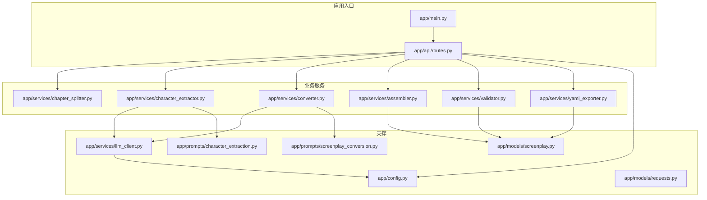
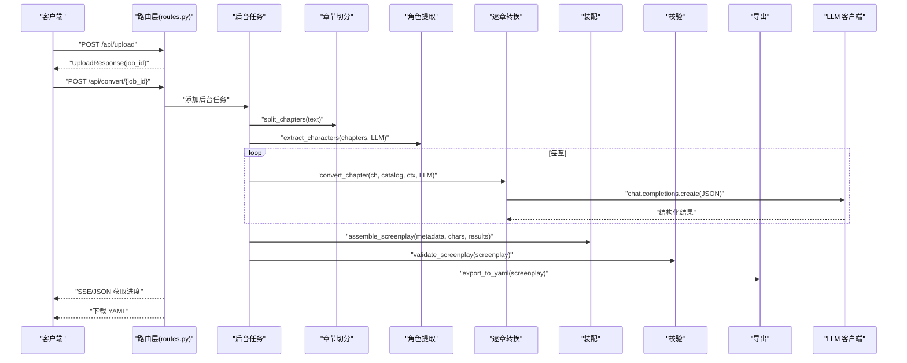
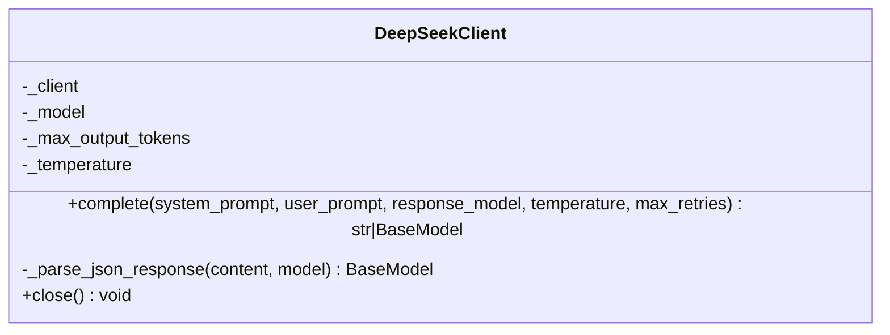
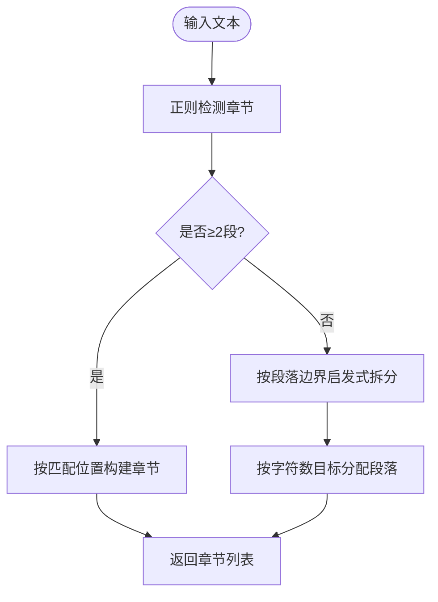
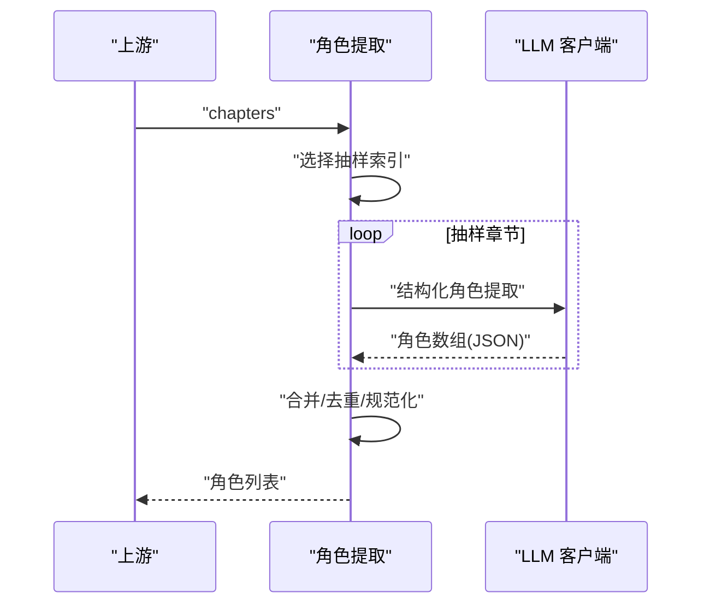
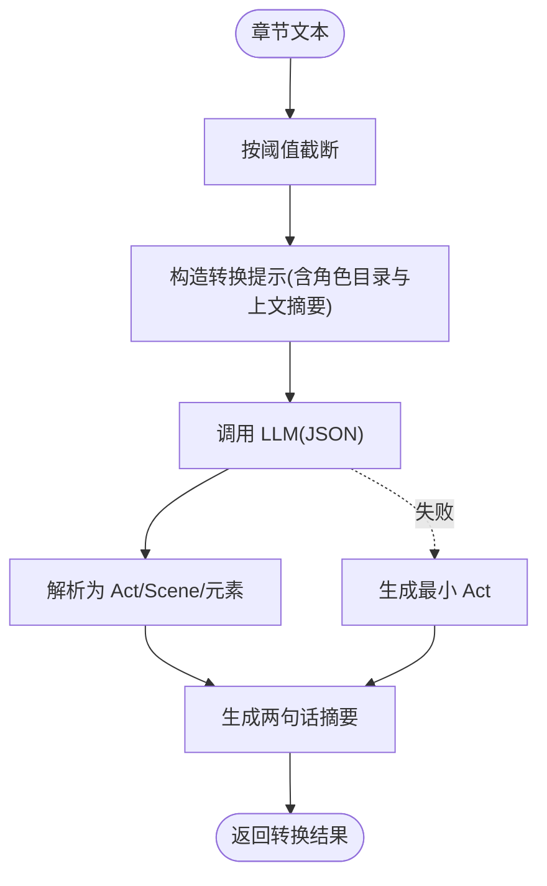
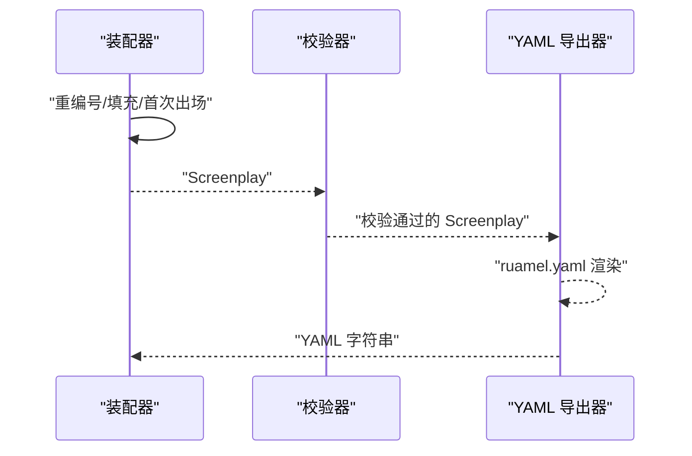
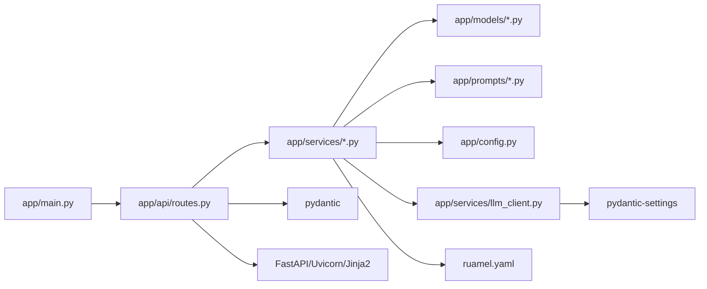

# 性能优化

<cite>
**本文引用的文件**
- [app/main.py](file://app/main.py)
- [app/api/routes.py](file://app/api/routes.py)
- [app/services/llm_client.py](file://app/services/llm_client.py)
- [app/config.py](file://app/config.py)
- [app/services/converter.py](file://app/services/converter.py)
- [app/services/chapter_splitter.py](file://app/services/chapter_splitter.py)
- [app/services/character_extractor.py](file://app/services/character_extractor.py)
- [app/services/assembler.py](file://app/services/assembler.py)
- [app/services/validator.py](file://app/services/validator.py)
- [app/services/yaml_exporter.py](file://app/services/yaml_exporter.py)
- [app/models/screenplay.py](file://app/models/screenplay.py)
- [app/models/requests.py](file://app/models/requests.py)
- [app/prompts/screenplay_conversion.py](file://app/prompts/screenplay_conversion.py)
- [app/prompts/character_extraction.py](file://app/prompts/character_extraction.py)
- [pyproject.toml](file://pyproject.toml)
</cite>

## 目录
1. [简介](#简介)
2. [项目结构](#项目结构)
3. [核心组件](#核心组件)
4. [架构总览](#架构总览)
5. [详细组件分析](#详细组件分析)
6. [依赖分析](#依赖分析)
7. [性能考量与优化策略](#性能考量与优化策略)
8. [故障排查指南](#故障排查指南)
9. [结论](#结论)
10. [附录](#附录)

## 简介
本指南面向小说转剧本工具的性能优化，聚焦以下方面：LLM API 调用优化（请求批量化、缓存策略、并发控制）、数据库查询优化（如存在）、内存使用优化（对象池与垃圾回收调优）、网络 I/O 优化（连接池与超时）、静态资源优化（压缩、缓存与 CDN）、并发处理优化（异步与线程池）、性能测试与基准测试方法论、资源监控与瓶颈识别工具、以及成本优化建议（计算资源配置）。本文以代码为依据，结合系统架构与数据流，给出可操作的优化路径。

## 项目结构
该应用采用 FastAPI + 异步服务的分层架构，核心模块包括：
- 入口与路由：FastAPI 应用入口、CORS 中间件、静态文件挂载、路由注册
- 业务流程：上传、解析、章节切分、角色提取、逐章转换、装配、校验、导出
- LLM 客户端：基于 OpenAI SDK 的异步客户端封装，支持重试与结构化输出
- 配置管理：通过 pydantic-settings 加载 .env 与环境变量
- 模型定义：基于 Pydantic 的 YAML 结构模型，用于验证与序列化
- 提示词模板：面向角色提取与剧本转换的结构化提示

图表来源
- [app/main.py:1-46](file://app/main.py#L1-L46)
- [app/api/routes.py:1-313](file://app/api/routes.py#L1-L313)
- [app/services/chapter_splitter.py:1-163](file://app/services/chapter_splitter.py#L1-L163)
- [app/services/character_extractor.py:1-154](file://app/services/character_extractor.py#L1-L154)
- [app/services/converter.py:1-218](file://app/services/converter.py#L1-L218)
- [app/services/assembler.py:1-101](file://app/services/assembler.py#L1-L101)
- [app/services/validator.py:1-111](file://app/services/validator.py#L1-L111)
- [app/services/yaml_exporter.py:1-57](file://app/services/yaml_exporter.py#L1-L57)
- [app/services/llm_client.py:1-103](file://app/services/llm_client.py#L1-L103)
- [app/config.py:1-45](file://app/config.py#L1-L45)
- [app/prompts/character_extraction.py:1-47](file://app/prompts/character_extraction.py#L1-L47)
- [app/prompts/screenplay_conversion.py:1-91](file://app/prompts/screenplay_conversion.py#L1-L91)
- [app/models/screenplay.py:1-167](file://app/models/screenplay.py#L1-L167)
- [app/models/requests.py:1-41](file://app/models/requests.py#L1-L41)

章节来源
- [app/main.py:1-46](file://app/main.py#L1-L46)
- [app/api/routes.py:1-313](file://app/api/routes.py#L1-L313)

## 核心组件
- FastAPI 应用与生命周期：启动时确保上传与输出目录存在；挂载静态资源；注册路由；提供命令行运行入口
- LLM 客户端：封装异步 OpenAI 客户端，支持响应格式化、指数退避重试、关闭资源
- 转换流水线：章节切分 → 角色提取 → 逐章转换 → 装配 → 校验 → 导出 YAML
- 配置中心：统一加载 API Key、模型参数、超时、令牌上限等
- 数据模型：严格的 Pydantic 模型，保障结构一致性与序列化稳定性
- 提示词模板：面向角色提取与剧本转换的结构化 JSON 输出约束

章节来源
- [app/main.py:14-46](file://app/main.py#L14-L46)
- [app/services/llm_client.py:18-103](file://app/services/llm_client.py#L18-L103)
- [app/api/routes.py:208-313](file://app/api/routes.py#L208-L313)
- [app/config.py:9-45](file://app/config.py#L9-L45)
- [app/models/screenplay.py:161-167](file://app/models/screenplay.py#L161-L167)
- [app/prompts/character_extraction.py:1-47](file://app/prompts/character_extraction.py#L1-L47)
- [app/prompts/screenplay_conversion.py:1-91](file://app/prompts/screenplay_conversion.py#L1-L91)

## 架构总览
下图展示从上传到导出的完整异步流水线，以及 LLM 调用在关键阶段的分布。

图表来源
- [app/api/routes.py:114-185](file://app/api/routes.py#L114-L185)
- [app/api/routes.py:208-313](file://app/api/routes.py#L208-L313)
- [app/services/chapter_splitter.py:42-64](file://app/services/chapter_splitter.py#L42-L64)
- [app/services/character_extractor.py:21-76](file://app/services/character_extractor.py#L21-L76)
- [app/services/converter.py:36-85](file://app/services/converter.py#L36-L85)
- [app/services/assembler.py:18-51](file://app/services/assembler.py#L18-L51)
- [app/services/validator.py:11-111](file://app/services/validator.py#L11-L111)
- [app/services/yaml_exporter.py:14-57](file://app/services/yaml_exporter.py#L14-L57)
- [app/services/llm_client.py:33-87](file://app/services/llm_client.py#L33-L87)

## 详细组件分析

### LLM 客户端（DeepSeekClient）
- 异步封装：基于 AsyncOpenAI，支持结构化 JSON 响应与超时控制
- 重试机制：指数退避重试，避免瞬时错误放大
- 资源管理：显式 close，避免连接泄漏
- 参数来源：从配置读取模型名、最大输出令牌、温度、超时

图表来源
- [app/services/llm_client.py:18-103](file://app/services/llm_client.py#L18-L103)

章节来源
- [app/services/llm_client.py:18-103](file://app/services/llm_client.py#L18-L103)
- [app/config.py:18-32](file://app/config.py#L18-L32)

### 章节切分（ChapterSplitter）
- 双轨策略：正则检测 → LLM 辅助检测 → 基于段落的启发式拆分
- 目标：尽量保证每段约 3000-5000 词，最多 30 段
- 性能要点：正则匹配与段落分布算法，避免 O(n^2) 复杂度

图表来源
- [app/services/chapter_splitter.py:42-135](file://app/services/chapter_splitter.py#L42-L135)

章节来源
- [app/services/chapter_splitter.py:42-135](file://app/services/chapter_splitter.py#L42-L135)

### 角色提取（CharacterExtractor）
- 抽样策略：对前 3 段及中间/末尾段抽样，降低 LLM 调用次数
- 合并与去重：按 slug 合并描述、别名与关系，提升后续转换稳定性
- 回退：若无角色提取结果，生成占位角色

图表来源
- [app/services/character_extractor.py:21-76](file://app/services/character_extractor.py#L21-L76)
- [app/services/llm_client.py:33-87](file://app/services/llm_client.py#L33-L87)

章节来源
- [app/services/character_extractor.py:21-76](file://app/services/character_extractor.py#L21-L76)

### 逐章转换（Converter）
- 截断策略：单章文本超过阈值时截断，避免超出上下文长度
- 连续性上下文：将上一章摘要注入当前章节提示，维持全局连贯
- 失败回退：LLM 解析失败时生成最小可用场景树
- 摘要生成：对本章场景做两句话总结，供下一章使用

图表来源
- [app/services/converter.py:36-85](file://app/services/converter.py#L36-L85)
- [app/prompts/screenplay_conversion.py:76-91](file://app/prompts/screenplay_conversion.py#L76-L91)

章节来源
- [app/services/converter.py:36-85](file://app/services/converter.py#L36-L85)

### 装配与导出（Assembler + YAML Exporter）
- 装配：全局重编号、填充场景出场角色、设置首次出场
- 导出：使用 ruamel.yaml 保持顺序、块风格、Unicode 支持与注释头

图表来源
- [app/services/assembler.py:18-51](file://app/services/assembler.py#L18-L51)
- [app/services/validator.py:11-111](file://app/services/validator.py#L11-L111)
- [app/services/yaml_exporter.py:14-57](file://app/services/yaml_exporter.py#L14-L57)

章节来源
- [app/services/assembler.py:18-51](file://app/services/assembler.py#L18-L51)
- [app/services/yaml_exporter.py:14-57](file://app/services/yaml_exporter.py#L14-L57)

## 依赖分析
- 框架与运行：FastAPI、Uvicorn、Jinja2、multipart
- LLM 客户端：OpenAI SDK（兼容 DeepSeek）
- 模型与配置：Pydantic、pydantic-settings
- 文档与导出：ruamel.yaml
- 工具链：pytest、ruff

图表来源
- [pyproject.toml:8-25](file://pyproject.toml#L8-L25)
- [app/main.py:1-46](file://app/main.py#L1-L46)
- [app/api/routes.py:1-313](file://app/api/routes.py#L1-L313)

章节来源
- [pyproject.toml:8-25](file://pyproject.toml#L8-L25)

## 性能考量与优化策略

### LLM API 调用优化
- 请求批量化
  - 当前：逐章顺序调用，章节间串行
  - 建议：对角色提取与章节转换引入有限并发（受 LLM 并发限制与令牌预算约束），例如使用 asyncio.gather 控制并发度，或分批队列
  - 关键点：避免同时触发过多长上下文请求，防止超时与限流
- 缓存策略
  - 建议：对“章节标题 + 上下文摘要”等稳定提示进行内容哈希缓存，命中则复用 LLM 输出；注意缓存键需包含角色目录与温度等参数
  - 注意：缓存仅适用于非流式、确定性输出
- 并发控制
  - 建议：为 DeepSeekClient 增加连接池与并发上限配置；在路由层对同一用户或作业设置速率限制
- 重试与退避
  - 现状：已实现指数退避
  - 建议：区分瞬时错误与语义错误，对语义错误快速失败并记录
- 结构化输出
  - 现状：已启用 response_format=json_object
  - 建议：在提示中明确 JSON schema，减少解析失败与二次重试

章节来源
- [app/services/llm_client.py:33-87](file://app/services/llm_client.py#L33-L87)
- [app/services/converter.py:66-78](file://app/services/converter.py#L66-L78)
- [app/services/character_extractor.py:52-61](file://app/services/character_extractor.py#L52-L61)

### 数据库查询优化（如存在）
- 本项目未发现数据库依赖，无需查询优化
- 若未来引入数据库（如作业状态持久化），建议：
  - 为作业表建立复合索引（job_id、stage、created_at）
  - 使用分页与覆盖索引查询状态
  - 对热点字段使用物化视图或缓存

### 内存使用优化
- 对象池与复用
  - 建议：对大型字符串（章节文本）与提示模板进行池化；对 Pydantic 模型实例在多处使用时避免重复构造
- 垃圾回收调优
  - 建议：在长任务中定期触发 gc.collect，避免长时间持有大对象导致内存峰值过高
- 流式处理
  - 建议：对超大文件上传与导出采用流式写入，避免一次性加载至内存

### 网络 I/O 优化
- 连接池配置
  - 建议：为 LLM 客户端设置连接池大小与复用策略；在反向代理（如 Nginx）侧启用 keep-alive
- 超时设置
  - 现状：已设置 llm_timeout
  - 建议：区分 connect/read 超时；对 SSE/下载接口设置合理的 readtimeout
- 负载均衡与限流
  - 建议：在网关层对 LLM API Key 进行速率限制，避免单 Key 暴走

章节来源
- [app/config.py:27-32](file://app/config.py#L27-L32)
- [app/services/llm_client.py:24-28](file://app/services/llm_client.py#L24-L28)

### 静态资源优化
- 压缩与缓存
  - 建议：开启 gzip/br 压缩；设置强缓存策略（ETag/Last-Modified）；版本化静态资源
- CDN 配置
  - 建议：将 /static 资源接入 CDN，缩短首字节时间
- 资源打包
  - 建议：前端资源进行 Tree Shaking 与按需加载

章节来源
- [app/main.py:37-37](file://app/main.py#L37-L37)

### 并发处理优化
- 异步编程
  - 现状：已广泛使用 asyncio；路由与服务均为异步
  - 建议：在 LLM 调用处使用 asyncio.Semaphore 控制并发；对 CPU 密集步骤（如大文本处理）使用进程池
- 线程池配置
  - 建议：对阻塞 I/O（文件读写、PDF/DOC 解析）使用线程池；线程数与 CPU 核心数匹配
- 事件驱动
  - 建议：SSE 状态推送已较高效；可考虑引入消息队列（如 Redis/RabbitMQ）解耦后台任务

章节来源
- [app/api/routes.py:131-158](file://app/api/routes.py#L131-L158)
- [app/api/routes.py:208-313](file://app/api/routes.py#L208-L313)

### 性能测试与基准测试
- 方法论
  - 基准场景：不同长度的小说（短/中/长）与不同章节数量，测量端到端耗时、CPU/内存峰值、LLM 调用次数与费用
  - 指标：P50/P95 延迟、吞吐量、错误率、重试率、缓存命中率
  - 工具：locust（并发场景）、pytest-asyncio（单元与集成）、py-spy（火焰图）
- 建议的测试用例
  - 单测：角色提取、章节切分、转换器、装配器、导出器
  - 集成：端到端上传→转换→导出→校验
  - 压测：多用户并发上传与转换

章节来源
- [pyproject.toml:27-42](file://pyproject.toml#L27-L42)

### 资源监控与瓶颈识别
- 监控指标
  - 应用层：QPS、P95 延迟、错误率、并发数、队列长度
  - LLM 层：请求耗时、Token 使用量、费用、限流触发次数
  - 资源层：CPU、内存、磁盘 IO、网络带宽
- 工具推荐
  - APM：OpenTelemetry + Jaeger/Zipkin
  - 指标：Prometheus + Grafana
  - 日志：ELK/Fluentd
  - 火焰图：py-spy、perf

### 成本优化建议
- 计算资源
  - 建议：根据 P95 延迟与并发需求，选择合适的实例规格；对低峰期降配或自动扩缩容
- 存储与带宽
  - 建议：临时文件及时清理；CDN 缓存策略最大化命中率
- LLM 成本
  - 建议：启用结构化输出与提示词优化，减少 Token 消耗；对重复任务启用缓存；批量与并发控制在预算内

## 故障排查指南
- LLM 调用失败
  - 现象：异常日志、重试后仍失败
  - 排查：检查 API Key、超时设置、网络连通性、提示长度与 JSON schema 匹配
- 转换结果为空或不完整
  - 现象：章节转换失败回退为最小场景
  - 排查：检查截断阈值、角色目录完整性、提示模板一致性
- 校验失败
  - 现象：校验器报告缺失字段或引用无效
  - 排查：确认装配阶段的角色出场与首次出场逻辑、场景元素完整性
- 导出异常
  - 现象：YAML 导出失败或编码问题
  - 排查：确认 ruamel.yaml 配置、Unicode 支持、输出文件权限

章节来源
- [app/services/llm_client.py:80-86](file://app/services/llm_client.py#L80-L86)
- [app/services/converter.py:73-76](file://app/services/converter.py#L73-L76)
- [app/services/validator.py:30-99](file://app/services/validator.py#L30-L99)
- [app/services/yaml_exporter.py:14-57](file://app/services/yaml_exporter.py#L14-L57)

## 结论
本项目以异步 FastAPI 为核心，围绕 LLM 的结构化输出与严格的数据模型构建了完整的转换流水线。性能优化的关键在于：合理控制 LLM 并发与重试、引入提示缓存、优化提示长度与结构、加强内存与 I/O 管理、完善监控与压测体系，并在成本可控前提下平衡质量与速度。建议优先实施提示缓存与并发上限控制，再逐步引入连接池与 CDN 等基础设施优化。

## 附录
- 关键配置项参考
  - LLM 参数：模型名、最大输出令牌、温度、超时
  - 文件参数：最大上传大小、数据目录
- 建议的配置扩展
  - LLM 并发上限、连接池大小、提示缓存 TTL、SSE 心跳间隔、静态资源缓存策略

章节来源
- [app/config.py:18-40](file://app/config.py#L18-L40)