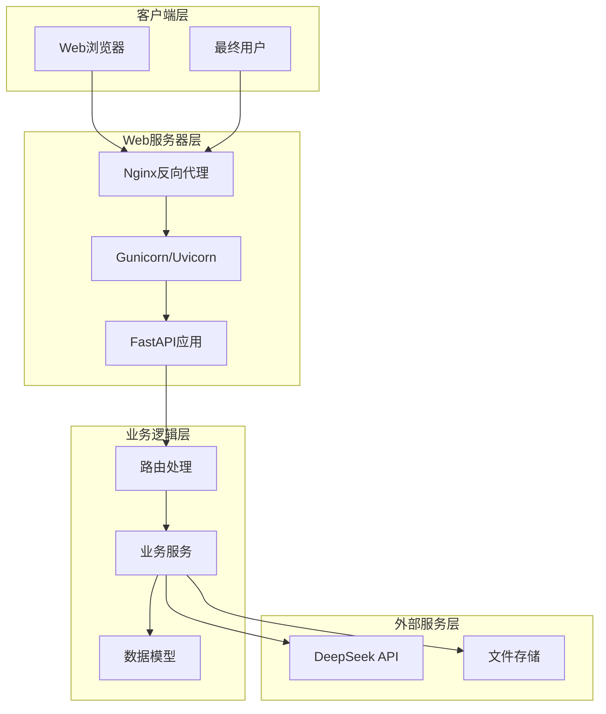
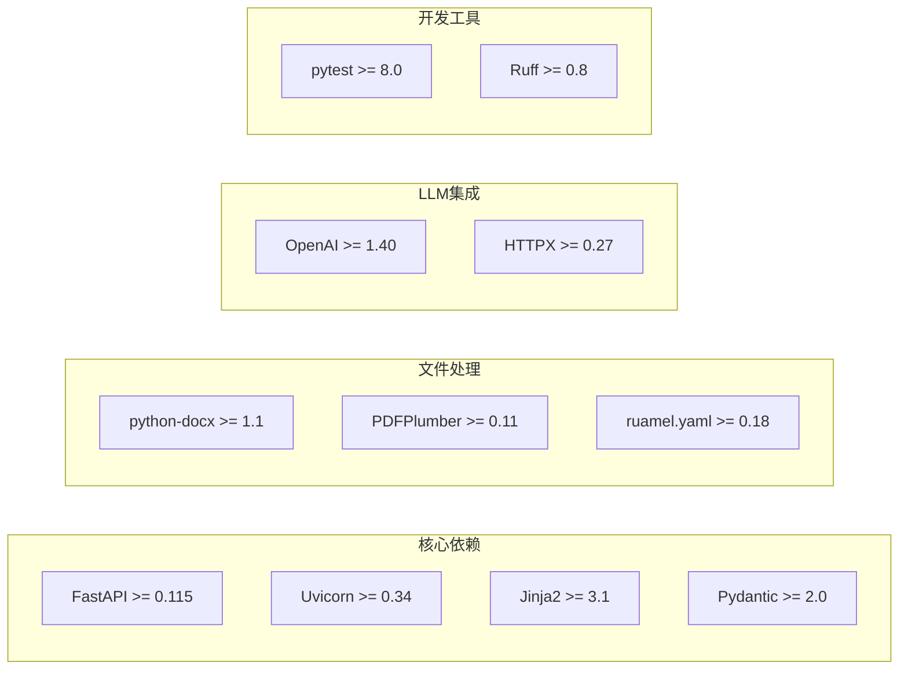

# 生产部署

<cite>
**本文档引用的文件**
- [README.md](file://README.md)
- [pyproject.toml](file://pyproject.toml)
- [app/main.py](file://app/main.py)
- [app/config.py](file://app/config.py)
- [app/api/routes.py](file://app/api/routes.py)
- [app/services/llm_client.py](file://app/services/llm_client.py)
- [app/services/converter.py](file://app/services/converter.py)
- [app/services/assembler.py](file://app/services/assembler.py)
- [app/services/validator.py](file://app/services/validator.py)
- [app/models/screenplay.py](file://app/models/screenplay.py)
- [app/templates/index.html](file://app/templates/index.html)
- [app/dependencies.py](file://app/dependencies.py)
</cite>

## 目录
1. [简介](#简介)
2. [项目架构概览](#项目架构概览)
3. [部署前准备](#部署前准备)
4. [直接部署方案](#直接部署方案)
5. [Docker容器化部署](#docker容器化部署)
6. [云平台部署](#云平台部署)
7. [Nginx反向代理配置](#nginx反向代理配置)
8. [Gunicorn/Uvicorn生产配置](#gunicornuvicorn生产配置)
9. [域名配置与SSL证书](#域名配置与ssl证书)
10. [防火墙与安全组配置](#防火墙与安全组配置)
11. [数据库与文件存储配置](#数据库与文件存储配置)
12. [自动化部署脚本](#自动化部署脚本)
13. [部署后验证与健康检查](#部署后验证与健康检查)
14. [故障排除指南](#故障排除指南)
15. [性能优化建议](#性能优化建议)

## 简介

小说转剧本工具是一个基于FastAPI的AI驱动应用程序，能够将小说文本自动转换为结构化的YAML剧本格式。该工具提供了完整的Web界面，支持多种文件格式的上传和转换，包括TXT、Markdown、DOCX和PDF格式。

该应用的核心特性包括：
- 多格式文件解析和处理
- 智能章节检测和分割
- 基于LLM的角色提取和对话生成
- 结构化YAML输出和验证
- 实时进度监控和状态更新

## 项目架构概览



**图表来源**
- [app/main.py:1-46](file://app/main.py#L1-L46)
- [app/api/routes.py:1-313](file://app/api/routes.py#L1-L313)
- [app/services/llm_client.py:1-103](file://app/services/llm_client.py#L1-L103)

**章节来源**
- [app/main.py:1-46](file://app/main.py#L1-L46)
- [app/api/routes.py:1-313](file://app/api/routes.py#L1-L313)

## 部署前准备

### 环境要求

- **Python版本**: >= 3.10
- **操作系统**: Linux/Unix系统（推荐Ubuntu 20.04+）
- **内存**: 至少2GB RAM（建议4GB+）
- **存储空间**: 至少5GB可用空间
- **网络**: 出站网络访问DeepSeek API

### 依赖组件



**图表来源**
- [pyproject.toml:13-25](file://pyproject.toml#L13-L25)
- [pyproject.toml:28-32](file://pyproject.toml#L28-L32)

**章节来源**
- [pyproject.toml:1-47](file://pyproject.toml#L1-L47)
- [README.md:30-34](file://README.md#L30-L34)

## 直接部署方案

### 1. 系统环境准备

```bash
# 更新系统包
sudo apt update && sudo apt upgrade -y

# 安装Python和相关工具
sudo apt install python3 python3-pip python3-venv nginx git -y

# 创建应用用户
sudo useradd -m -U -d /home/novel-app novel-app
sudo passwd novel-app
```

### 2. 应用安装和配置

```bash
# 切换到应用用户
sudo -u novel-app -H bash
cd /home/novel-app

# 克隆项目
git clone https://github.com/your-repo/novel.git
cd novel

# 创建虚拟环境
python3 -m venv .venv
source .venv/bin/activate

# 安装依赖
pip install --upgrade pip
pip install -e ".[dev]"

# 复制并配置环境变量
cp .env.example .env
```

### 3. 配置文件设置

编辑 `.env` 文件：

```env
DEEPSEEK_API_KEY=sk-your-deepseek-key-here
DEEPSEEK_BASE_URL=https://api.deepseek.com
DEEPSEEK_MODEL=deepseek-chat
MAX_UPLOAD_SIZE_MB=50
DATA_DIR=/home/novel-app/data
```

### 4. 启动应用

```bash
# 在虚拟环境中启动
source .venv/bin/activate
python -m uvicorn app.main:app --host 0.0.0.0 --port 8008 --workers 2
```

**章节来源**
- [README.md:35-68](file://README.md#L35-L68)
- [app/main.py:42-46](file://app/main.py#L42-L46)

## Docker容器化部署

### Dockerfile构建

```dockerfile
FROM python:3.10-slim

# 设置工作目录
WORKDIR /app

# 复制项目文件
COPY . .

# 安装系统依赖
RUN apt-get update && apt-get install -y \
    gcc \
    && rm -rf /var/lib/apt/lists/*

# 安装Python依赖
RUN pip install --upgrade pip
RUN pip install -e ".[dev]"

# 创建非root用户
RUN useradd --create-home --shell /bin/bash novel-user
USER novel-user
WORKDIR /home/novel-user

# 暴露端口
EXPOSE 8000

# 健康检查
HEALTHCHECK --interval=30s --timeout=3s --start-period=5s --retries=3 \
    CMD curl -f http://localhost:8000/health || exit 1

# 启动命令
CMD ["python", "-m", "uvicorn", "app.main:app", "--host", "0.0.0.0", "--port", "8000"]
```

### Docker Compose配置

```yaml
version: '3.8'

services:
  novel-app:
    build: .
    container_name: novel-app
    restart: unless-stopped
    ports:
      - "8000:8000"
    environment:
      - DEEPSEEK_API_KEY=${DEEPSEEK_API_KEY}
      - DEEPSEEK_BASE_URL=${DEEPSEEK_BASE_URL}
      - DATA_DIR=/app/data
    volumes:
      - ./data:/app/data
      - ./logs:/app/logs
    healthcheck:
      test: ["CMD", "curl", "-f", "http://localhost:8000/health"]
      interval: 30s
      timeout: 10s
      retries: 3
      start_period: 40s

  nginx:
    image: nginx:alpine
    container_name: novel-nginx
    restart: unless-stopped
    ports:
      - "80:80"
      - "443:443"
    depends_on:
      - novel-app
    volumes:
      - ./nginx.conf:/etc/nginx/nginx.conf
      - ./ssl:/etc/nginx/ssl
    links:
      - novel-app

volumes:
  data:
  logs:
```

**章节来源**
- [pyproject.toml:1-47](file://pyproject.toml#L1-L47)

## 云平台部署

### AWS部署方案

#### EC2实例配置

```bash
# SSH连接到EC2实例
ssh -i your-key.pem ubuntu@your-instance-ip

# 安装Docker
sudo apt update
sudo apt install docker.io docker-compose -y

# 创建Docker网络
docker network create novel-network

# 启动应用容器
docker-compose up -d
```

#### ECS部署配置

```yaml
# ecs-task-definition.json
{
  "family": "novel-app",
  "networkMode": "awsvpc",
  "requiresCompatibilities": ["FARGATE"],
  "cpu": "512",
  "memory": "1024",
  "taskRoleArn": "arn:aws:iam::YOUR_ACCOUNT:role/ECS-TASK-ROLE",
  "executionRoleArn": "arn:aws:iam::YOUR_ACCOUNT:role/ECS-EXECUTION-ROLE",
  "containerDefinitions": [
    {
      "name": "novel-app",
      "image": "YOUR_REGISTRY/novel-app:latest",
      "essential": true,
      "environment": [
        {
          "name": "DEEPSEEK_API_KEY",
          "valueFrom": "arn:aws:ssm:us-east-1:YOUR_ACCOUNT:parameter/novel/deepseek/key"
        }
      ],
      "portMappings": [
        {
          "containerPort": 8000,
          "protocol": "tcp"
        }
      ],
      "healthCheck": {
        "command": ["CMD-SHELL", "curl -f http://localhost:8000/health || exit 1"],
        "interval": 30,
        "timeout": 5,
        "retries": 3
      }
    }
  ]
}
```

### Azure部署方案

#### Azure Container Instances

```bash
# 创建资源组
az group create --name novel-rg --location eastus

# 创建容器实例
az container create \
  --resource-group novel-rg \
  --name novel-app \
  --image yourregistry.azurecr.io/novel-app:latest \
  --ports 8000 \
  --dns-name-label novel-app-$RANDOM \
  --environment-variables DEEPSEEK_API_KEY=your-key \
  --secure-ports 8000 \
  --restart-policy OnFailure
```

**章节来源**
- [README.md:15-27](file://README.md#L15-L27)

## Nginx反向代理配置

### 基础反向代理配置

```nginx
upstream novel_backend {
    server 127.0.0.1:8008;
    server 127.0.0.1:8009;
    server 127.0.0.1:8010;
}

server {
    listen 80;
    server_name your-domain.com www.your-domain.com;
    
    # 重定向到HTTPS
    return 301 https://$server_name$request_uri;
}

server {
    listen 443 ssl http2;
    server_name your-domain.com www.your-domain.com;
    
    # SSL证书配置
    ssl_certificate /path/to/your/certificate.crt;
    ssl_certificate_key /path/to/your/private.key;
    ssl_trusted_certificate /path/to/your/chain.crt;
    
    # SSL安全配置
    ssl_protocols TLSv1.2 TLSv1.3;
    ssl_ciphers ECDHE-RSA-AES256-GCM-SHA512:DHE-RSA-AES256-GCM-SHA512:ECDHE-RSA-AES256-GCM-SHA384:DHE-RSA-AES256-GCM-SHA384;
    ssl_prefer_server_ciphers off;
    ssl_session_cache shared:SSL:10m;
    ssl_session_timeout 10m;
    
    # 安全头
    add_header X-Frame-Options "SAMEORIGIN" always;
    add_header X-XSS-Protection "1; mode=block" always;
    add_header X-Content-Type-Options "nosniff" always;
    add_header Referrer-Policy "no-referrer-when-downgrade" always;
    
    # Gzip压缩
    gzip on;
    gzip_vary on;
    gzip_min_length 1024;
    gzip_types text/plain text/css application/json application/javascript text/xml application/xml;
    
    # 负载均衡配置
    location / {
        proxy_pass http://novel_backend;
        proxy_set_header Host $host;
        proxy_set_header X-Real-IP $remote_addr;
        proxy_set_header X-Forwarded-For $proxy_add_x_forwarded_for;
        proxy_set_header X-Forwarded-Proto $scheme;
        
        # 超时设置
        proxy_connect_timeout 30s;
        proxy_send_timeout 30s;
        proxy_read_timeout 30s;
        
        # 缓冲设置
        proxy_buffering on;
        proxy_buffer_size 128k;
        proxy_buffers 4 256k;
        proxy_busy_buffers_size 256k;
        
        # 错误处理
        proxy_next_upstream error timeout invalid_header http_500 http_502 http_503;
        proxy_next_upstream_tries 3;
    }
    
    # 静态文件缓存
    location /static/ {
        alias /path/to/app/static/;
        expires 1y;
        add_header Cache-Control "public, immutable";
        gzip_static on;
    }
    
    # 健康检查端点
    location /health {
        access_log off;
        return 200 "healthy\n";
        add_header Content-Type text/plain;
    }
}
```

### WebSocket支持配置

```nginx
# 用于支持Server-Sent Events
location /api/status/ {
    proxy_pass http://novel_backend;
    proxy_set_header Host $host;
    proxy_set_header X-Real-IP $remote_addr;
    proxy_set_header X-Forwarded-For $proxy_add_x_forwarded_for;
    proxy_set_header X-Forwarded-Proto $scheme;
    
    # 关键的WebSocket/SSE配置
    proxy_http_version 1.1;
    proxy_set_header Upgrade $http_upgrade;
    proxy_set_header Connection "upgrade";
    
    # 保持连接
    proxy_set_header Connection "";
    proxy_connect_timeout 30s;
    proxy_send_timeout 30s;
    proxy_read_timeout 86400s;
    proxy_buffering off;
}
```

**章节来源**
- [app/api/routes.py:131-158](file://app/api/routes.py#L131-L158)

## Gunicorn/Uvicorn生产配置

### Gunicorn配置文件

```python
# gunicorn.conf.py
import os

# 基本配置
bind = "0.0.0.0:8000"
workers = int(os.environ.get('WEB_CONCURRENCY', 2))
worker_class = "uvicorn.workers.UvicornWorker"
worker_connections = 1000
timeout = 120
keepalive = 2

# 性能优化
preload = False
max_requests = 1000
max_requests_jitter = 100
graceful_timeout = 30

# 日志配置
accesslog = "/var/log/gunicorn/access.log"
errorlog = "/var/log/gunicorn/error.log"
access_log_format = '%(h)s %(l)s %(u)s %(t)s "%(r)s" %(s)s %(b)s %(T)s %(D)s %(p)s'

# 进程管理
daemon = False
pidfile = "/tmp/gunicorn.pid"
user = "novel-app"
group = "novel-app"
umask = 0o007

# 环境变量
env = {
    'DEEPSEEK_API_KEY': os.environ.get('DEEPSEEK_API_KEY'),
    'DEEPSEEK_BASE_URL': os.environ.get('DEEPSEEK_BASE_URL'),
    'DATA_DIR': '/home/novel-app/data'
}
```

### Uvicorn配置参数

```bash
# 生产环境启动命令
uvicorn app.main:app \
    --host 0.0.0.0 \
    --port 8000 \
    --workers 2 \
    --log-level info \
    --forwarded-allow-ips "*" \
    --proxy-headers \
    --limit-concurrency 1000 \
    --backlog 2048 \
    --limit-max-requests 1000 \
    --timeout-keep-alive 2
```

### systemd服务配置

```ini
# /etc/systemd/system/novel-app.service
[Unit]
Description=Novel to Screenplay Application
After=network.target

[Service]
Type=simple
User=novel-app
Group=novel-app
WorkingDirectory=/home/novel-app/novel
Environment=PATH=/home/novel-app/novel/.venv/bin:$PATH
Environment=DEEPSEEK_API_KEY=your-api-key
ExecStart=/home/novel-app/novel/.venv/bin/gunicorn -c gunicorn.conf.py app.main:app
Restart=always
RestartSec=10

# 进程限制
LimitNOFILE=65536
LimitNPROC=32768

# 日志配置
StandardOutput=journal
StandardError=journal
SyslogIdentifier=NovelApp

[Install]
WantedBy=multi-user.target
```

**章节来源**
- [app/main.py:42-46](file://app/main.py#L42-L46)
- [pyproject.toml:34-35](file://pyproject.toml#L34-L35)

## 域名配置与SSL证书

### DNS配置

```dns
; A记录
@    IN  A    203.0.113.10
www  IN  A    203.0.113.10

; CNAME记录
api  IN  CNAME  novel-app.your-domain.com

; TXT记录（用于验证）
@    IN  TXT    "v=spf1 include:_spf.google.com ~all"
```

### Let's Encrypt SSL证书

```bash
# 安装Certbot
sudo apt install certbot python3-certbot-nginx -y

# 获取证书
sudo certbot --nginx -d your-domain.com -d www.your-domain.com

# 自动续期
sudo crontab -e
# 添加以下行
0 12 * * * /usr/bin/certbot renew --quiet
```

### SSL配置最佳实践

```nginx
# SSL安全配置
ssl_protocols TLSv1.2 TLSv1.3;
ssl_ciphers ECDHE-RSA-AES256-GCM-SHA512:DHE-RSA-AES256-GCM-SHA512:ECDHE-RSA-AES256-GCM-SHA384:DHE-RSA-AES256-GCM-SHA384;
ssl_prefer_server_ciphers off;
ssl_session_cache shared:SSL:10m;
ssl_session_timeout 10m;
ssl_stapling on;
ssl_stapling_verify on;

# HSTS配置
add_header Strict-Transport-Security "max-age=31536000; includeSubDomains" always;
add_header X-Frame-Options "SAMEORIGIN" always;
add_header X-XSS-Protection "1; mode=block" always;
add_header X-Content-Type-Options "nosniff" always;
```

**章节来源**
- [README.md:52-60](file://README.md#L52-L60)

## 防火墙与安全组配置

### UFW防火墙配置

```bash
# 启用UFW
sudo ufw enable

# 配置规则
sudo ufw default deny incoming
sudo ufw default allow outgoing

# 允许SSH
sudo ufw allow ssh

# 允许HTTP/HTTPS
sudo ufw allow 80/tcp
sudo ufw allow 443/tcp

# 允认应用端口
sudo ufw allow 8000/tcp
sudo ufw allow 8008/tcp

# 允许特定IP访问管理端口
sudo ufw allow from 192.168.1.0/24 to any port 8000
```

### AWS安全组配置

```json
{
  "SecurityGroupName": "novel-app-sg",
  "SecurityGroupRules": [
    {
      "IpProtocol": "tcp",
      "FromPort": 80,
      "ToPort": 80,
      "CidrIpv4": "0.0.0.0/0",
      "RuleAction": "allow"
    },
    {
      "IpProtocol": "tcp",
      "FromPort": 443,
      "ToPort": 443,
      "CidrIpv4": "0.0.0.0/0",
      "RuleAction": "allow"
    },
    {
      "IpProtocol": "tcp",
      "FromPort": 22,
      "ToPort": 22,
      "CidrIpv4": "203.0.113.0/24",
      "RuleAction": "allow"
    },
    {
      "IpProtocol": "tcp",
      "FromPort": 8000,
      "ToPort": 8000,
      "CidrIpv4": "0.0.0.0/0",
      "RuleAction": "allow"
    }
  ]
}
```

### 内网访问控制

```bash
# 仅允许特定IP访问管理端点
sudo iptables -A INPUT -p tcp --dport 8000 -s 192.168.1.0/24 -j ACCEPT
sudo iptables -A INPUT -p tcp --dport 8000 -j DROP

# 限制并发连接数
sudo iptables -A INPUT -p tcp --dport 80 -m connlimit --connlimit-above 100 -j REJECT
```

**章节来源**
- [app/config.py:23-31](file://app/config.py#L23-L31)

## 数据库与文件存储配置

### 文件存储配置

```python
# 应用配置类
class Settings(BaseSettings):
    # ... 其他配置 ...
    
    # 文件存储配置
    data_dir: Path = Path("./data")
    
    @property
    def upload_dir(self) -> Path:
        return self.data_dir / "uploads"
    
    @property
    def output_dir(self) -> Path:
        return self.data_dir / "outputs"
    
    @property
    def log_dir(self) -> Path:
        return self.data_dir / "logs"
```

### 存储卷挂载

```yaml
# Docker Compose存储配置
volumes:
  novel-data:
    driver: local
    driver_opts:
      type: none
      o: bind
      device: /home/novel-app/data
  novel-logs:
    driver: local
    driver_opts:
      type: none
      o: bind
      device: /home/novel-app/logs

services:
  novel-app:
    # ... 其他配置 ...
    volumes:
      - novel-data:/app/data
      - novel-logs:/app/logs
      - ./logs:/app/logs
```

### 云存储集成

```python
# AWS S3存储配置
import boto3
from botocore.exceptions import ClientError

class S3Storage:
    def __init__(self):
        self.s3_client = boto3.client(
            's3',
            aws_access_key_id=os.getenv('AWS_ACCESS_KEY_ID'),
            aws_secret_access_key=os.getenv('AWS_SECRET_ACCESS_KEY'),
            region_name=os.getenv('AWS_REGION')
        )
        self.bucket_name = os.getenv('S3_BUCKET_NAME')
    
    def upload_file(self, file_path, object_name):
        try:
            self.s3_client.upload_file(file_path, self.bucket_name, object_name)
            return True
        except ClientError as e:
            logging.error(f"Upload failed: {e}")
            return False
```

**章节来源**
- [app/config.py:33-39](file://app/config.py#L33-L39)

## 自动化部署脚本

### 部署脚本

```bash
#!/bin/bash

# deploy.sh - 自动化部署脚本

set -e

# 配置变量
APP_NAME="novel-app"
APP_USER="novel-app"
APP_DIR="/home/${APP_USER}/${APP_NAME}"
LOG_DIR="/var/log/${APP_NAME}"

# 颜色定义
RED='\033[0;31m'
GREEN='\033[0;32m'
YELLOW='\033[1;33m'
NC='\033[0m'

# 日志函数
log() {
    echo -e "${GREEN}[INFO]${NC} $(date '+%Y-%m-%d %H:%M:%S') - $1"
}

warn() {
    echo -e "${YELLOW}[WARN]${NC} $(date '+%Y-%m-%d %H:%M:%S') - $1"
}

error() {
    echo -e "${RED}[ERROR]${NC} $(date '+%Y-%m-%d %H:%M:%S') - $1"
}

# 检查依赖
check_dependencies() {
    log "检查依赖..."
    
    deps=("git" "python3" "pip" "systemctl" "ufw")
    for dep in "${deps[@]}"; do
        if ! command -v "$dep" &> /dev/null; then
            error "缺少依赖: $dep"
            exit 1
        fi
    done
    
    log "所有依赖已就绪"
}

# 更新代码
update_code() {
    log "更新代码..."
    
    cd /home/${APP_USER}
    
    if [ -d "${APP_DIR}" ]; then
        cd ${APP_DIR}
        git pull origin main
    else
        git clone https://github.com/your-repo/novel.git ${APP_DIR}
        cd ${APP_DIR}
    fi
    
    log "代码更新完成"
}

# 安装依赖
install_dependencies() {
    log "安装Python依赖..."
    
    cd ${APP_DIR}
    
    # 激活虚拟环境
    if [ ! -d ".venv" ]; then
        python3 -m venv .venv
    fi
    
    source .venv/bin/activate
    
    # 升级pip
    pip install --upgrade pip
    
    # 安装依赖
    pip install -e ".[dev]"
    
    log "依赖安装完成"
}

# 配置环境变量
configure_env() {
    log "配置环境变量..."
    
    cd ${APP_DIR}
    
    # 复制环境变量模板
    if [ ! -f ".env" ]; then
        cp .env.example .env
    fi
    
    # 设置权限
    chown -R ${APP_USER}:${APP_USER} .env
    chmod 600 .env
    
    log "环境变量配置完成"
}

# 配置系统服务
setup_systemd() {
    log "配置systemd服务..."
    
    # 创建服务文件
    cat > /etc/systemd/system/${APP_NAME}.service << EOF
[Unit]
Description=${APP_NAME}
After=network.target

[Service]
Type=simple
User=${APP_USER}
Group=${APP_USER}
WorkingDirectory=${APP_DIR}
Environment=PATH=${APP_DIR}/.venv/bin:\$PATH
ExecStart=${APP_DIR}/.venv/bin/gunicorn -c gunicorn.conf.py app.main:app
Restart=always
RestartSec=10

[Install]
WantedBy=multi-user.target
EOF
    
    # 重新加载systemd
    systemctl daemon-reload
    
    log "systemd服务配置完成"
}

# 配置防火墙
setup_firewall() {
    log "配置防火墙..."
    
    # 允许必要的端口
    ufw allow 22/tcp
    ufw allow 80/tcp
    ufw allow 443/tcp
    ufw allow 8000/tcp
    
    log "防火墙配置完成"
}

# 启动应用
start_app() {
    log "启动应用..."
    
    # 启用并启动服务
    systemctl enable ${APP_NAME}
    systemctl start ${APP_NAME}
    
    # 检查状态
    if systemctl is-active --quiet ${APP_NAME}; then
        log "应用启动成功"
    else
        error "应用启动失败"
        systemctl status ${APP_NAME}
        exit 1
    fi
}

# 主函数
main() {
    log "开始自动化部署..."
    
    check_dependencies
    update_code
    install_dependencies
    configure_env
    setup_systemd
    setup_firewall
    start_app
    
    log "部署完成!"
    echo "访问地址: http://your-domain.com"
    echo "管理端口: http://your-domain.com:8000"
}

# 执行主函数
main
```

### CI/CD流水线配置

```yaml
# .github/workflows/deploy.yml
name: Deploy to Production

on:
  push:
    branches: [ main ]

jobs:
  deploy:
    runs-on: ubuntu-latest
    
    steps:
    - name: Checkout code
      uses: actions/checkout@v4
    
    - name: Setup Python
      uses: actions/setup-python@v4
      with:
        python-version: '3.10'
    
    - name: Install dependencies
      run: |
        python -m pip install --upgrade pip
        pip install -e ".[dev]"
    
    - name: Run tests
      run: |
        python -m pytest tests/ -v
    
    - name: Deploy to production
      run: |
        ssh ${{ secrets.SSH_USER }}@${{ secrets.SSH_HOST }} << EOF
        cd /home/novel-app/novel
        git pull origin main
        source .venv/bin/activate
        pip install -e ".[dev]"
        systemctl restart novel-app
        EOF
```

**章节来源**
- [app/main.py:42-46](file://app/main.py#L42-L46)

## 部署后验证与健康检查

### 健康检查端点

```python
# 添加健康检查路由
@router.get("/health")
async def health_check():
    """健康检查端点"""
    return {
        "status": "healthy",
        "timestamp": datetime.utcnow().isoformat(),
        "version": "1.0.0",
        "services": {
            "database": "connected",
            "storage": "accessible",
            "llm_api": "reachable"
        }
    }

@router.get("/metrics")
async def metrics():
    """性能指标端点"""
    return {
        "active_connections": len(_jobs),
        "upload_dir_size": get_directory_size(settings.upload_dir),
        "output_dir_size": get_directory_size(settings.output_dir),
        "memory_usage": psutil.virtual_memory().percent,
        "cpu_usage": psutil.cpu_percent()
    }
```

### 监控脚本

```bash
#!/bin/bash

# monitor.sh - 应用监控脚本

check_health() {
    local url="${1:-http://localhost:8000/health}"
    
    echo "检查健康状态..."
    local response=$(curl -s -o /dev/null -w "%{http_code}" $url)
    
    if [ "$response" = "200" ]; then
        echo "✅ 应用健康: $response"
        return 0
    else
        echo "❌ 应用异常: $response"
        return 1
    fi
}

check_resources() {
    echo "检查系统资源..."
    
    # 检查CPU使用率
    cpu_usage=$(top -bn1 | grep "Cpu(s)" | awk "{print \$2}" | cut -d'%' -f1)
    echo "CPU使用率: ${cpu_usage}%"
    
    # 检查内存使用率
    memory_usage=$(free | grep "Mem" | awk "{printf \"%.2f%%\", (\$3/\$2)*100}")
    echo "内存使用率: ${memory_usage}"
    
    # 检查磁盘空间
    disk_usage=$(df -h / | awk 'NR==2 {print $5}')
    echo "磁盘使用率: ${disk_usage}"
}

check_logs() {
    echo "检查日志文件..."
    
    # 检查最近的错误日志
    if [ -f "/var/log/gunicorn/error.log" ]; then
        tail -n 20 /var/log/gunicorn/error.log
    fi
    
    # 检查应用日志
    if [ -f "/var/log/syslog" ]; then
        grep "novel-app" /var/log/syslog | tail -n 10
    fi
}

# 主监控循环
monitor() {
    echo "开始监控..."
    
    while true; do
        echo "=== $(date) ==="
        check_health
        check_resources
        check_logs
        echo ""
        
        sleep 60
    done
}

monitor
```

### 性能基准测试

```bash
# benchmark.sh - 性能测试脚本

echo "开始性能测试..."

# 基准测试
echo "测试1: 健康检查"
time curl -s http://localhost:8000/health > /dev/null

echo "测试2: 文件上传"
curl -s -F "file=@tests/fixtures/sample_novel.txt" http://localhost:8000/api/upload > /dev/null

echo "测试3: 转换请求"
curl -s -X POST http://localhost:8000/api/convert/{job_id} > /dev/null

echo "测试4: 并发请求"
ab -n 100 -c 10 http://localhost:8000/health

echo "测试完成"
```

**章节来源**
- [app/api/routes.py:53-66](file://app/api/routes.py#L53-L66)

## 故障排除指南

### 常见问题诊断

```python
# 错误处理和日志记录
import logging
from fastapi import HTTPException

# 配置日志
logging.basicConfig(
    level=logging.INFO,
    format='%(asctime)s - %(name)s - %(levelname)s - %(message)s',
    handlers=[
        logging.FileHandler('/var/log/novel-app/app.log'),
        logging.StreamHandler()
    ]
)

logger = logging.getLogger(__name__)

# 错误处理器
@app.exception_handler(Exception)
async def global_exception_handler(request, exc):
    logger.error(f"未处理异常: {exc}", exc_info=True)
    
    return JSONResponse(
        status_code=500,
        content={
            "detail": "Internal server error",
            "request_id": str(uuid.uuid4())
        }
    )

# LLM调用错误处理
class LLMError(Exception):
    def __init__(self, message, retry_after=None):
        self.message = message
        self.retry_after = retry_after
        super().__init__(self.message)
```

### 日志分析

```bash
# 查看应用日志
tail -f /var/log/gunicorn/error.log

# 查看系统日志
journalctl -u novel-app -f

# 分析错误模式
grep -i "error" /var/log/gunicorn/error.log | tail -n 50

# 检查内存泄漏
ps aux | grep novel-app
```

### 性能问题排查

```bash
# 检查进程状态
ps aux | grep uvicorn
htop

# 检查网络连接
netstat -tulpn | grep :8000
ss -tulpn | grep :8000

# 检查文件描述符
lsof -p $(pgrep uvicorn) | wc -l

# 检查磁盘I/O
iotop -a
```

### 配置验证

```bash
# 验证环境变量
env | grep DEEPSEEK

# 验证端口占用
sudo netstat -tlnp | grep :8000

# 验证文件权限
ls -la /home/novel-app/data/

# 验证依赖安装
python -c "import fastapi; print(fastapi.__version__)"
```

**章节来源**
- [app/services/llm_client.py:80-86](file://app/services/llm_client.py#L80-L86)

## 性能优化建议

### 应用性能优化

```python
# 配置优化
class OptimizedSettings(Settings):
    # LLM调优参数
    llm_temperature: float = 0.3  # 更稳定的输出
    llm_timeout: int = 120        # 更长的超时时间
    max_output_tokens: int = 8192 # 更大的输出限制
    
    # 文件处理优化
    max_upload_size_mb: int = 100  # 增加上传限制
    max_tokens_per_chunk: int = 8000 # 更大的文本块
    
    # 缓存配置
    cache_enabled: bool = True
    cache_ttl: int = 3600
```

### 缓存策略

```python
# Redis缓存配置
import redis
import json
from datetime import timedelta

class CacheManager:
    def __init__(self):
        self.redis_client = redis.Redis(
            host='localhost',
            port=6379,
            db=0,
            decode_responses=True
        )
    
    def get(self, key):
        try:
            data = self.redis_client.get(key)
            return json.loads(data) if data else None
        except:
            return None
    
    def set(self, key, value, ttl=3600):
        try:
            self.redis_client.setex(
                key,
                ttl,
                json.dumps(value)
            )
        except:
            pass
```

### 负载均衡配置

```nginx
# 负载均衡配置
upstream novel_backend {
    # 启用健康检查
    server 127.0.0.1:8008 max_fails=3 fail_timeout=30s;
    server 127.0.0.1:8009 max_fails=3 fail_timeout=30s;
    server 127.0.0.1:8010 max_fails=3 fail_timeout=30s;
    
    # 启用会话保持
    keepalive 32;
}

server {
    # ... 其他配置 ...
    
    location / {
        proxy_pass http://novel_backend;
        # 启用会话保持
        proxy_set_header Connection "";
        
        # 错误重试
        proxy_next_upstream error timeout invalid_header http_500 http_502 http_503;
        proxy_next_upstream_tries 3;
        proxy_next_upstream_timeout 10s;
    }
}
```

### 监控和告警

```python
# Prometheus监控配置
from prometheus_client import start_http_server, Counter, Histogram, Gauge

# 定义指标
REQUEST_COUNT = Counter('novel_requests_total', 'Total requests', ['method', 'endpoint'])
REQUEST_LATENCY = Histogram('novel_request_duration_seconds', 'Request latency')
ACTIVE_CONNECTIONS = Gauge('novel_active_connections', 'Active connections')

# 应用中间件
@app.middleware("http")
async def metrics_middleware(request, call_next):
    start_time = time.time()
    
    try:
        response = await call_next(request)
        REQUEST_COUNT.labels(method=request.method, endpoint=request.url.path).inc()
        REQUEST_LATENCY.observe(time.time() - start_time)
        return response
    except Exception as e:
        REQUEST_COUNT.labels(method=request.method, endpoint=request.url.path).inc()
        raise e
```

**章节来源**
- [app/config.py:27-31](file://app/config.py#L27-L31)