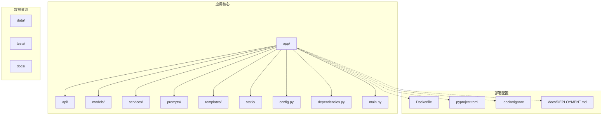
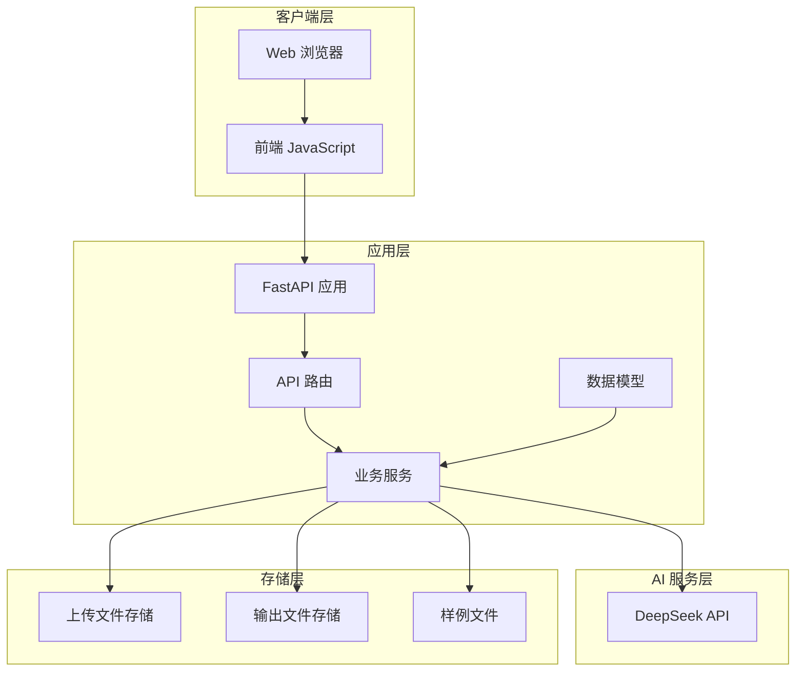
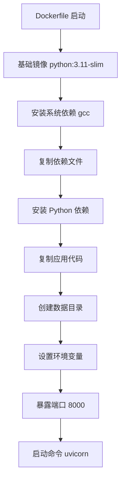
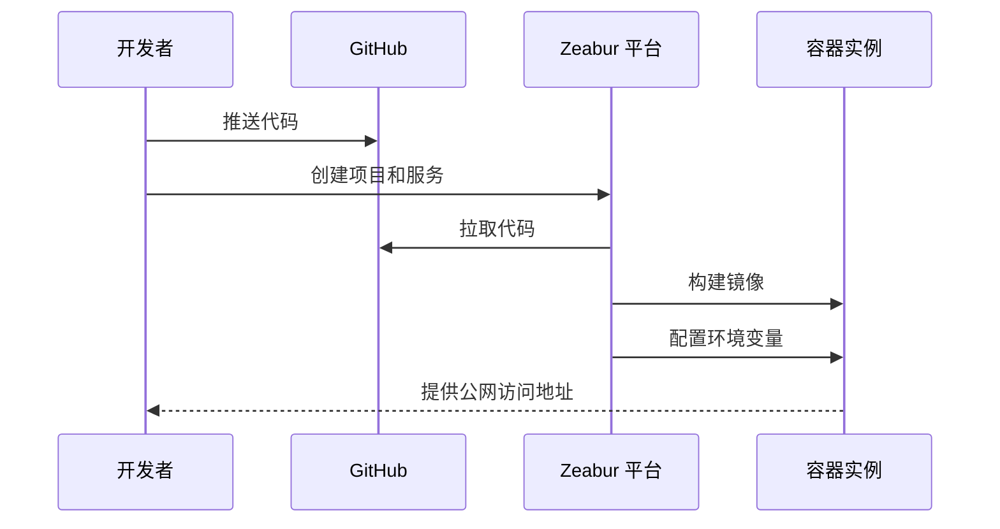
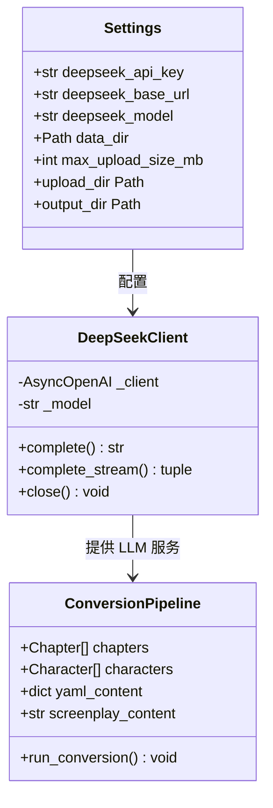
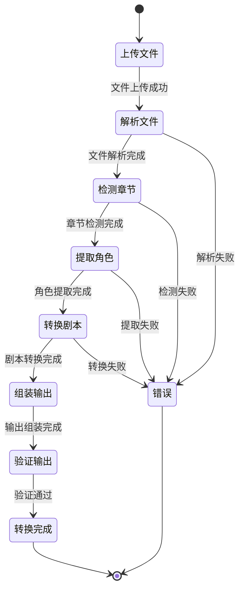
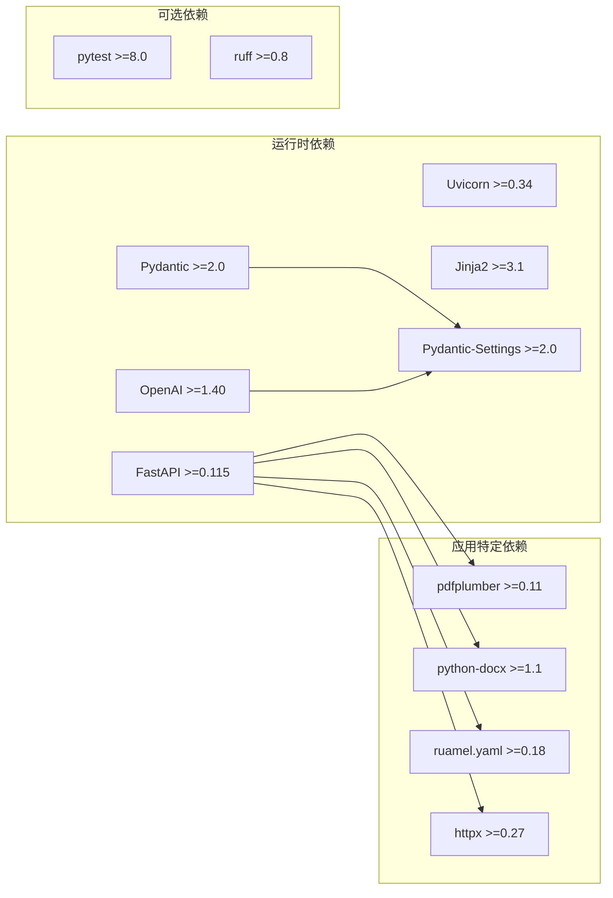
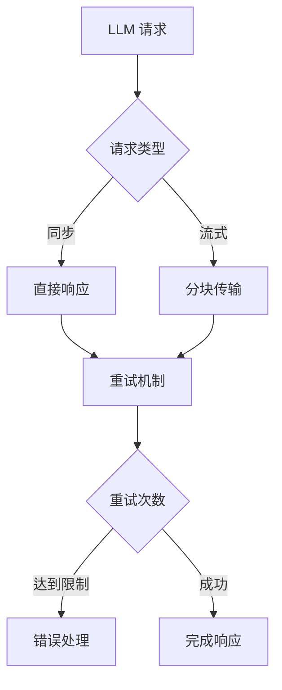
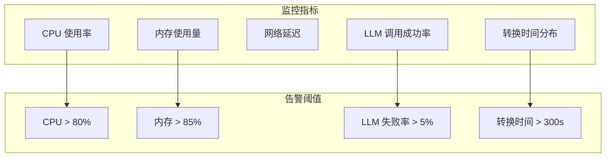

# 生产部署

<cite>
**本文档引用的文件**
- [Dockerfile](file://Dockerfile)
- [pyproject.toml](file://pyproject.toml)
- [app/main.py](file://app/main.py)
- [docs/DEPLOYMENT.md](file://docs/DEPLOYMENT.md)
- [app/config.py](file://app/config.py)
- [.dockerignore](file://.dockerignore)
- [app/dependencies.py](file://app/dependencies.py)
- [app/api/routes.py](file://app/api/routes.py)
- [app/services/llm_client.py](file://app/services/llm_client.py)
- [app/models/screenplay.py](file://app/models/screenplay.py)
- [app/prompts/chapter_detection.py](file://app/prompts/chapter_detection.py)
- [app/templates/index.html](file://app/templates/index.html)
- [app/static/js/conversion.js](file://app/static/js/conversion.js)
</cite>

## 目录
1. [简介](#简介)
2. [项目结构](#项目结构)
3. [核心组件](#核心组件)
4. [架构概览](#架构概览)
5. [详细组件分析](#详细组件分析)
6. [依赖关系分析](#依赖关系分析)
7. [性能考虑](#性能考虑)
8. [故障排除指南](#故障排除指南)
9. [结论](#结论)

## 简介

这是一个基于 FastAPI 的小说转剧本工具，能够将小说文本转换为结构化的 YAML 剧本格式。该项目提供了完整的生产部署解决方案，包括 Docker 容器化、云平台一键部署和手动部署选项。

## 项目结构

项目采用模块化设计，主要包含以下核心目录：



**图表来源**
- [Dockerfile:1-27](file://Dockerfile#L1-L27)
- [pyproject.toml:1-47](file://pyproject.toml#L1-L47)
- [app/main.py:1-48](file://app/main.py#L1-L48)

**章节来源**
- [Dockerfile:1-27](file://Dockerfile#L1-L27)
- [pyproject.toml:1-47](file://pyproject.toml#L1-L47)
- [app/main.py:1-48](file://app/main.py#L1-L48)

## 核心组件

### 应用入口与配置

应用使用 FastAPI 作为 Web 框架，提供现代化的异步 API 接口。核心配置通过 Pydantic Settings 管理，支持环境变量和 .env 文件配置。

### LLM 客户端

集成 DeepSeek AI API，提供异步流式处理能力，支持重试机制和超时控制。

### 转换服务

包含完整的剧本转换流水线，从文件解析到最终输出的完整流程。

**章节来源**
- [app/main.py:1-48](file://app/main.py#L1-L48)
- [app/config.py:1-45](file://app/config.py#L1-L45)
- [app/services/llm_client.py:1-155](file://app/services/llm_client.py#L1-L155)

## 架构概览



**图表来源**
- [app/api/routes.py:1-946](file://app/api/routes.py#L1-L946)
- [app/services/llm_client.py:1-155](file://app/services/llm_client.py#L1-L155)
- [app/config.py:1-45](file://app/config.py#L1-L45)

## 详细组件分析

### Docker 容器化部署

项目提供了完整的 Docker 容器化解决方案，支持多种部署方式：

#### Dockerfile 配置要点



**图表来源**
- [Dockerfile:1-27](file://Dockerfile#L1-L27)

#### 环境变量配置

| 变量名 | 默认值 | 必填 | 说明 |
|--------|--------|------|------|
| DEEPSEEK_API_KEY | 空字符串 | 是 | DeepSeek API 密钥 |
| DEEPSEEK_BASE_URL | https://api.deepseek.com | 否 | API 基础 URL |
| DEEPSEEK_MODEL | deepseek-v4-flash | 否 | 使用的模型名称 |
| DATA_DIR | /data | 否 | 数据存储目录 |
| PORT | 8000 | 否 | 应用监听端口 |

**章节来源**
- [Dockerfile:1-27](file://Dockerfile#L1-L27)
- [app/config.py:18-31](file://app/config.py#L18-L31)
- [docs/DEPLOYMENT.md:25-34](file://docs/DEPLOYMENT.md#L25-L34)

### 部署策略

#### Zeabur 一键部署

推荐使用 Zeabur 平台进行一键部署，支持以下步骤：



**图表来源**
- [docs/DEPLOYMENT.md:3-42](file://docs/DEPLOYMENT.md#L3-L42)

#### 手动 Docker 部署

```bash
# 构建镜像
docker build -t novel-to-screenplay .

# 运行容器
docker run -d \
  -p 8000:8000 \
  -e DEEPSEEK_API_KEY=sk-your-key-here \
  -e DATA_DIR=/data \
  -v $(pwd)/data:/data \
  --name novel-to-screenplay \
  novel-to-screenplay
```

**章节来源**
- [docs/DEPLOYMENT.md:44-62](file://docs/DEPLOYMENT.md#L44-L62)

### API 架构设计



**图表来源**
- [app/config.py:9-44](file://app/config.py#L9-L44)
- [app/services/llm_client.py:19-33](file://app/services/llm_client.py#L19-L33)
- [app/api/routes.py:693-700](file://app/api/routes.py#L693-L700)

**章节来源**
- [app/api/routes.py:1-946](file://app/api/routes.py#L1-L946)
- [app/models/screenplay.py:1-167](file://app/models/screenplay.py#L1-L167)

### 前端用户界面

应用提供直观的 Web 界面，支持文件上传、实时进度跟踪和结果预览：



**图表来源**
- [app/templates/index.html:26-176](file://app/templates/index.html#L26-L176)
- [app/static/js/conversion.js:50-93](file://app/static/js/conversion.js#L50-L93)

**章节来源**
- [app/templates/index.html:1-226](file://app/templates/index.html#L1-L226)
- [app/static/js/conversion.js:1-230](file://app/static/js/conversion.js#L1-L230)

## 依赖关系分析



**图表来源**
- [pyproject.toml:13-25](file://pyproject.toml#L13-L25)

**章节来源**
- [pyproject.toml:1-47](file://pyproject.toml#L1-L47)

## 性能考虑

### 内存管理

应用使用内存字典存储转换作业状态，适合中小型部署场景。对于高并发场景，建议：

1. **持久化存储**：将作业状态迁移到 Redis 或数据库
2. **水平扩展**：使用多个容器实例配合负载均衡
3. **缓存优化**：实现结果缓存减少重复计算

### LLM 调用优化



**图表来源**
- [app/services/llm_client.py:72-87](file://app/services/llm_client.py#L72-L87)

### 文件处理优化

- **上传限制**：默认 50MB 限制，可根据需求调整
- **流式处理**：大文件采用流式读取避免内存溢出
- **并发控制**：合理设置并发数避免资源耗尽

## 故障排除指南

### 常见部署问题

#### 端口冲突

**问题**：容器启动后端口被占用
**解决**：修改映射端口或停止占用进程
```bash
docker ps  # 查看运行中的容器
docker stop <container_id>  # 停止占用端口的容器
```

#### API 密钥错误

**问题**：转换过程中出现认证错误
**解决**：检查 DEEPSEEK_API_KEY 环境变量配置
```bash
# 验证环境变量
docker exec -it container_name env | grep DEEPSEEK
```

#### 存储权限问题

**问题**：文件无法保存到 /data 目录
**解决**：确保挂载卷具有写权限
```bash
# 检查目录权限
ls -la /data/
chmod 755 /data/
```

### 性能监控



**章节来源**
- [app/services/llm_client.py:81-87](file://app/services/llm_client.py#L81-L87)
- [app/api/routes.py:156-190](file://app/api/routes.py#L156-L190)

## 结论

该项目提供了完整的生产就绪的部署解决方案，具有以下优势：

1. **容器化友好**：完整的 Docker 支持，易于在各种环境中部署
2. **多平台兼容**：支持 Zeabur 一键部署和手动 Docker 部署
3. **配置灵活**：通过环境变量轻松配置 LLM 参数和应用设置
4. **用户友好**：提供直观的 Web 界面和实时进度反馈
5. **可扩展性**：模块化设计便于功能扩展和性能优化

建议在生产环境中结合监控工具进行持续观察，并根据实际使用情况进行资源配置和性能调优。