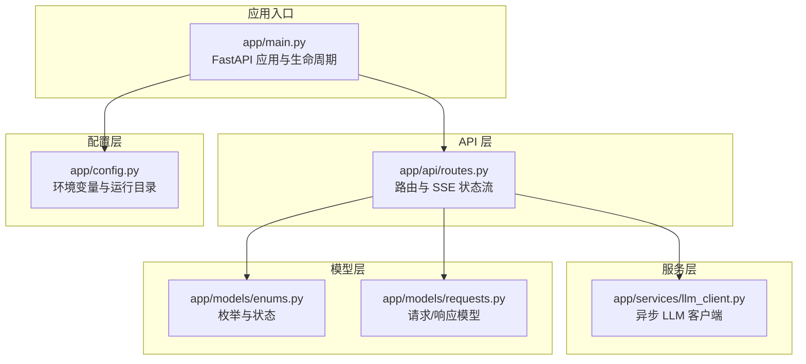
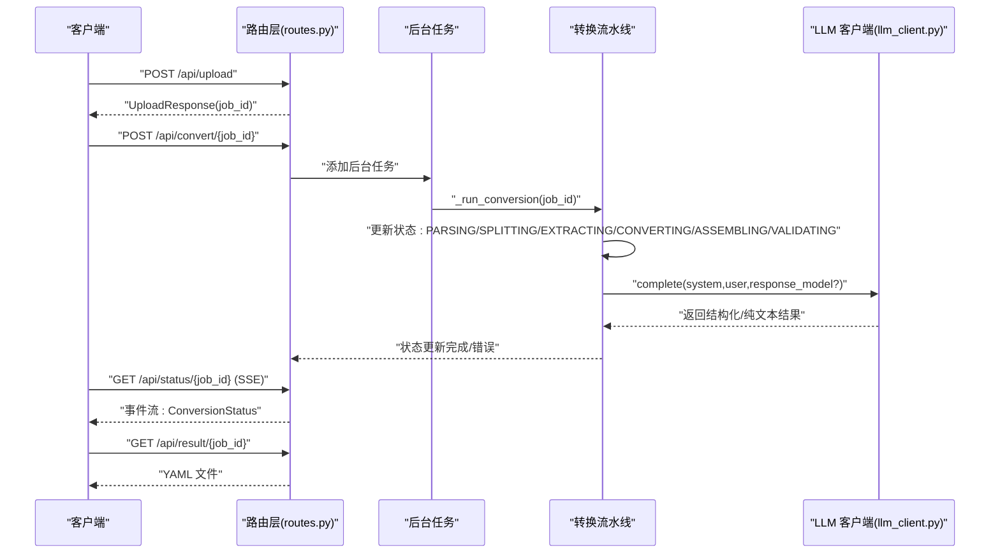
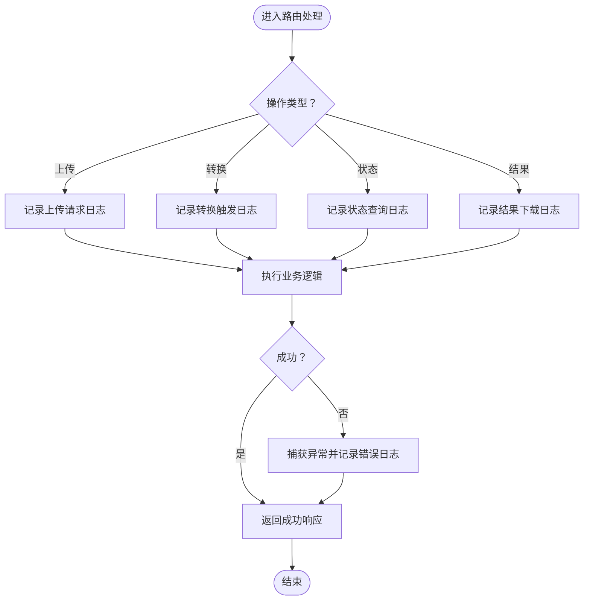
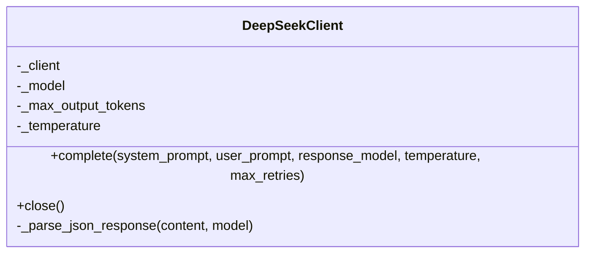
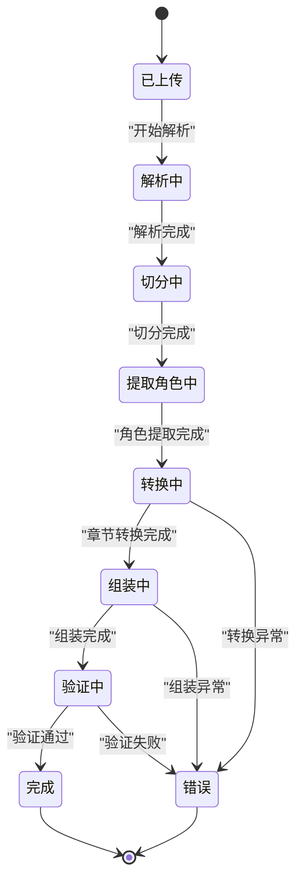
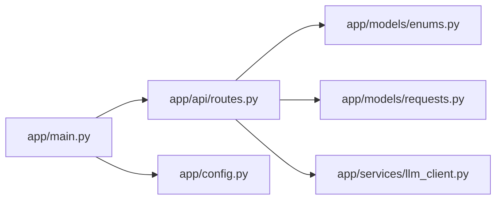

# 监控日志

<cite>
**本文引用的文件**
- [app/main.py](file://app/main.py)
- [app/api/routes.py](file://app/api/routes.py)
- [app/config.py](file://app/config.py)
- [app/services/llm_client.py](file://app/services/llm_client.py)
- [app/models/enums.py](file://app/models/enums.py)
- [app/models/requests.py](file://app/models/requests.py)
- [pyproject.toml](file://pyproject.toml)
- [README.md](file://README.md)
</cite>

## 目录
1. [简介](#简介)
2. [项目结构](#项目结构)
3. [核心组件](#核心组件)
4. [架构总览](#架构总览)
5. [详细组件分析](#详细组件分析)
6. [依赖分析](#依赖分析)
7. [性能考虑](#性能考虑)
8. [故障排查指南](#故障排查指南)
9. [结论](#结论)
10. [附录](#附录)

## 简介
本指南面向小说转剧本工具的运维与开发团队，提供系统监控与日志管理的完整实践建议。当前代码库基于 FastAPI + Uvicorn，采用异步 LLM 客户端调用 DeepSeek API，提供文件上传、章节切分、角色提取、逐章转换、组装、验证与 YAML 导出的完整流水线。本文围绕以下目标展开：
- 应用性能监控（APM）：请求响应时间、错误率、吞吐量
- 日志级别与轮转：访问日志与错误日志管理
- Prometheus 指标采集：自定义指标定义与导出
- 告警规则：CPU、内存、API 错误率阈值
- 日志聚合与分析：ELK/类似方案集成思路
- 性能基准与容量规划：评估与建议
- 监控仪表板：Grafana/类似平台的可视化配置

## 项目结构
该应用采用模块化组织，核心入口、路由、配置与服务层清晰分离，便于扩展监控与日志能力。

**图表来源**
- [app/main.py:1-46](file://app/main.py#L1-L46)
- [app/api/routes.py:1-313](file://app/api/routes.py#L1-L313)
- [app/config.py:1-45](file://app/config.py#L1-L45)
- [app/services/llm_client.py:1-103](file://app/services/llm_client.py#L1-L103)
- [app/models/enums.py:1-83](file://app/models/enums.py#L1-L83)
- [app/models/requests.py:1-41](file://app/models/requests.py#L1-L41)

**章节来源**
- [app/main.py:1-46](file://app/main.py#L1-L46)
- [app/api/routes.py:1-313](file://app/api/routes.py#L1-L313)
- [app/config.py:1-45](file://app/config.py#L1-L45)
- [app/services/llm_client.py:1-103](file://app/services/llm_client.py#L1-L103)
- [app/models/enums.py:1-83](file://app/models/enums.py#L1-L83)
- [app/models/requests.py:1-41](file://app/models/requests.py#L1-L41)
- [pyproject.toml:1-47](file://pyproject.toml#L1-L47)
- [README.md:1-178](file://README.md#L1-L178)

## 核心组件
- 应用入口与生命周期：负责启动时创建上传与输出目录，挂载静态资源与路由。
- API 路由：提供上传、转换、状态查询（SSE/JSON）、结果下载与校验接口；内部维护内存作业池与状态。
- 配置管理：集中读取环境变量，暴露上传/输出目录路径。
- LLM 客户端：封装异步 OpenAI 兼容客户端，支持重试、超时与结构化输出解析。
- 模型与枚举：定义转换阶段、状态与请求/响应结构。

**章节来源**
- [app/main.py:14-46](file://app/main.py#L14-L46)
- [app/api/routes.py:66-206](file://app/api/routes.py#L66-L206)
- [app/config.py:9-44](file://app/config.py#L9-L44)
- [app/services/llm_client.py:18-103](file://app/services/llm_client.py#L18-L103)
- [app/models/enums.py:72-83](file://app/models/enums.py#L72-L83)
- [app/models/requests.py:6-41](file://app/models/requests.py#L6-L41)

## 架构总览
下图展示从客户端到 LLM 的典型调用链路，以及状态更新与错误处理的关键节点。

**图表来源**
- [app/api/routes.py:114-158](file://app/api/routes.py#L114-L158)
- [app/api/routes.py:210-313](file://app/api/routes.py#L210-L313)
- [app/services/llm_client.py:33-87](file://app/services/llm_client.py#L33-L87)

## 详细组件分析

### 日志与错误处理
- 日志记录点：路由层在转换失败时记录异常日志；LLM 客户端在重试失败时记录警告。
- 建议增强：
  - 在路由层对每个关键 API 调用增加结构化访问日志（请求方法、路径、耗时、状态码、用户标识等）。
  - 对 LLM 调用增加调用耗时与错误计数指标，便于下游告警。
  - 对 SSE 状态流与下载接口增加访问日志与错误统计。

**图表来源**
- [app/api/routes.py:68-112](file://app/api/routes.py#L68-L112)
- [app/api/routes.py:114-184](file://app/api/routes.py#L114-L184)
- [app/api/routes.py:186-206](file://app/api/routes.py#L186-L206)
- [app/api/routes.py:210-217](file://app/api/routes.py#L210-L217)

**章节来源**
- [app/api/routes.py:25-27](file://app/api/routes.py#L25-L27)
- [app/api/routes.py:214-216](file://app/api/routes.py#L214-L216)
- [app/services/llm_client.py:80-86](file://app/services/llm_client.py#L80-L86)

### LLM 客户端与重试机制
- 支持结构化 JSON 返回解析，自动去除代码块围栏。
- 指数退避重试，最大重试次数可配置。
- 建议：
  - 在 LLM 客户端中埋点：调用次数、成功/失败、耗时、重试次数、错误类型。
  - 对不同阶段（角色提取、章节转换）分别统计指标，便于定位瓶颈。

**图表来源**
- [app/services/llm_client.py:18-103](file://app/services/llm_client.py#L18-L103)

**章节来源**
- [app/services/llm_client.py:18-103](file://app/services/llm_client.py#L18-L103)

### 转换流水线与状态管理
- 内存作业池保存上传文件、状态、章节总数、校验问题与最终 YAML。
- 状态枚举覆盖上传、解析、切分、角色提取、转换、组装、验证、完成、错误。
- 建议：
  - 对每个阶段增加耗时与进度指标，结合 SSE 推送前端。
  - 对错误阶段记录错误消息与重试次数，便于告警。

**图表来源**
- [app/models/enums.py:72-83](file://app/models/enums.py#L72-L83)
- [app/models/requests.py:14-22](file://app/models/requests.py#L14-L22)
- [app/api/routes.py:210-313](file://app/api/routes.py#L210-L313)

**章节来源**
- [app/models/enums.py:72-83](file://app/models/enums.py#L72-L83)
- [app/models/requests.py:14-22](file://app/models/requests.py#L14-L22)
- [app/api/routes.py:34-49](file://app/api/routes.py#L34-L49)
- [app/api/routes.py:210-313](file://app/api/routes.py#L210-L313)

### 配置与运行目录
- 通过配置类统一读取环境变量，启动时确保上传与输出目录存在。
- 建议：
  - 将日志文件路径纳入配置，支持按天/大小轮转。
  - 将 LLM 调用超时、温度、最大输出 tokens 等参数纳入监控面板。

**章节来源**
- [app/config.py:9-44](file://app/config.py#L9-L44)
- [app/main.py:14-20](file://app/main.py#L14-L20)

## 依赖分析
- 应用入口依赖路由与配置；路由依赖服务层与模型层；服务层依赖配置与 LLM 客户端。
- 依赖耦合度低，便于独立扩展监控与日志功能。

**图表来源**
- [app/main.py:1-46](file://app/main.py#L1-L46)
- [app/api/routes.py:1-313](file://app/api/routes.py#L1-L313)
- [app/config.py:1-45](file://app/config.py#L1-L45)
- [app/models/enums.py:1-83](file://app/models/enums.py#L1-L83)
- [app/models/requests.py:1-41](file://app/models/requests.py#L1-L41)
- [app/services/llm_client.py:1-103](file://app/services/llm_client.py#L1-L103)

**章节来源**
- [app/main.py:1-46](file://app/main.py#L1-L46)
- [app/api/routes.py:1-313](file://app/api/routes.py#L1-L313)
- [app/config.py:1-45](file://app/config.py#L1-L45)
- [app/models/enums.py:1-83](file://app/models/enums.py#L1-L83)
- [app/models/requests.py:1-41](file://app/models/requests.py#L1-L41)
- [app/services/llm_client.py:1-103](file://app/services/llm_client.py#L1-L103)

## 性能考虑
- I/O 密集：文件上传、解析、LLM 调用、磁盘写入。
- CPU 密集：章节切分、角色提取、转换与组装（取决于 LLM 与解析库）。
- 并发：异步路由与 LLM 客户端；后台任务队列化，避免阻塞主请求。
- 建议：
  - 为 LLM 调用增加速率限制与并发上限，防止上游限流。
  - 对大文件进行分块处理与进度上报，优化用户体验。
  - 使用连接池与合理的超时配置，减少网络抖动影响。

[本节为通用性能建议，无需特定文件引用]

## 故障排查指南
- 常见错误与定位
  - 上传失败：检查文件类型检测、大小限制与存储权限。
  - 转换失败：查看路由层异常日志与 LLM 客户端重试日志。
  - 状态流中断：确认 SSE 头部设置与循环条件。
- 建议的日志字段
  - 请求 ID、用户 IP、方法、路径、状态码、耗时、错误码与错误详情。
  - LLM 调用耗时、重试次数、响应长度、错误类型。
- 建议的告警阈值
  - 5xx 错误率 > 1% 持续 5 分钟
  - P95 响应时间 > 5 秒
  - LLM 调用失败率 > 5%
  - 磁盘剩余空间 < 1GB

**章节来源**
- [app/api/routes.py:68-112](file://app/api/routes.py#L68-L112)
- [app/api/routes.py:114-158](file://app/api/routes.py#L114-L158)
- [app/api/routes.py:210-217](file://app/api/routes.py#L210-L217)
- [app/services/llm_client.py:80-86](file://app/services/llm_client.py#L80-L86)

## 结论
通过在现有代码基础上引入结构化日志、指标埋点与告警规则，可以有效提升系统的可观测性与稳定性。建议优先实现访问日志与 LLM 调用指标，再逐步完善 Prometheus 指标与 Grafana 仪表板，最终形成闭环的监控与告警体系。

[本节为总结性内容，无需特定文件引用]

## 附录

### A. 应用性能监控（APM）配置要点
- 请求响应时间：记录每个 API 的耗时直方图，区分路径与方法。
- 错误率：统计 4xx/5xx 比例与错误分布。
- 吞吐量：QPS 与并发请求数。
- LLM 指标：调用次数、成功率、P95/P99 耗时、重试次数、错误类型分布。

[本节为通用配置建议，无需特定文件引用]

### B. 日志级别与轮转
- 日志级别：INFO（访问日志）、WARNING（重试/异常）、ERROR（致命错误）。
- 轮转策略：按大小轮转（如 200MB）与按时间轮转（每日）。
- 建议将日志输出到 stdout/stderr，交由容器/系统日志收集器统一处理。

[本节为通用配置建议，无需特定文件引用]

### C. Prometheus 指标采集示例
- 指标类型与标签建议
  - http_request_duration_seconds{method, route, status}
  - llm_call_total{endpoint, success, error_type}
  - conversion_stage_duration_seconds{stage}
  - job_status{stage, error_code}
- 导出方式：在应用内暴露 /metrics 端点，或使用 Pushgateway。
- 采集频率：默认 15s，可根据负载调整。

[本节为通用配置建议，无需特定文件引用]

### D. 告警规则设置示例
- CPU 使用率 > 85% 持续 10 分钟
- 内存使用率 > 90% 持续 5 分钟
- API 错误率 > 1% 持续 5 分钟
- LLM 调用失败率 > 5% 持续 5 分钟
- 磁盘剩余空间 < 1GB

[本节为通用配置建议，无需特定文件引用]

### E. 日志聚合与分析（ELK/类似方案）
- 收集：Filebeat/Fluent Bit 采集 stdout/stderr 与应用日志文件。
- 存储：Elasticsearch 索引按日期滚动。
- 查询与可视化：Kibana 创建仪表板与告警。
- 建议字段映射：timestamp、level、service、method、path、status、duration_ms、error。

[本节为通用配置建议，无需特定文件引用]

### F. 性能基准与容量规划
- 基准测试：使用 wrk/Artillery 对上传、转换、下载接口施压，记录 P50/P95/P99 与错误率。
- 容量规划：根据 LLM 调用成本与时延，估算并发与实例数量；预留 30% 缓冲。
- 优化方向：缓存热点数据、减少 LLM 调用次数、分片处理大文件。

[本节为通用配置建议，无需特定文件引用]

### G. 监控仪表板搭建与可视化
- Grafana 数据源：Prometheus、Elasticsearch、Uptime Kuma（可选）。
- 关键看板：QPS/错误率、响应时间分布、LLM 成功率、作业队列长度、磁盘/内存/CPU。
- 告警通道：邮件、Slack、PagerDuty。

[本节为通用配置建议，无需特定文件引用]