# 部署运维

<cite>
**本文档引用的文件**
- [README.md](file://README.md)
- [pyproject.toml](file://pyproject.toml)
- [app/main.py](file://app/main.py)
- [app/config.py](file://app/config.py)
- [app/api/routes.py](file://app/api/routes.py)
- [app/services/llm_client.py](file://app/services/llm_client.py)
- [app/services/converter.py](file://app/services/converter.py)
- [app/services/file_parser.py](file://app/services/file_parser.py)
- [app/services/chapter_splitter.py](file://app/services/chapter_splitter.py)
- [app/services/validator.py](file://app/services/validator.py)
- [app/models/screenplay.py](file://app/models/screenplay.py)
- [docs/YAML_SCHEMA.md](file://docs/YAML_SCHEMA.md)
- [tests/conftest.py](file://tests/conftest.py)
</cite>

## 目录
1. [简介](#简介)
2. [项目结构](#项目结构)
3. [核心组件](#核心组件)
4. [架构概览](#架构概览)
5. [详细组件分析](#详细组件分析)
6. [依赖分析](#依赖分析)
7. [性能考虑](#性能考虑)
8. [故障排除指南](#故障排除指南)
9. [结论](#结论)
10. [附录](#附录)

## 简介

小说转剧本工具是一个基于AI驱动的小说到结构化YAML剧本转换系统。该工具能够将小说文本自动转换为符合行业标准的剧本格式，支持多种输入格式（TXT、Markdown、DOCX、PDF），并通过Web界面提供用户友好的交互体验。

该系统采用FastAPI作为后端框架，使用DeepSeek API进行AI处理，结合多层转换管道实现从原始小说到最终剧本的完整转换流程。系统设计注重可扩展性和可靠性，支持生产环境的部署和运维需求。

## 项目结构

项目采用模块化的组织方式，按照功能层次进行划分：

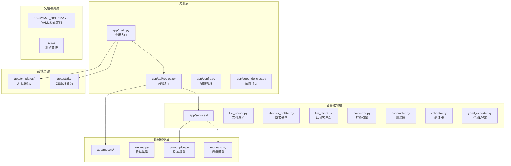

**图表来源**
- [app/main.py:1-46](file://app/main.py#L1-L46)
- [app/api/routes.py:1-313](file://app/api/routes.py#L1-L313)
- [app/config.py:1-45](file://app/config.py#L1-L45)

**章节来源**
- [README.md:77-108](file://README.md#L77-L108)
- [app/main.py:1-46](file://app/main.py#L1-L46)

## 核心组件

### 应用配置系统

应用使用Pydantic Settings进行配置管理，支持从环境变量和.env文件加载配置：

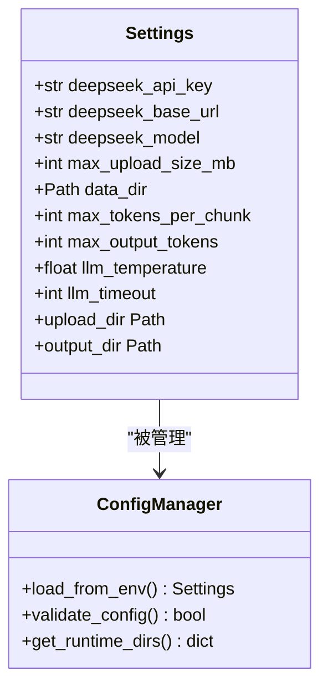

**图表来源**
- [app/config.py:9-45](file://app/config.py#L9-L45)

### API路由系统

系统提供RESTful API接口，支持文件上传、转换状态跟踪、结果下载等功能：

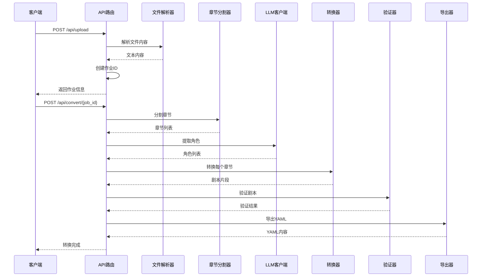

**图表来源**
- [app/api/routes.py:114-313](file://app/api/routes.py#L114-L313)
- [app/services/file_parser.py:16-57](file://app/services/file_parser.py#L16-L57)
- [app/services/chapter_splitter.py:42-64](file://app/services/chapter_splitter.py#L42-L64)

**章节来源**
- [app/config.py:18-40](file://app/config.py#L18-L40)
- [app/api/routes.py:68-206](file://app/api/routes.py#L68-L206)

## 架构概览

系统采用分层架构设计，确保关注点分离和模块化：

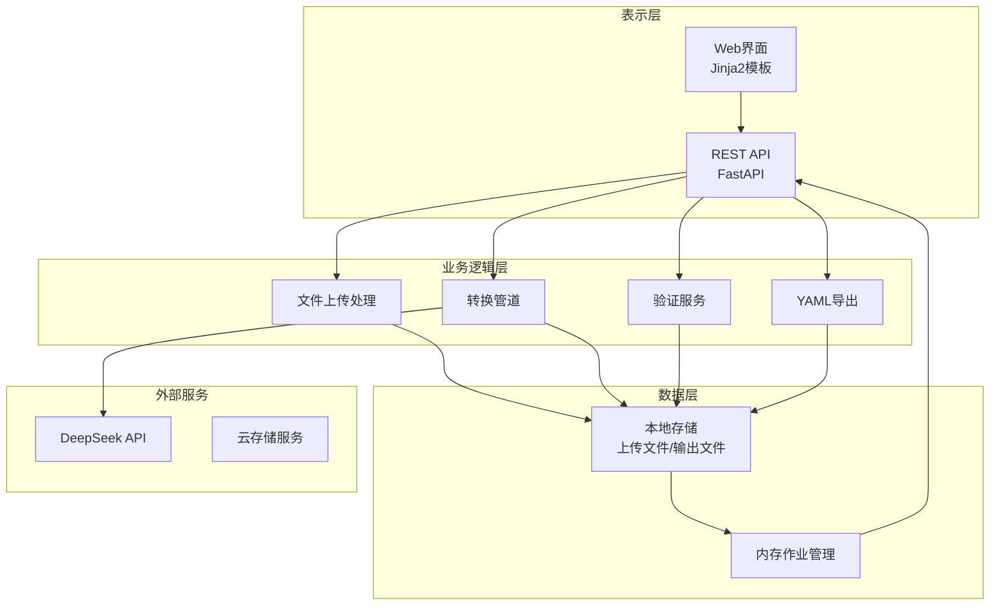

**图表来源**
- [app/main.py:23-40](file://app/main.py#L23-L40)
- [app/api/routes.py:208-313](file://app/api/routes.py#L208-L313)

## 详细组件分析

### 文件解析服务

文件解析服务支持多种文档格式的处理：

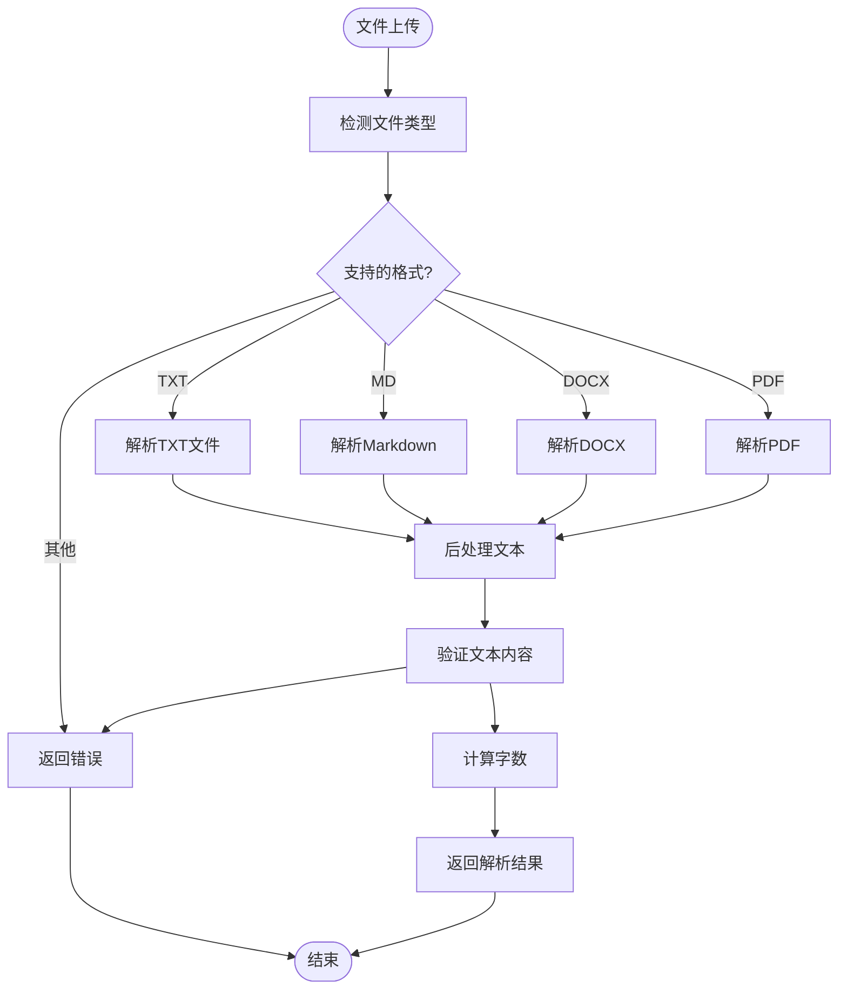

**图表来源**
- [app/services/file_parser.py:16-57](file://app/services/file_parser.py#L16-L57)
- [app/services/file_parser.py:164-187](file://app/services/file_parser.py#L164-L187)

### 章节分割算法

章节分割采用两阶段策略确保准确性：

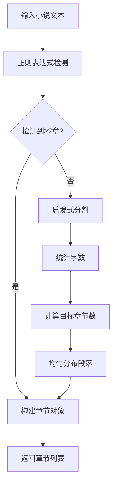

**图表来源**
- [app/services/chapter_splitter.py:42-64](file://app/services/chapter_splitter.py#L42-L64)
- [app/services/chapter_splitter.py:99-135](file://app/services/chapter_splitter.py#L99-L135)

### LLM客户端设计

LLM客户端提供异步调用和重试机制：

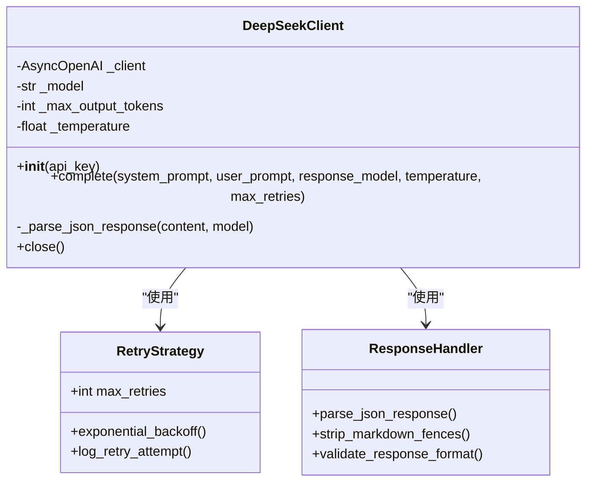

**图表来源**
- [app/services/llm_client.py:18-103](file://app/services/llm_client.py#L18-L103)

**章节来源**
- [app/services/file_parser.py:11-187](file://app/services/file_parser.py#L11-L187)
- [app/services/chapter_splitter.py:16-163](file://app/services/chapter_splitter.py#L16-L163)
- [app/services/llm_client.py:18-103](file://app/services/llm_client.py#L18-L103)

### 转换管道

转换管道实现从章节到剧本的完整转换过程：

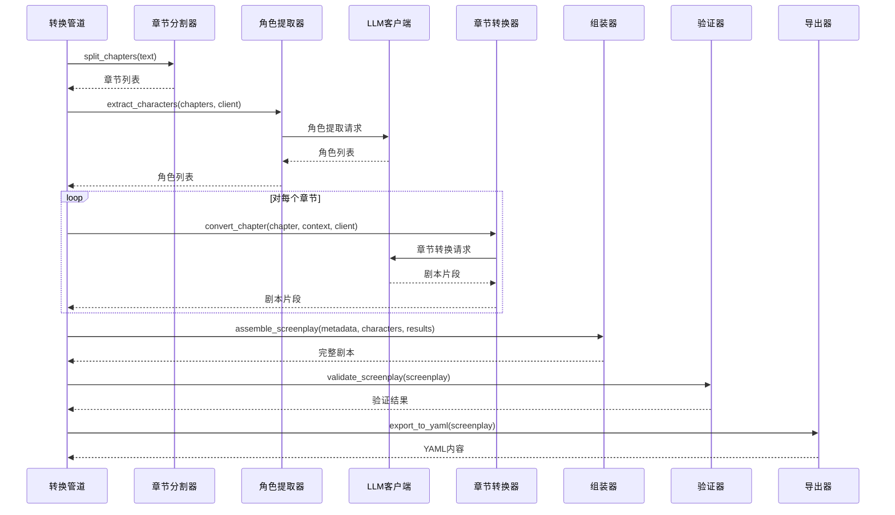

**图表来源**
- [app/api/routes.py:209-313](file://app/api/routes.py#L209-L313)
- [app/services/converter.py:36-85](file://app/services/converter.py#L36-L85)

**章节来源**
- [app/api/routes.py:208-313](file://app/api/routes.py#L208-L313)
- [app/services/converter.py:16-218](file://app/services/converter.py#L16-L218)

## 依赖分析

系统依赖关系清晰，遵循单一职责原则：

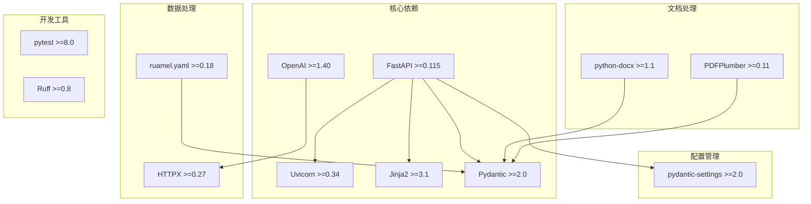

**图表来源**
- [pyproject.toml:13-25](file://pyproject.toml#L13-L25)

**章节来源**
- [pyproject.toml:1-47](file://pyproject.toml#L1-L47)

## 性能考虑

### 内存管理

系统使用内存作业存储，需要合理配置以避免内存溢出：

- **作业存储**：当前实现使用内存字典存储作业状态
- **文件大小限制**：默认最大上传50MB
- **章节截断**：长章节自动截断以控制Token预算

### LLM调用优化

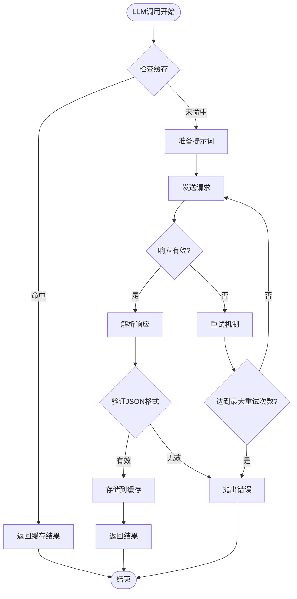

**图表来源**
- [app/services/llm_client.py:33-87](file://app/services/llm_client.py#L33-L87)

### 并发处理

系统支持异步处理和并发转换：

- **异步API**：使用FastAPI异步特性
- **后台任务**：转换过程作为后台任务执行
- **Server-Sent Events**：实时状态更新

**章节来源**
- [app/services/llm_client.py:18-103](file://app/services/llm_client.py#L18-L103)
- [app/api/routes.py:131-158](file://app/api/routes.py#L131-L158)

## 故障排除指南

### 常见问题诊断

#### LLM API连接问题

**症状**：转换过程中出现API调用失败

**排查步骤**：
1. 验证API密钥有效性
2. 检查网络连接
3. 确认API基础URL正确
4. 查看重试日志

**解决方案**：
- 更新正确的API密钥
- 配置代理设置（如需要）
- 检查API配额限制

#### 文件解析错误

**症状**：文件上传后无法解析

**排查步骤**：
1. 验证文件格式支持
2. 检查文件编码
3. 确认文件完整性
4. 查看解析异常日志

**解决方案**：
- 转换为支持的格式
- 重新保存文件
- 检查文件损坏情况

#### 内存不足问题

**症状**：系统运行缓慢或崩溃

**排查步骤**：
1. 监控内存使用情况
2. 检查作业数量
3. 分析文件大小
4. 查看内存警告日志

**解决方案**：
- 增加系统内存
- 限制并发作业数
- 优化文件大小

### 日志管理

系统使用标准Python日志记录：

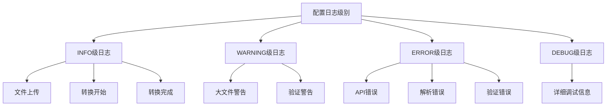

**图表来源**
- [app/api/routes.py:209-313](file://app/api/routes.py#L209-L313)
- [app/services/validator.py:11-111](file://app/services/validator.py#L11-L111)

**章节来源**
- [app/api/routes.py:209-313](file://app/api/routes.py#L209-L313)
- [app/services/validator.py:11-111](file://app/services/validator.py#L11-L111)

## 结论

小说转剧本工具提供了完整的生产级部署方案，具有以下特点：

1. **模块化设计**：清晰的分层架构便于维护和扩展
2. **性能优化**：异步处理和缓存机制确保高效运行
3. **可靠性保障**：完善的错误处理和重试机制
4. **安全性考虑**：API密钥管理和文件上传安全
5. **可观测性**：完整的日志记录和状态跟踪

该系统适合在生产环境中部署，通过合理的资源配置和监控设置，可以稳定地处理大量转换请求。

## 附录

### 部署配置清单

#### 环境变量配置

| 变量名 | 默认值 | 说明 |
|--------|--------|------|
| DEEPSEEK_API_KEY | (必填) | DeepSeek API密钥 |
| DEEPSEEK_BASE_URL | https://api.deepseek.com | API基础URL |
| DEEPSEEK_MODEL | deepseek-chat | 使用的模型 |
| MAX_UPLOAD_SIZE_MB | 50 | 最大上传文件大小(MB) |
| DATA_DIR | ./data | 数据存储目录 |

#### 服务器要求

- **CPU**：至少2核处理器
- **内存**：至少4GB RAM
- **存储**：至少10GB可用空间
- **网络**：稳定的互联网连接
- **Python**：3.10+

#### 容器化部署

系统支持Docker容器化部署，建议使用以下配置：

```dockerfile
FROM python:3.10-slim

WORKDIR /app

COPY requirements.txt .
RUN pip install -r requirements.txt

COPY . .

EXPOSE 8000

CMD ["uvicorn", "app.main:app", "--host", "0.0.0.0", "--port", "8000"]
```

#### 负载均衡配置

建议使用Nginx进行反向代理和负载均衡：

```nginx
upstream app_servers {
    server 127.0.0.1:8008;
    server 127.0.0.1:8009;
    server 127.0.0.1:8010;
}

server {
    listen 80;
    server_name your-domain.com;
    
    location / {
        proxy_pass http://app_servers;
        proxy_set_header Host $host;
        proxy_set_header X-Real-IP $remote_addr;
    }
}
```

#### 备份策略

1. **数据库备份**：定期备份作业状态数据
2. **文件备份**：备份用户上传的源文件和生成的YAML
3. **配置备份**：备份环境变量配置
4. **日志轮转**：配置日志文件轮转策略

#### 监控指标

- **系统指标**：CPU使用率、内存使用率、磁盘空间
- **应用指标**：请求响应时间、错误率、并发请求数
- **业务指标**：转换成功率、平均转换时间、文件大小分布

#### 安全加固

1. **API密钥管理**：使用环境变量存储，定期轮换
2. **文件上传安全**：限制文件类型和大小，扫描恶意文件
3. **访问控制**：实施速率限制和IP白名单
4. **传输加密**：启用HTTPS和TLS
5. **权限控制**：最小权限原则，定期审计

#### CI/CD集成

建议使用GitHub Actions进行自动化部署：

```yaml
name: Deploy
on:
  push:
    branches: [ main ]

jobs:
  deploy:
    runs-on: ubuntu-latest
    steps:
    - uses: actions/checkout@v2
    - name: Setup Python
      uses: actions/setup-python@v2
      with:
        python-version: 3.10
    - name: Install dependencies
      run: pip install -e ".[dev]"
    - name: Run tests
      run: pytest tests/
    - name: Deploy to production
      run: |
        # 部署命令
        echo "Deploying..."
```