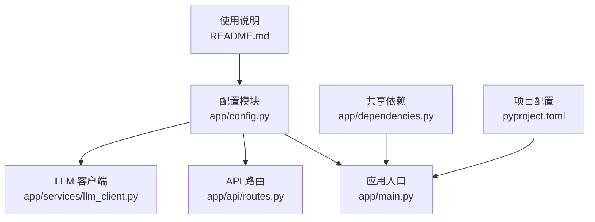
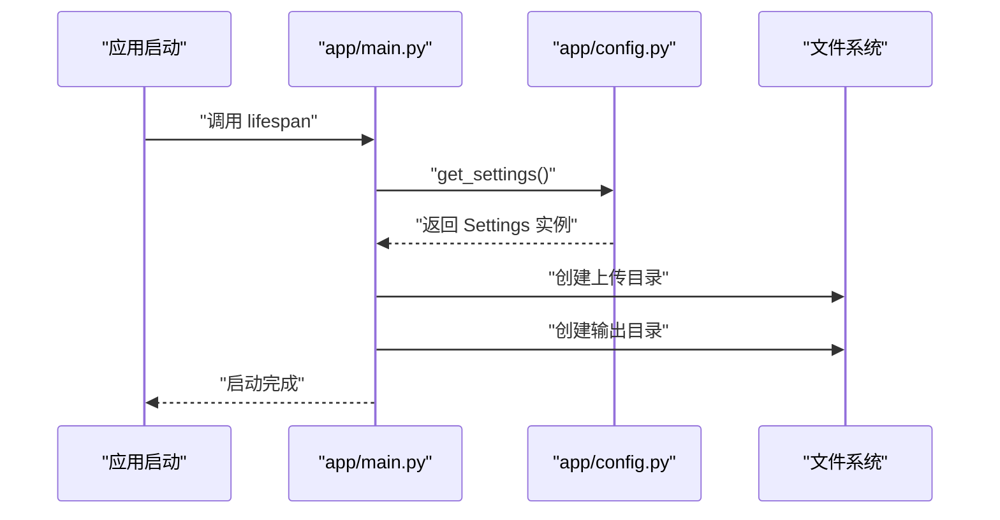
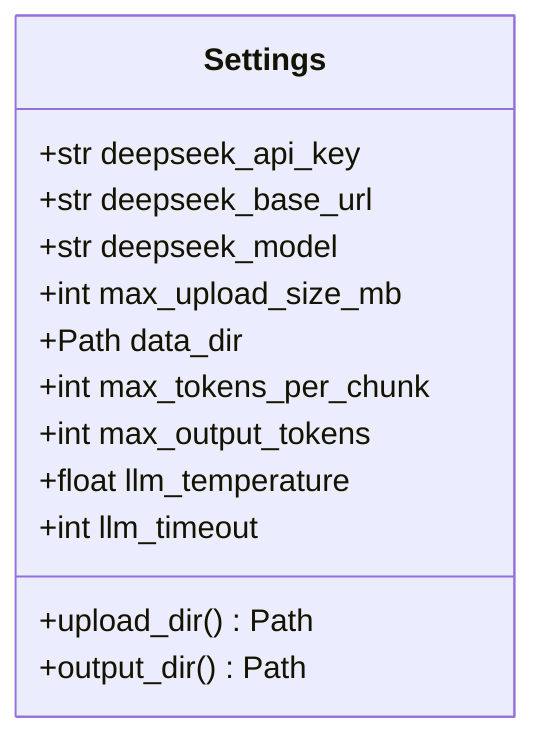
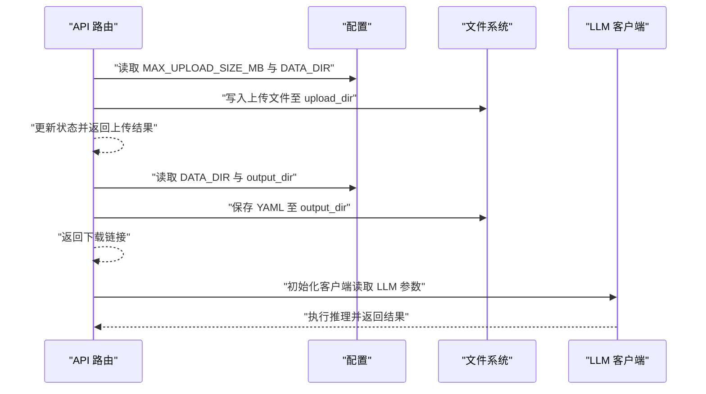
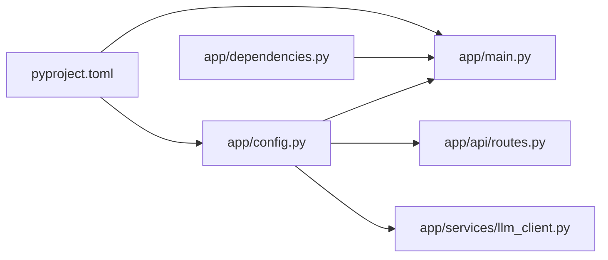

# 配置管理

<cite>
**本文引用的文件**
- [app/config.py](file://app/config.py)
- [app/main.py](file://app/main.py)
- [app/dependencies.py](file://app/dependencies.py)
- [app/api/routes.py](file://app/api/routes.py)
- [app/services/llm_client.py](file://app/services/llm_client.py)
- [pyproject.toml](file://pyproject.toml)
- [README.md](file://README.md)
</cite>

## 目录
1. [简介](#简介)
2. [项目结构](#项目结构)
3. [核心组件](#核心组件)
4. [架构总览](#架构总览)
5. [详细组件分析](#详细组件分析)
6. [依赖分析](#依赖分析)
7. [性能考虑](#性能考虑)
8. [故障排查指南](#故障排查指南)
9. [结论](#结论)
10. [附录](#附录)

## 简介
本项目采用基于 Pydantic V2 的配置管理方案，通过 pydantic-settings 提供的 Settings 类从环境变量与 .env 文件中加载应用配置，并以类型安全的方式在运行时提供统一的配置对象。该配置系统覆盖 LLM 服务参数、应用行为参数以及路径与目录等关键设置，确保在不同环境（开发、测试、生产）下具备一致且可验证的行为。

## 项目结构
配置系统的核心位于 app/config.py，其余模块通过依赖注入的方式按需读取配置，形成“集中定义、分散使用”的模式。启动阶段会确保数据目录存在；API 层在上传与导出环节使用配置控制文件大小与输出位置；LLM 客户端根据配置初始化 OpenAI 兼容客户端。

**图表来源**
- [app/config.py:1-45](file://app/config.py#L1-L45)
- [app/main.py:1-46](file://app/main.py#L1-L46)
- [app/dependencies.py:1-9](file://app/dependencies.py#L1-L9)
- [app/api/routes.py:1-313](file://app/api/routes.py#L1-L313)
- [app/services/llm_client.py:1-103](file://app/services/llm_client.py#L1-L103)
- [pyproject.toml:1-47](file://pyproject.toml#L1-L47)
- [README.md:1-178](file://README.md#L1-L178)

**章节来源**
- [app/config.py:1-45](file://app/config.py#L1-L45)
- [app/main.py:1-46](file://app/main.py#L1-L46)
- [app/dependencies.py:1-9](file://app/dependencies.py#L1-L9)
- [app/api/routes.py:1-313](file://app/api/routes.py#L1-L313)
- [app/services/llm_client.py:1-103](file://app/services/llm_client.py#L1-L103)
- [pyproject.toml:1-47](file://pyproject.toml#L1-L47)
- [README.md:1-178](file://README.md#L1-L178)

## 核心组件
- 配置类 Settings：集中定义所有配置项及其默认值，声明从 .env 加载与 UTF-8 编码，忽略未知字段，避免误配导致的异常。
- 配置获取函数 get_settings：使用缓存装饰器确保全局单例，减少重复解析成本。
- 应用启动生命周期：在启动时创建上传与输出目录，确保运行时可用。
- API 层使用：在上传校验与结果导出时读取最大上传大小与输出目录。
- LLM 客户端使用：在初始化时读取 API Key、基础 URL、模型、超时、温度与最大输出 Token 数。

**章节来源**
- [app/config.py:9-44](file://app/config.py#L9-L44)
- [app/main.py:14-20](file://app/main.py#L14-L20)
- [app/api/routes.py:71-87](file://app/api/routes.py#L71-L87)
- [app/api/routes.py:304-307](file://app/api/routes.py#L304-L307)
- [app/services/llm_client.py:21-32](file://app/services/llm_client.py#L21-L32)

## 架构总览
配置系统遵循“定义一次、按需读取”的原则，通过依赖注入在各模块中透明使用。配置加载顺序与覆盖机制见下一节。

**图表来源**
- [app/main.py:14-20](file://app/main.py#L14-L20)
- [app/config.py:42-44](file://app/config.py#L42-L44)

## 详细组件分析

### 配置类 Settings 设计
- 配置来源与编码：通过 SettingsConfigDict 指定从 .env 文件加载，使用 UTF-8 编码；extra="ignore" 忽略未显式声明的字段，避免误配引发异常。
- 分组与命名：将 LLM 相关参数、应用行为参数与路径参数分组，便于维护与查找。
- 默认值与类型：所有字段均提供明确默认值，确保在缺少环境变量时仍能正常工作；路径类型使用 Path，便于跨平台路径拼接。
- 计算属性：upload_dir 与 output_dir 基于 data_dir 动态计算，避免硬编码路径。

**图表来源**
- [app/config.py:9-39](file://app/config.py#L9-L39)

**章节来源**
- [app/config.py:9-39](file://app/config.py#L9-L39)

### 配置加载与覆盖机制
- 加载顺序（从低到高优先级）：
  1) 默认值（类属性默认值）
  2) .env 文件（UTF-8 编码）
  3) 环境变量（覆盖 .env）
- 覆盖示例：
  - 若同时设置了 DEEPSEEK_API_KEY 与环境变量 OPENAI_API_KEY，后者将覆盖前者（取决于具体键名映射规则）。
  - 若仅提供环境变量而未提供 .env，将以环境变量为准。
- 错误处理：
  - 未设置必填字段（例如 DEEPSEEK_API_KEY）时，将在首次使用时触发类型验证错误或运行时异常，建议在部署前进行本地验证。

**章节来源**
- [app/config.py:12-16](file://app/config.py#L12-L16)
- [README.md:46-60](file://README.md#L46-L60)

### 参数说明与取值范围
- DEEPSEEK_API_KEY
  - 作用：用于 LLM 认证的密钥。
  - 取值范围：字符串，建议使用平台提供的完整密钥。
  - 优先级：环境变量 > .env > 默认值。
- DEEPSEEK_BASE_URL
  - 作用：LLM 服务的基础 URL。
  - 默认值：https://api.deepseek.com。
  - 取值范围：合法 URL 字符串。
- DEEPSEEK_MODEL
  - 作用：使用的模型名称。
  - 默认值：deepseek-chat。
  - 取值范围：字符串，需与平台支持的模型名称一致。
- MAX_UPLOAD_SIZE_MB
  - 作用：限制上传文件的最大大小（MB）。
  - 默认值：50。
  - 取值范围：正整数。
- DATA_DIR
  - 作用：运行时数据目录根路径。
  - 默认值：./data。
  - 取值范围：可解析为有效路径的字符串。
- max_tokens_per_chunk、max_output_tokens、llm_temperature、llm_timeout
  - 作用：控制 LLM 调用的上下文长度、输出长度、采样温度与请求超时。
  - 默认值：分别为 6000、8192、0.3、120。
  - 取值范围：整数或浮点数，需满足平台限制与业务需求。

**章节来源**
- [app/config.py:18-31](file://app/config.py#L18-L31)
- [README.md:165-174](file://README.md#L165-L174)

### 在不同模块中的使用
- 应用启动：在 lifespan 中创建上传与输出目录，确保路径存在。
- API 上传：读取 MAX_UPLOAD_SIZE_MB 与 DATA_DIR，计算最大字节数并写入上传目录。
- 结果导出：读取 DATA_DIR 与 output_dir，将 YAML 写入输出目录。
- LLM 客户端：读取 DEEPSEEK_API_KEY、DEEPSEEK_BASE_URL、DEEPSEEK_MODEL、llm_timeout、max_output_tokens、llm_temperature 初始化异步客户端。

**图表来源**
- [app/api/routes.py:71-87](file://app/api/routes.py#L71-L87)
- [app/api/routes.py:304-307](file://app/api/routes.py#L304-L307)
- [app/services/llm_client.py:21-32](file://app/services/llm_client.py#L21-L32)

**章节来源**
- [app/main.py:17-19](file://app/main.py#L17-L19)
- [app/api/routes.py:71-87](file://app/api/routes.py#L71-L87)
- [app/api/routes.py:304-307](file://app/api/routes.py#L304-L307)
- [app/services/llm_client.py:21-32](file://app/services/llm_client.py#L21-L32)

### 配置验证与错误处理
- 类型验证：Pydantic 在实例化 Settings 时对字段进行类型检查与默认值填充。
- 运行时验证：在实际使用前，若缺少必要配置（如 API Key），应在启动阶段或首次调用前进行显式校验。
- 错误传播：当 LLM 客户端初始化失败或请求超时时，会抛出异常并记录日志，便于上层捕获与处理。
- 建议：在 CI/CD 中增加配置校验步骤，确保关键参数在部署前已正确设置。

**章节来源**
- [app/services/llm_client.py:21-32](file://app/services/llm_client.py#L21-L32)
- [app/api/routes.py:82-83](file://app/api/routes.py#L82-L83)

### 扩展与自定义
- 新增配置项：在 Settings 类中添加新字段并提供合理默认值；如涉及路径，请使用 Path 类型。
- 环境隔离：通过不同 .env 文件或环境变量区分开发、测试、生产环境；在容器化部署时使用环境变量注入。
- 动态切换：可在运行时通过重新加载配置或重启进程来应用新配置（注意缓存装饰器的单例特性）。
- 安全增强：敏感参数仅通过环境变量注入，不在代码仓库中提交 .env 文件；使用只读权限与最小暴露面。

**章节来源**
- [app/config.py:9-16](file://app/config.py#L9-L16)
- [README.md:46-60](file://README.md#L46-L60)

## 依赖分析
- 依赖关系：app/main.py、app/api/routes.py、app/services/llm_client.py 均依赖 app/config.py 提供的配置；app/dependencies.py 提供基础路径常量供静态资源挂载使用。
- 外部依赖：pyproject.toml 明确声明了 pydantic 与 pydantic-settings 的版本要求，确保配置系统的稳定性。

**图表来源**
- [app/config.py:1-45](file://app/config.py#L1-L45)
- [app/main.py:1-46](file://app/main.py#L1-L46)
- [app/dependencies.py:1-9](file://app/dependencies.py#L1-L9)
- [pyproject.toml:1-47](file://pyproject.toml#L1-L47)

**章节来源**
- [app/config.py:1-45](file://app/config.py#L1-L45)
- [app/main.py:1-46](file://app/main.py#L1-L46)
- [app/dependencies.py:1-9](file://app/dependencies.py#L1-L9)
- [pyproject.toml:1-47](file://pyproject.toml#L1-L47)

## 性能考虑
- 配置缓存：通过缓存装饰器确保 get_settings 单例，避免重复解析 .env 与环境变量带来的开销。
- 目录预创建：在启动阶段一次性创建所需目录，减少后续 IO 操作的不确定性。
- LLM 参数：合理设置 llm_timeout 与 max_output_tokens，避免长时间阻塞与超大响应导致的内存压力。

**章节来源**
- [app/config.py:42-44](file://app/config.py#L42-L44)
- [app/main.py:17-19](file://app/main.py#L17-L19)
- [app/services/llm_client.py:27-31](file://app/services/llm_client.py#L27-L31)

## 故障排查指南
- 无法加载配置
  - 检查 .env 文件是否存在且编码为 UTF-8。
  - 确认环境变量键名与配置类字段一致（大小写敏感）。
- 上传失败或被拒绝
  - 检查 MAX_UPLOAD_SIZE_MB 是否过小；确认上传文件大小是否超过限制。
- LLM 调用失败
  - 核对 DEEPSEEK_API_KEY 是否正确；确认 DEEPSEEK_BASE_URL 与模型名称 DEEPSEEK_MODEL 是否匹配。
  - 查看 llm_timeout 设置是否过短；适当增大以避免超时。
- 目录不存在或权限不足
  - 确保 DATA_DIR、upload_dir、output_dir 可写；在容器环境中检查卷挂载权限。

**章节来源**
- [app/config.py:12-16](file://app/config.py#L12-L16)
- [app/api/routes.py:81-83](file://app/api/routes.py#L81-L83)
- [app/services/llm_client.py:24-28](file://app/services/llm_client.py#L24-L28)

## 结论
本项目的配置系统以 Pydantic V2 为核心，结合 pydantic-settings 提供了类型安全、易于维护与可扩展的配置管理能力。通过明确的加载顺序、默认值与计算属性，实现了在不同环境下的稳定运行。建议在团队内建立统一的配置模板与校验流程，配合严格的环境隔离与最小权限原则，进一步提升安全性与可靠性。

## 附录
- 环境变量与默认值对照表（来自 README）
  - DEEPSEEK_API_KEY：必填
  - DEEPSEEK_BASE_URL：默认 https://api.deepseek.com
  - DEEPSEEK_MODEL：默认 deepseek-chat
  - MAX_UPLOAD_SIZE_MB：默认 50
  - DATA_DIR：默认 ./data

**章节来源**
- [README.md:165-174](file://README.md#L165-L174)