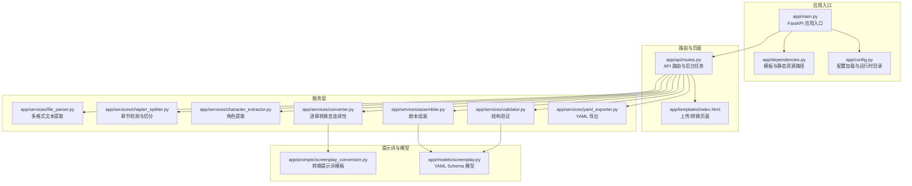
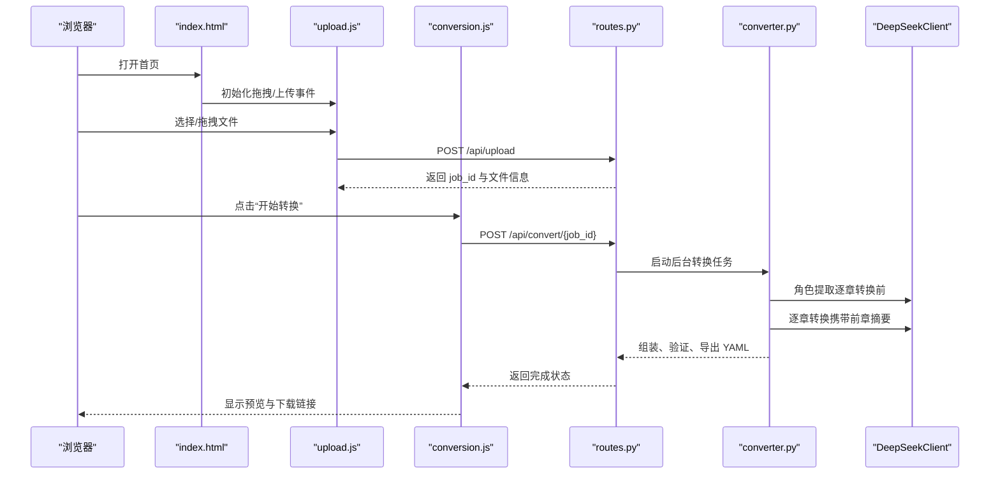
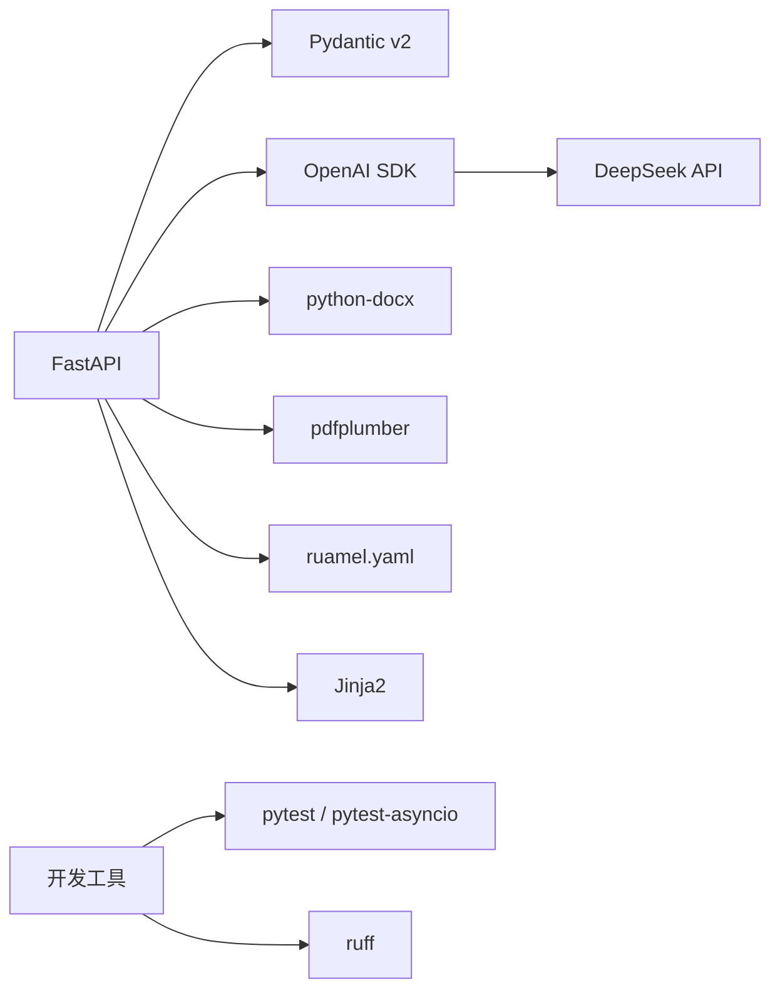

# 快速开始

<cite>
**本文引用的文件**
- [README.md](file://README.md)
- [pyproject.toml](file://pyproject.toml)
- [app/main.py](file://app/main.py)
- [app/config.py](file://app/config.py)
- [app/dependencies.py](file://app/dependencies.py)
- [app/api/routes.py](file://app/api/routes.py)
- [app/services/converter.py](file://app/services/converter.py)
- [app/models/screenplay.py](file://app/models/screenplay.py)
- [app/templates/index.html](file://app/templates/index.html)
- [app/static/js/upload.js](file://app/static/js/upload.js)
- [app/static/js/conversion.js](file://app/static/js/conversion.js)
- [app/prompts/screenplay_conversion.py](file://app/prompts/screenplay_conversion.py)
- [tests/test_models.py](file://tests/test_models.py)
- [tests/conftest.py](file://tests/conftest.py)
</cite>

## 目录
1. [简介](#简介)
2. [项目结构](#项目结构)
3. [核心组件](#核心组件)
4. [架构总览](#架构总览)
5. [详细组件分析](#详细组件分析)
6. [依赖分析](#依赖分析)
7. [性能考虑](#性能考虑)
8. [故障排除指南](#故障排除指南)
9. [结论](#结论)
10. [附录](#附录)

## 简介
本指南面向首次使用“小说转剧本工具”的用户，提供从环境准备到项目运行的完整流程，包括：
- Python 环境要求（≥3.10）
- DeepSeek API 密钥申请与配置
- 虚拟环境创建与依赖安装（含开发依赖）
- 环境变量配置（.env 文件）
- 项目启动（Uvicorn 命令）
- Web 界面访问与使用
- 常见安装问题与故障排除
- 默认配置与可调参数
- 第一次使用的完整操作示例（文件上传、转换执行、结果查看）

## 项目结构
该工具基于 FastAPI 提供 Web 界面，后端通过 LLM（DeepSeek API）完成小说到剧本的转换，前端采用原生 JavaScript 与 Tailwind CSS 实现拖拽上传、进度展示与 YAML 预览。

图表来源
- [app/main.py:1-46](file://app/main.py#L1-L46)
- [app/dependencies.py:1-9](file://app/dependencies.py#L1-L9)
- [app/config.py:1-45](file://app/config.py#L1-L45)
- [app/api/routes.py:1-313](file://app/api/routes.py#L1-L313)
- [app/services/converter.py:1-218](file://app/services/converter.py#L1-L218)
- [app/models/screenplay.py:1-167](file://app/models/screenplay.py#L1-L167)
- [app/templates/index.html:1-140](file://app/templates/index.html#L1-L140)
- [app/prompts/screenplay_conversion.py:1-91](file://app/prompts/screenplay_conversion.py#L1-L91)

章节来源
- [README.md:77-108](file://README.md#L77-L108)
- [pyproject.toml:8-32](file://pyproject.toml#L8-L32)

## 核心组件
- 应用入口与生命周期：FastAPI 应用初始化、CORS 中间件、静态资源挂载、运行时目录创建。
- 配置系统：从 .env 与环境变量读取 DeepSeek API 参数、上传大小限制、数据目录与 LLM 参数。
- 路由与后台任务：文件上传、章节切分、角色提取、逐章转换、组装、验证、导出与下载。
- 转换引擎：基于 DeepSeek 的逐章转换，结合前章摘要实现连续性；章节过长时进行截断。
- 剧本模型：Pydantic 定义的 YAML Schema，确保结构一致性与可验证性。
- 前端交互：拖拽上传、进度轮询、错误处理、结果预览与下载。

章节来源
- [app/main.py:14-46](file://app/main.py#L14-L46)
- [app/config.py:9-44](file://app/config.py#L9-L44)
- [app/api/routes.py:68-313](file://app/api/routes.py#L68-L313)
- [app/services/converter.py:36-84](file://app/services/converter.py#L36-L84)
- [app/models/screenplay.py:17-167](file://app/models/screenplay.py#L17-L167)
- [app/templates/index.html:1-140](file://app/templates/index.html#L1-L140)

## 架构总览
下图展示了从浏览器到后端服务的请求流与关键处理阶段。

图表来源
- [app/templates/index.html:1-140](file://app/templates/index.html#L1-L140)
- [app/static/js/upload.js:82-129](file://app/static/js/upload.js#L82-L129)
- [app/static/js/conversion.js:30-71](file://app/static/js/conversion.js#L30-L71)
- [app/api/routes.py:114-313](file://app/api/routes.py#L114-L313)
- [app/services/converter.py:36-84](file://app/services/converter.py#L36-L84)

## 详细组件分析

### 环境准备与安装
- Python 版本要求：≥3.10
- 安装步骤（Linux/macOS 示例）：
  - 创建并激活虚拟环境
  - 在项目根目录执行安装命令（包含开发依赖）
- 安装命令参考路径：
  - [README.md:37-44](file://README.md#L37-L44)
  - [pyproject.toml:12-25](file://pyproject.toml#L12-L25)

章节来源
- [README.md:30-44](file://README.md#L30-L44)
- [pyproject.toml:12-25](file://pyproject.toml#L12-L25)

### DeepSeek API 配置
- 申请地址：https://platform.deepseek.com/
- 配置项（.env 或环境变量）：
  - DEEPSEEK_API_KEY（必填）
  - DEEPSEEK_BASE_URL（默认 https://api.deepseek.com）
  - DEEPSEEK_MODEL（默认 deepseek-chat）
- 参考路径：
  - [README.md:48-60](file://README.md#L48-L60)
  - [app/config.py:18-21](file://app/config.py#L18-L21)

章节来源
- [README.md:48-60](file://README.md#L48-L60)
- [app/config.py:18-21](file://app/config.py#L18-L21)

### 虚拟环境与依赖安装
- 虚拟环境创建与激活
- 依赖安装（包含开发依赖）
- 参考路径：
  - [README.md:37-44](file://README.md#L37-L44)
  - [pyproject.toml:27-32](file://pyproject.toml#L27-L32)

章节来源
- [README.md:37-44](file://README.md#L37-L44)
- [pyproject.toml:27-32](file://pyproject.toml#L27-L32)

### 环境变量与默认配置
- .env 文件模板复制与编辑
- 关键配置项：
  - MAX_UPLOAD_SIZE_MB（默认 50）
  - DATA_DIR（默认 ./data）
  - LLM 参数：max_tokens_per_chunk、max_output_tokens、llm_temperature、llm_timeout
- 参考路径：
  - [README.md:48-60](file://README.md#L48-L60)
  - [app/config.py:23-31](file://app/config.py#L23-L31)

章节来源
- [README.md:48-60](file://README.md#L48-L60)
- [app/config.py:23-31](file://app/config.py#L23-L31)

### 项目启动与访问
- 启动命令（Uvicorn）与端口
- 访问地址：http://localhost:8000
- 参考路径：
  - [README.md:62-68](file://README.md#L62-L68)
  - [app/main.py:42-46](file://app/main.py#L42-L46)

章节来源
- [README.md:62-68](file://README.md#L62-L68)
- [app/main.py:42-46](file://app/main.py#L42-L46)

### Web 界面使用流程
- 上传文件：支持 TXT/MD/DOCX/PDF，最大 50MB
- 开始转换：输入 API Key 后点击“开始转换”
- 查看进度：实时进度条与阶段说明
- 结果查看：在线预览 YAML 或下载文件
- 参考路径：
  - [app/templates/index.html:1-140](file://app/templates/index.html#L1-L140)
  - [app/static/js/upload.js:82-129](file://app/static/js/upload.js#L82-L129)
  - [app/static/js/conversion.js:30-71](file://app/static/js/conversion.js#L30-L71)

章节来源
- [app/templates/index.html:1-140](file://app/templates/index.html#L1-L140)
- [app/static/js/upload.js:82-129](file://app/static/js/upload.js#L82-L129)
- [app/static/js/conversion.js:30-71](file://app/static/js/conversion.js#L30-L71)

### 转换流程与关键算法
- 转换管线：上传 → 文本提取 → 章节切分 → 角色提取 → 逐章转换 → 组装 → 验证 → YAML 导出
- 连续性策略：逐章转换时携带前章摘要，保证多章节一致性
- 章节截断：超长章节按 Token 预算进行截断
- 参考路径：
  - [README.md:110-129](file://README.md#L110-L129)
  - [app/api/routes.py:219-313](file://app/api/routes.py#L219-L313)
  - [app/services/converter.py:53-84](file://app/services/converter.py#L53-L84)

章节来源
- [README.md:110-129](file://README.md#L110-L129)
- [app/api/routes.py:219-313](file://app/api/routes.py#L219-L313)
- [app/services/converter.py:53-84](file://app/services/converter.py#L53-L84)

### YAML Schema 与模型
- 根对象：metadata、characters、structure、notes
- 结构层级：acts → scenes → elements（action/dialogue/parenthetical/transition/note）
- 模型定义与校验：Pydantic 模型确保输出结构一致
- 参考路径：
  - [README.md:131-146](file://README.md#L131-L146)
  - [app/models/screenplay.py:17-167](file://app/models/screenplay.py#L17-L167)

章节来源
- [README.md:131-146](file://README.md#L131-L146)
- [app/models/screenplay.py:17-167](file://app/models/screenplay.py#L17-L167)

### 提示词与 LLM 调用
- 系统提示词：明确屏幕剧写作原则、场景标题规则、元素类型与数量建议
- 用户提示词模板：包含角色目录、前章上下文、章节编号/标题与文本
- 参考路径：
  - [app/prompts/screenplay_conversion.py:1-91](file://app/prompts/screenplay_conversion.py#L1-L91)

章节来源
- [app/prompts/screenplay_conversion.py:1-91](file://app/prompts/screenplay_conversion.py#L1-L91)

## 依赖分析
- 后端框架：FastAPI
- LLM 客户端：OpenAI SDK（兼容 DeepSeek API）
- 文件解析：python-docx、pdfplumber
- 数据校验：Pydantic v2
- YAML 导出：ruamel.yaml
- 前端模板与样式：Jinja2、Tailwind CSS
- 开发工具：pytest、pytest-asyncio、ruff

图表来源
- [pyproject.toml:14-24](file://pyproject.toml#L14-L24)
- [README.md:15-26](file://README.md#L15-L26)

章节来源
- [pyproject.toml:14-24](file://pyproject.toml#L14-L24)
- [README.md:15-26](file://README.md#L15-L26)

## 性能考虑
- Token 预算控制：单次调用包含系统提示、角色目录、前章摘要、章节文本与输出 JSON，避免超出模型上下文长度。
- 章节截断：对超长章节进行截断，减少一次性处理成本。
- 连续性摘要：仅保留两句话摘要，降低后续调用成本。
- 并发与异步：后台任务与 SSE 轮询相结合，兼顾兼容性与实时性。
- 参考路径：
  - [README.md:119-129](file://README.md#L119-L129)
  - [app/services/converter.py:53-84](file://app/services/converter.py#L53-L84)

章节来源
- [README.md:119-129](file://README.md#L119-L129)
- [app/services/converter.py:53-84](file://app/services/converter.py#L53-L84)

## 故障排除指南
- 端口占用
  - 现象：启动失败，提示端口被占用
  - 处理：更换端口或停止占用进程
  - 参考路径：[app/main.py:42-46](file://app/main.py#L42-L46)
- API Key 无效或网络异常
  - 现象：转换过程中出现错误或无法连接
  - 处理：确认 DEEPSEEK_API_KEY、DEEPSEEK_BASE_URL 设置正确；检查网络连通性
  - 参考路径：[app/config.py:18-21](file://app/config.py#L18-L21)
- 文件过大
  - 现象：上传返回 413 错误
  - 处理：减小文件大小或调整 MAX_UPLOAD_SIZE_MB
  - 参考路径：[app/api/routes.py:81-83](file://app/api/routes.py#L81-L83)
- 转换中途失败
  - 现象：进度停留在某阶段并报错
  - 处理：查看错误详情，确认 API Key 与网络；必要时重试
  - 参考路径：[app/api/routes.py:210-217](file://app/api/routes.py#L210-L217)
- 验证发现问题
  - 现象：下载后发现校验错误或警告
  - 处理：根据验证报告修正 YAML 内容
  - 参考路径：[app/api/routes.py:201-205](file://app/api/routes.py#L201-L205)

章节来源
- [app/main.py:42-46](file://app/main.py#L42-L46)
- [app/config.py:18-21](file://app/config.py#L18-L21)
- [app/api/routes.py:81-83](file://app/api/routes.py#L81-L83)
- [app/api/routes.py:210-217](file://app/api/routes.py#L210-L217)
- [app/api/routes.py:201-205](file://app/api/routes.py#L201-L205)

## 结论
本指南提供了从环境准备到项目运行的完整路径，覆盖了配置、启动、使用与故障排除的关键环节。建议首次用户按照“快速开始”步骤逐一执行，并在遇到问题时对照“故障排除指南”。项目默认配置已针对一般使用场景优化，如需更高精度或更长文本，可调整相关参数与 LLM 设置。

## 附录

### 常用命令清单
- 创建虚拟环境与激活
- 安装依赖（含开发依赖）
- 复制 .env 模板并填写 API Key
- 启动服务（Uvicorn）
- 访问 http://localhost:8000

参考路径
- [README.md:37-68](file://README.md#L37-L68)

### 配置参数一览
- DEEPSEEK_API_KEY：必填
- DEEPSEEK_BASE_URL：默认 https://api.deepseek.com
- DEEPSEEK_MODEL：默认 deepseek-chat
- MAX_UPLOAD_SIZE_MB：默认 50
- DATA_DIR：默认 ./data
- LLM 参数：max_tokens_per_chunk、max_output_tokens、llm_temperature、llm_timeout

参考路径
- [README.md:54-60](file://README.md#L54-L60)
- [app/config.py:18-31](file://app/config.py#L18-L31)

### 第一次使用完整示例
- 步骤 1：创建并激活虚拟环境，安装依赖
- 步骤 2：复制 .env.example 为 .env，填入 DEEPSEEK_API_KEY
- 步骤 3：启动服务，访问 http://localhost:8000
- 步骤 4：在首页拖拽或点击上传小说文件（TXT/MD/DOCX/PDF）
- 步骤 5：输入 API Key，点击“开始转换”，等待进度条完成
- 步骤 6：点击“预览 YAML”或“下载 YAML”获取结果

参考路径
- [README.md:70-76](file://README.md#L70-L76)
- [app/templates/index.html:1-140](file://app/templates/index.html#L1-L140)
- [app/static/js/upload.js:82-129](file://app/static/js/upload.js#L82-L129)
- [app/static/js/conversion.js:90-114](file://app/static/js/conversion.js#L90-L114)