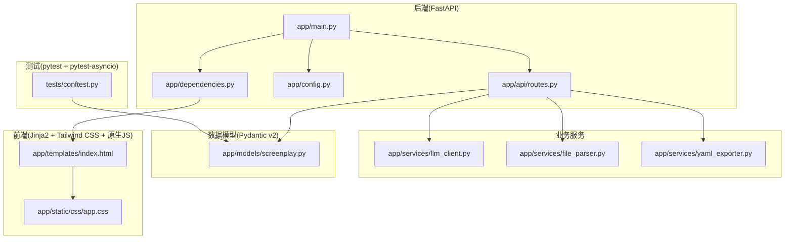
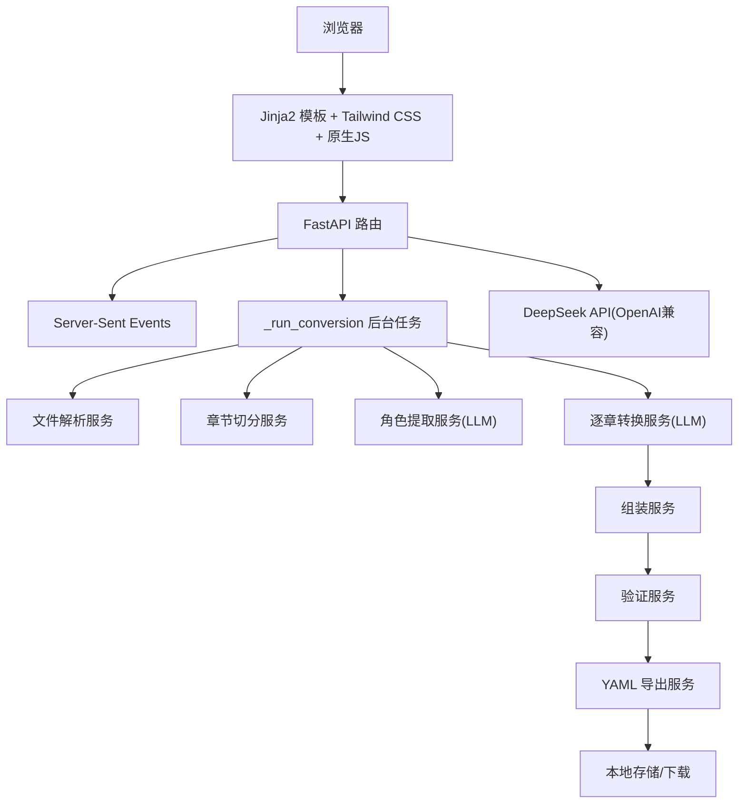
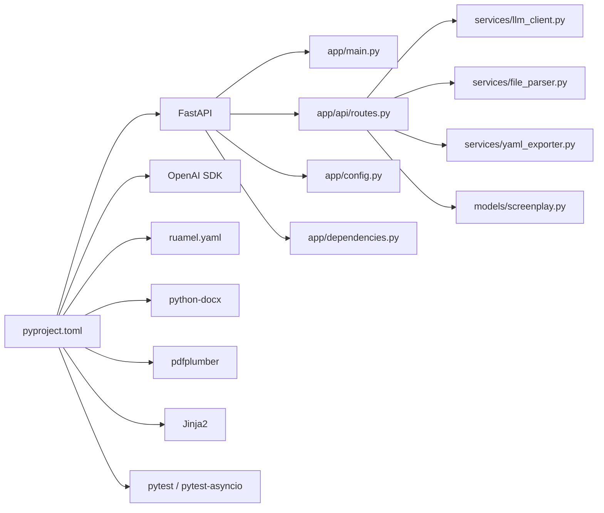

# 技术栈介绍

<cite>
**本文引用的文件**
- [app/main.py](file://app/main.py)
- [pyproject.toml](file://pyproject.toml)
- [app/config.py](file://app/config.py)
- [README.md](file://README.md)
- [app/models/screenplay.py](file://app/models/screenplay.py)
- [app/services/llm_client.py](file://app/services/llm_client.py)
- [app/templates/index.html](file://app/templates/index.html)
- [app/static/css/app.css](file://app/static/css/app.css)
- [tests/conftest.py](file://tests/conftest.py)
- [app/prompts/screenplay_conversion.py](file://app/prompts/screenplay_conversion.py)
- [app/services/yaml_exporter.py](file://app/services/yaml_exporter.py)
- [app/services/file_parser.py](file://app/services/file_parser.py)
- [app/api/routes.py](file://app/api/routes.py)
- [app/dependencies.py](file://app/dependencies.py)
</cite>

## 目录
1. [引言](#引言)
2. [项目结构](#项目结构)
3. [核心组件](#核心组件)
4. [架构总览](#架构总览)
5. [详细组件分析](#详细组件分析)
6. [依赖关系分析](#依赖关系分析)
7. [性能考虑](#性能考虑)
8. [故障排查指南](#故障排查指南)
9. [结论](#结论)
10. [附录](#附录)

## 引言
本项目是一个“小说转剧本”工具，目标是将小说文本自动转换为结构化的 YAML 剧本，降低改编门槛并提升创作效率。技术栈围绕“高性能后端 + LLM 服务 + 前端模板 + 专业数据处理 + 数据验证 + 测试框架”的组合展开，既满足工程化落地，又兼顾易用性和可维护性。

## 项目结构
项目采用按功能域划分的模块化组织方式，后端使用 FastAPI，前端采用 Jinja2 模板 + Tailwind CSS + 原生 JS，数据处理层使用 ruamel.yaml、python-docx、pdfplumber，数据建模与验证使用 Pydantic v2，测试使用 pytest + pytest-asyncio。

图表来源
- [app/main.py:1-46](file://app/main.py#L1-L46)
- [app/api/routes.py:1-313](file://app/api/routes.py#L1-L313)
- [app/config.py:1-45](file://app/config.py#L1-L45)
- [app/dependencies.py:1-9](file://app/dependencies.py#L1-L9)
- [app/services/llm_client.py:1-103](file://app/services/llm_client.py#L1-L103)
- [app/services/file_parser.py:1-187](file://app/services/file_parser.py#L1-L187)
- [app/services/yaml_exporter.py:1-57](file://app/services/yaml_exporter.py#L1-L57)
- [app/models/screenplay.py:1-167](file://app/models/screenplay.py#L1-L167)
- [app/templates/index.html:1-140](file://app/templates/index.html#L1-L140)
- [app/static/css/app.css:1-25](file://app/static/css/app.css#L1-L25)
- [tests/conftest.py:1-167](file://tests/conftest.py#L1-L167)

章节来源
- [README.md:77-108](file://README.md#L77-L108)
- [pyproject.toml:8-25](file://pyproject.toml#L8-L25)

## 核心组件
- 后端框架：FastAPI，提供高性能 ASGI 服务器、自动 OpenAPI 文档、类型安全路由与中间件生态。
- LLM 服务：DeepSeek API（OpenAI 兼容接口），通过异步客户端封装，支持结构化输出与重试机制。
- 前端技术：Jinja2 模板渲染 + Tailwind CSS 样式 + 原生 JavaScript，实现拖拽上传、进度流、YAML 预览与下载。
- 数据处理：ruamel.yaml 用于高质量 YAML 导出；python-docx/pdfplumber 用于 DOCX/PDF 文本抽取；正则与启发式算法进行章节切分。
- 数据验证：Pydantic v2 模型作为 YAML Schema 的单源事实，提供序列化、JSON Schema 生成与运行时校验。
- 测试框架：pytest + pytest-asyncio，支持异步测试与标记（如 live）。

章节来源
- [app/main.py:23-45](file://app/main.py#L23-L45)
- [app/config.py:9-44](file://app/config.py#L9-L44)
- [app/services/llm_client.py:18-103](file://app/services/llm_client.py#L18-L103)
- [app/templates/index.html:1-140](file://app/templates/index.html#L1-L140)
- [app/static/css/app.css:1-25](file://app/static/css/app.css#L1-L25)
- [app/services/yaml_exporter.py:14-57](file://app/services/yaml_exporter.py#L14-L57)
- [app/services/file_parser.py:16-187](file://app/services/file_parser.py#L16-L187)
- [app/models/screenplay.py:17-167](file://app/models/screenplay.py#L17-L167)
- [tests/conftest.py:23-167](file://tests/conftest.py#L23-L167)

## 架构总览
系统采用“Web 前端 + API 后端 + LLM 服务 + 数据处理服务”的分层架构。用户通过浏览器上传文件，后端以 SSE 实时推送转换进度，后台任务执行解析、章节切分、角色提取、逐章转换、组装、验证与导出，最终生成 YAML 并提供预览与下载。

图表来源
- [app/api/routes.py:53-313](file://app/api/routes.py#L53-L313)
- [app/services/llm_client.py:18-103](file://app/services/llm_client.py#L18-L103)
- [app/services/file_parser.py:16-187](file://app/services/file_parser.py#L16-L187)
- [app/services/yaml_exporter.py:14-57](file://app/services/yaml_exporter.py#L14-L57)

## 详细组件分析

### 后端框架：FastAPI
- 选择理由
  - 高性能：基于 Starlette 和 Uvicorn，支持异步 IO，适合高并发与长连接（SSE）。
  - 自动 API 文档：OpenAPI/Swagger 自动生成，便于联调与二次开发。
  - 类型安全：Pydantic v2 模型与类型注解结合，减少运行时错误。
  - 中间件生态：CORS、静态文件挂载等开箱即用。
- 关键实现
  - 应用生命周期：启动时确保上传与输出目录存在。
  - CORS 配置：允许跨域访问，便于前端直连。
  - 静态文件挂载：前端 CSS/JS 资源托管。
  - 路由组织：页面路由与 API 路由分离，职责清晰。
- 优缺点
  - 优点：开发体验佳、文档完善、生态成熟。
  - 缺点：对初学者有一定学习曲线；生产部署需关注 Gunicorn/Uvicorn 配置。

章节来源
- [app/main.py:14-45](file://app/main.py#L14-L45)
- [app/api/routes.py:53-64](file://app/api/routes.py#L53-L64)
- [app/dependencies.py:7-9](file://app/dependencies.py#L7-L9)

### LLM 服务：DeepSeek API（OpenAI 兼容）
- 选择理由
  - OpenAI 兼容接口：可直接复用 OpenAI SDK，迁移成本低。
  - 强大的语言理解能力：适合复杂结构化输出（JSON Schema）与长文本处理。
  - 异步客户端：支持重试与结构化输出，适配后台任务。
- 关键实现
  - 异步封装：统一温度、超时、最大输出 token 等参数。
  - 结构化输出：通过 response_format=json_object + Pydantic 校验，保证输出稳定性。
  - 重试机制：指数退避重试，提升鲁棒性。
- 优缺点
  - 优点：输出质量高、可扩展性强。
  - 缺点：网络依赖与费用成本；需要合理控制 Token 预算。

章节来源
- [app/config.py:18-32](file://app/config.py#L18-L32)
- [app/services/llm_client.py:18-103](file://app/services/llm_client.py#L18-L103)
- [app/prompts/screenplay_conversion.py:1-91](file://app/prompts/screenplay_conversion.py#L1-L91)

### 前端技术栈：Jinja2 + Tailwind CSS + 原生 JS
- 选择理由
  - Jinja2：轻量模板引擎，与 FastAPI 集成良好，便于服务端渲染。
  - Tailwind CSS：实用优先的原子类样式，快速构建一致的 UI。
  - 原生 JS：无需额外打包，交互逻辑简单直观（拖拽、进度、预览、下载）。
- 关键实现
  - 页面模板：index.html 提供上传、进度、错误、结果等区域。
  - 样式：app.css 定制拖拽高亮、滚动容器、进度条等。
  - 交互：upload.js/conversion.js 控制文件选择、拖拽、转换触发与 SSE 推送。
- 优缺点
  - 优点：部署简单、体积小、可快速迭代。
  - 缺点：复杂交互建议引入现代前端框架；样式一致性需团队规范。

章节来源
- [app/templates/index.html:1-140](file://app/templates/index.html#L1-L140)
- [app/static/css/app.css:1-25](file://app/static/css/app.css#L1-L25)
- [app/dependencies.py:7-9](file://app/dependencies.py#L7-L9)

### 数据处理：ruamel.yaml、python-docx、pdfplumber
- 选择理由
  - ruamel.yaml：保留插入顺序、块级风格、Unicode 支持与注释，适合生成高质量 YAML。
  - python-docx：稳定可靠地从 DOCX 中抽取段落与表格文本。
  - pdfplumber：从 PDF 中提取文本，处理扫描版 PDF 时需注意图像识别限制。
- 关键实现
  - YAML 导出：配置缩进、宽度、Unicode，添加头部注释与分隔符。
  - 文件解析：多编码尝试、Markdown 清洗、DOCX 表格抽取、PDF 分页提取。
  - 后处理：规范化 Unicode、折叠空白、统计词数（中英混合）。
- 优缺点
  - 优点：专业度强、可定制性高。
  - 缺点：第三方库安装与环境差异可能带来兼容性问题。

章节来源
- [app/services/yaml_exporter.py:14-57](file://app/services/yaml_exporter.py#L14-L57)
- [app/services/file_parser.py:16-187](file://app/services/file_parser.py#L16-L187)

### 数据验证：Pydantic v2
- 选择理由
  - 单源事实：以 Pydantic 模型定义 YAML Schema，贯穿序列化、JSON Schema 生成与运行时校验。
  - 现代化特性：支持泛型、联合类型、判别器、字段描述与默认工厂。
  - 与 LLM 结合：结构化输出 + 模型校验，保证生成内容一致性。
- 关键实现
  - 层次化模型：Metadata、Character、Scene、Act、Structure、Screenplay 等。
  - 联合类型：ScreenplayElement 使用判别器区分不同元素类型。
  - 时间戳与语言：UTC 时间戳、ISO 语言码等标准化字段。
- 优缺点
  - 优点：类型安全、文档友好、易于扩展。
  - 缺点：复杂模型学习成本较高；需配合测试用例覆盖边界。

章节来源
- [app/models/screenplay.py:17-167](file://app/models/screenplay.py#L17-L167)

### 测试框架：pytest + pytest-asyncio
- 选择理由
  - 异步测试：pytest-asyncio 支持协程与后台任务测试。
  - 标记与隔离：通过标记区分真实 LLM 调用与本地测试，避免外部依赖。
  - 夹具与模型：集中定义测试夹具，复用样本数据与模型实例。
- 关键实现
  - 夹具：样本小说文本、章节、角色、最小剧本等。
  - 标记：live 标记用于真实 API 测试。
  - 覆盖：单元/集成测试覆盖解析、切分、转换、组装、验证、导出等环节。
- 优缺点
  - 优点：测试驱动开发友好、可快速反馈。
  - 缺点：异步测试调试相对复杂；需合理拆分测试粒度。

章节来源
- [tests/conftest.py:23-167](file://tests/conftest.py#L23-L167)
- [pyproject.toml:37-42](file://pyproject.toml#L37-L42)

## 依赖关系分析
- 依赖管理：pyproject.toml 明确声明核心依赖与可选开发依赖，脚本入口 novel-serve 便于本地运行。
- 组件耦合：API 路由依赖配置、模板、服务与模型；服务之间通过明确职责边界解耦；LLM 客户端独立于业务流程。
- 外部依赖：DeepSeek API、OpenAI SDK、ruamel.yaml、python-docx、pdfplumber、Tailwind CSS、Jinja2。

图表来源
- [pyproject.toml:8-32](file://pyproject.toml#L8-L32)
- [app/main.py:5-11](file://app/main.py#L5-L11)
- [app/api/routes.py:15-24](file://app/api/routes.py#L15-L24)
- [app/config.py:6](file://app/config.py#L6)
- [app/dependencies.py:5-8](file://app/dependencies.py#L5-L8)
- [app/services/llm_client.py:8](file://app/services/llm_client.py#L8)
- [app/services/file_parser.py:1](file://app/services/file_parser.py#L1)
- [app/services/yaml_exporter.py:7](file://app/services/yaml_exporter.py#L7)
- [app/models/screenplay.py:12](file://app/models/screenplay.py#L12)

章节来源
- [pyproject.toml:8-32](file://pyproject.toml#L8-L32)
- [app/api/routes.py:15-24](file://app/api/routes.py#L15-L24)

## 性能考虑
- 异步与并发
  - FastAPI + Uvicorn：充分利用异步 IO，SSE 推送与后台任务并行执行。
  - LLM 调用：异步客户端 + 指数退避重试，避免阻塞主线程。
- I/O 优化
  - 文件解析：按需读取与缓存，避免重复解析；PDF/DOCX 解析失败时尽早抛错。
  - YAML 导出：一次性写入 StringIO，减少内存碎片。
- 内存与磁盘
  - 上传与输出目录：应用启动时创建，避免运行时权限问题。
  - 临时文件：上传后立即解析，完成后清理或持久化到输出目录。
- Token 预算
  - LLM 参数：max_output_tokens、temperature、timeout 等在配置中集中管理，避免超预算导致失败。

章节来源
- [app/main.py:14-20](file://app/main.py#L14-L20)
- [app/config.py:27-32](file://app/config.py#L27-L32)
- [app/services/llm_client.py:21-32](file://app/services/llm_client.py#L21-L32)
- [app/services/yaml_exporter.py:35-56](file://app/services/yaml_exporter.py#L35-L56)

## 故障排查指南
- LLM 相关
  - 现象：转换失败或返回非 JSON。
  - 排查：确认 API Key 有效、Base URL 正确、模型可用；检查重试日志与异常堆栈。
  - 参考：异步客户端的 complete 方法与重试逻辑。
- 文件解析
  - 现象：上传后提示无法解析或无文本。
  - 排查：确认文件类型与扩展名；检查编码与 PDF 是否为纯文本；DOCX 表格是否为空。
  - 参考：文件解析器的错误类型与后处理逻辑。
- YAML 导出
  - 现象：导出文件格式异常或缺少注释。
  - 排查：确认 ruamel.yaml 配置正确；检查缩进与宽度设置。
  - 参考：YAML 导出器的配置与头部注释。
- 前端交互
  - 现象：拖拽无效、进度不更新、预览空白。
  - 排查：确认静态资源已挂载、SSE 连接正常、JS 脚本加载成功。
  - 参考：模板与静态资源挂载、SSE 路由与事件流。

章节来源
- [app/services/llm_client.py:33-86](file://app/services/llm_client.py#L33-L86)
- [app/services/file_parser.py:11-187](file://app/services/file_parser.py#L11-L187)
- [app/services/yaml_exporter.py:14-57](file://app/services/yaml_exporter.py#L14-L57)
- [app/api/routes.py:131-158](file://app/api/routes.py#L131-L158)
- [app/templates/index.html:1-140](file://app/templates/index.html#L1-L140)

## 结论
该技术栈在“高性能后端 + LLM 服务 + 前端模板 + 专业数据处理 + 数据验证 + 测试框架”的组合下，实现了从文件上传到 YAML 导出的完整链路。FastAPI 提供了稳定的运行时与文档能力；DeepSeek API 保障了结构化输出质量；Jinja2/Tailwind/CSS/原生 JS 构建了简洁高效的前端界面；ruamel.yaml、python-docx、pdfplumber 确保了数据处理的专业性；Pydantic v2 使数据模型具备可维护性与可扩展性；pytest + pytest-asyncio 保证了测试的可靠性与可演进性。整体技术选型兼顾实用性与工程化，适合持续迭代与规模化部署。

## 附录
- 学习路径与资源
  - FastAPI：官方文档与教程，重点掌握路由、依赖注入、SSE、中间件。
  - OpenAI SDK：兼容 OpenAI 接口的 SDK 使用方法，结构化输出与重试策略。
  - Jinja2：模板语法与与 FastAPI 集成实践。
  - Tailwind CSS：原子类样式与响应式布局最佳实践。
  - ruamel.yaml：YAML 风格控制、注释与序列化。
  - Pydantic v2：模型定义、判别器、JSON Schema 生成与运行时校验。
  - pytest + pytest-asyncio：异步测试编写、标记与夹具使用。
- 项目配置与运行
  - 环境变量：DEEPSEEK_API_KEY、DEEPSEEK_BASE_URL、DEEPSEEK_MODEL、MAX_UPLOAD_SIZE_MB、DATA_DIR。
  - 启动命令：本地开发使用 novel-serve 或 uvicorn 指向 app.main:app。
  - 测试命令：pytest tests/ -v；ruff 检查与修复。

章节来源
- [README.md:15-26](file://README.md#L15-L26)
- [README.md:30-68](file://README.md#L30-L68)
- [README.md:152-163](file://README.md#L152-L163)
- [app/config.py:18-40](file://app/config.py#L18-L40)
- [pyproject.toml:34-46](file://pyproject.toml#L34-L46)