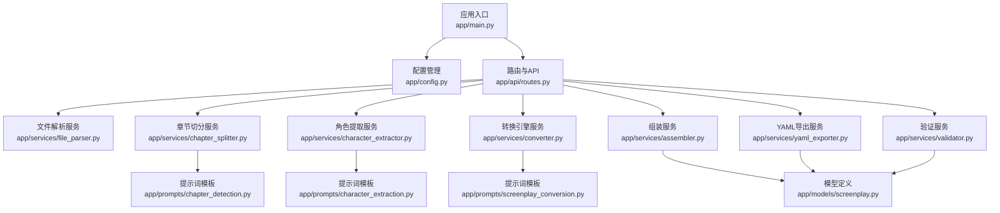
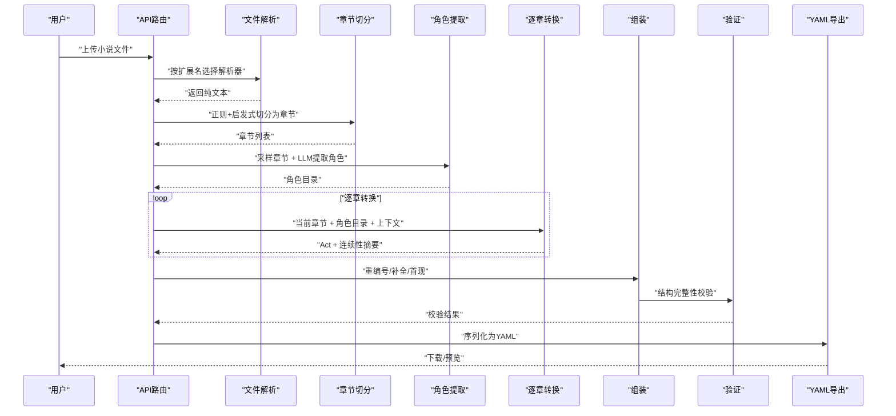
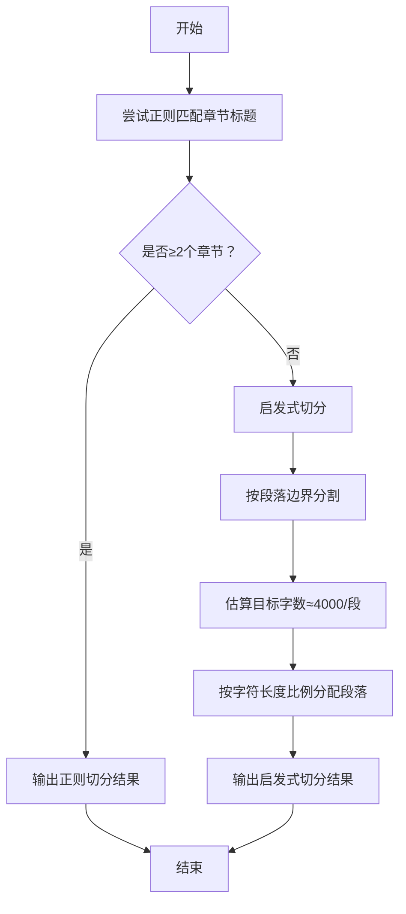
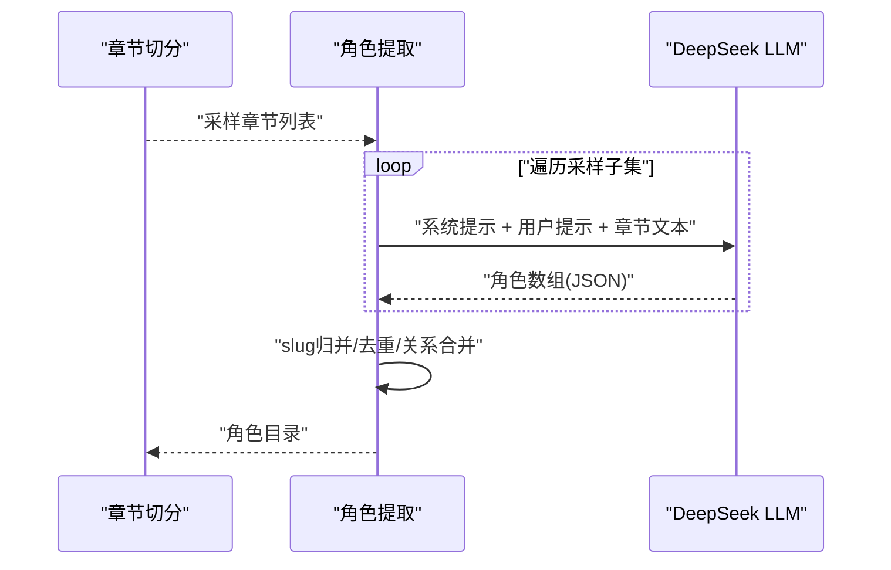
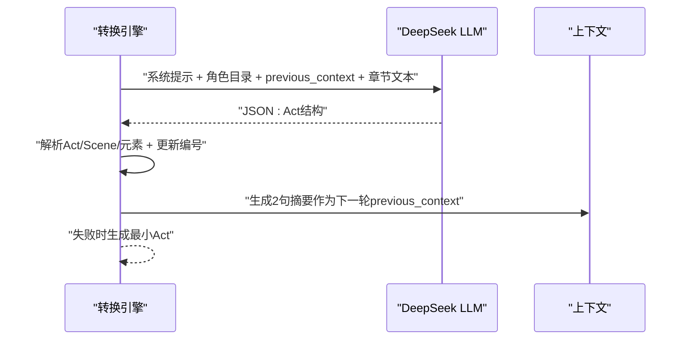
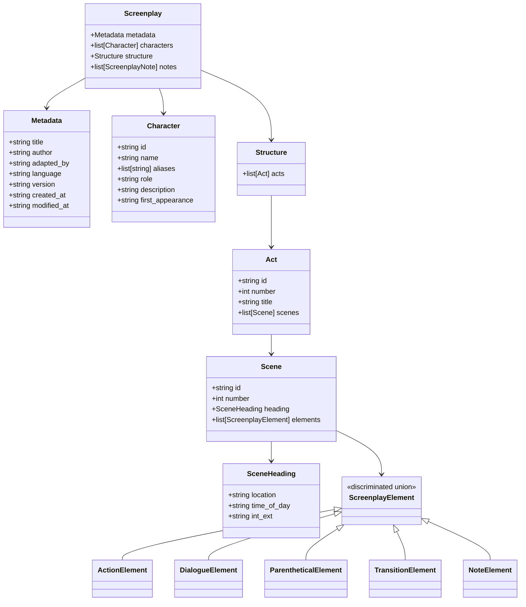
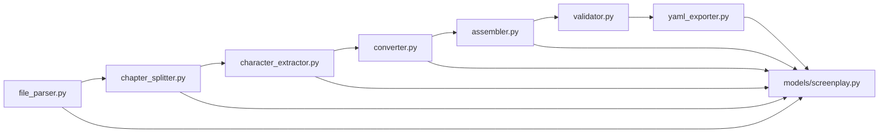

# 核心功能特性

<cite>
**本文档引用的文件**
- [app/main.py](file://app/main.py)
- [app/config.py](file://app/config.py)
- [app/models/screenplay.py](file://app/models/screenplay.py)
- [app/services/file_parser.py](file://app/services/file_parser.py)
- [app/services/chapter_splitter.py](file://app/services/chapter_splitter.py)
- [app/services/character_extractor.py](file://app/services/character_extractor.py)
- [app/services/converter.py](file://app/services/converter.py)
- [app/services/assembler.py](file://app/services/assembler.py)
- [app/services/validator.py](file://app/services/validator.py)
- [app/services/yaml_exporter.py](file://app/services/yaml_exporter.py)
- [app/prompts/chapter_detection.py](file://app/prompts/chapter_detection.py)
- [app/prompts/character_extraction.py](file://app/prompts/character_extraction.py)
- [app/prompts/screenplay_conversion.py](file://app/prompts/screenplay_conversion.py)
- [docs/YAML_SCHEMA.md](file://docs/YAML_SCHEMA.md)
- [tests/test_file_parser.py](file://tests/test_file_parser.py)
- [tests/test_chapter_splitter.py](file://tests/test_chapter_splitter.py)
- [README.md](file://README.md)
</cite>

## 目录
1. [简介](#简介)
2. [项目结构](#项目结构)
3. [核心组件](#核心组件)
4. [架构总览](#架构总览)
5. [详细组件分析](#详细组件分析)
6. [依赖分析](#依赖分析)
7. [性能考虑](#性能考虑)
8. [故障排查指南](#故障排查指南)
9. [结论](#结论)
10. [附录](#附录)

## 简介
本工具以“多格式输入 → 智能章节检测 → 角色目录提取 → 逐章剧本转换 → 组装 → 验证 → 结构化YAML输出”为主线，构建从小说到结构化剧本的自动化流水线。六大核心功能协同工作，确保输出既符合行业标准，又便于人工编辑与二次创作。

- 多格式输入支持（TXT、Markdown、DOCX、PDF）
- 智能章节检测（正则匹配 + 启发式算法）
- 角色目录提取（LLM驱动）
- 逐章剧本转换（滑动窗口 + 记忆策略）
- 结构化YAML输出（三层结构）
- Schema验证（完整性检查）

## 项目结构
后端基于FastAPI，采用服务层解耦与Pydantic模型驱动的数据结构定义；前端通过Jinja2模板与静态资源提供Web界面；文档包含完整的YAML Schema说明与使用指南。

图表来源
- [app/main.py:1-46](file://app/main.py#L1-L46)
- [app/config.py:1-45](file://app/config.py#L1-L45)
- [app/services/file_parser.py:1-187](file://app/services/file_parser.py#L1-L187)
- [app/services/chapter_splitter.py:1-163](file://app/services/chapter_splitter.py#L1-L163)
- [app/services/character_extractor.py:1-154](file://app/services/character_extractor.py#L1-L154)
- [app/services/converter.py:1-218](file://app/services/converter.py#L1-L218)
- [app/services/assembler.py:1-101](file://app/services/assembler.py#L1-L101)
- [app/services/validator.py:1-111](file://app/services/validator.py#L1-L111)
- [app/services/yaml_exporter.py:1-57](file://app/services/yaml_exporter.py#L1-L57)
- [app/prompts/chapter_detection.py:1-39](file://app/prompts/chapter_detection.py#L1-L39)
- [app/prompts/character_extraction.py:1-47](file://app/prompts/character_extraction.py#L1-L47)
- [app/prompts/screenplay_conversion.py:1-91](file://app/prompts/screenplay_conversion.py#L1-L91)
- [app/models/screenplay.py:1-167](file://app/models/screenplay.py#L1-L167)

章节来源
- [README.md:70-117](file://README.md#L70-L117)

## 核心组件
- 文件解析服务：统一从TXT/MD/DOCX/PDF抽取纯文本，进行编码与格式规范化处理。
- 章节切分服务：两阶段策略（正则优先 + 启发式兜底），确保有标题与无标题文本均能稳定切分。
- 角色提取服务：采样多章节文本，调用LLM提取角色清单，去重合并并生成slug标识。
- 转换引擎服务：逐章将小说内容转换为剧本场景，维护Act/Scene全局编号与连续性摘要。
- 组装服务：重编号、补全characters_present、设置first_appearance，形成完整Screenplay对象。
- 验证服务：跨引用一致性、编号连续性、非空约束等结构完整性检查。
- YAML导出服务：使用ruamel.yaml保持顺序、块风格、Unicode与注释，输出标准化YAML。

章节来源
- [app/services/file_parser.py:16-187](file://app/services/file_parser.py#L16-L187)
- [app/services/chapter_splitter.py:42-163](file://app/services/chapter_splitter.py#L42-L163)
- [app/services/character_extractor.py:21-154](file://app/services/character_extractor.py#L21-L154)
- [app/services/converter.py:36-218](file://app/services/converter.py#L36-L218)
- [app/services/assembler.py:18-101](file://app/services/assembler.py#L18-L101)
- [app/services/validator.py:11-111](file://app/services/validator.py#L11-L111)
- [app/services/yaml_exporter.py:14-57](file://app/services/yaml_exporter.py#L14-L57)

## 架构总览
下图展示了从文件上传到最终YAML输出的端到端流程，以及各模块间的协作关系。

图表来源
- [app/main.py:23-46](file://app/main.py#L23-L46)
- [app/services/file_parser.py:16-187](file://app/services/file_parser.py#L16-L187)
- [app/services/chapter_splitter.py:42-163](file://app/services/chapter_splitter.py#L42-L163)
- [app/services/character_extractor.py:21-154](file://app/services/character_extractor.py#L21-L154)
- [app/services/converter.py:36-218](file://app/services/converter.py#L36-L218)
- [app/services/assembler.py:18-101](file://app/services/assembler.py#L18-L101)
- [app/services/validator.py:11-111](file://app/services/validator.py#L11-L111)
- [app/services/yaml_exporter.py:14-57](file://app/services/yaml_exporter.py#L14-L57)

## 详细组件分析

### 多格式输入支持（TXT、Markdown、DOCX、PDF）
- 实现要点
  - 扩展名映射与类型检测，避免未知扩展导致的异常。
  - 编码容错：尝试多种编码解码，兼容UTF-8-BOM等。
  - Markdown净化：移除HTML标签、图片、链接、粗体/斜体等标记，保留纯文本。
  - DOCX：读取段落与表格文本，拼接为段落级内容。
  - PDF：逐页提取文本，处理空页与不可提取内容。
  - 后处理：规范化Unicode与空白字符，限制连续空行。
  - 词数统计：CJK字符与拉丁单词分别计数，用于启发式切分目标字数估算。
- 性能与鲁棒性
  - IO与正则处理为主，复杂度近似O(n)；DOCX/PDF可能受文件体积影响。
  - 对异常编码、空PDF、缺失依赖进行显式捕获与报错。
- 使用建议
  - DOCX/PDF尽量使用清晰扫描版，避免图像型PDF导致提取失败。
  - Markdown中如需保留特定信息，请在转换前自行处理格式。

章节来源
- [app/services/file_parser.py:16-187](file://app/services/file_parser.py#L16-L187)
- [tests/test_file_parser.py:14-102](file://tests/test_file_parser.py#L14-L102)

### 智能章节检测（正则匹配 + 启发式算法）
- 实现要点
  - 正则模式覆盖英文“Chapter/Part/Book + 数字/罗马数字”、中文“第X章/节/回/卷/集/篇”、中文“一、二、三…”、Markdown标题等。
  - 若正则未检测到足够章节，则退化为启发式切分：按段落边界均匀分布，目标每段约4000词，最少3段，最多30段。
  - 分布策略：先统计总字符目标，再按比例切分段落，避免在单词中间截断。
- 算法复杂度
  - 正则匹配：O(n)；启发式切分：O(p)（p为段落数）。
- 使用建议
  - 若原文无明显章节标题，建议在源文本中添加“---”或“第X章”等标记以提高正则命中率。
  - 超长文本将被自动拆分为多个章节，便于后续LLM处理。

图表来源
- [app/services/chapter_splitter.py:42-163](file://app/services/chapter_splitter.py#L42-L163)

章节来源
- [app/services/chapter_splitter.py:42-163](file://app/services/chapter_splitter.py#L42-L163)
- [tests/test_chapter_splitter.py:8-68](file://tests/test_chapter_splitter.py#L8-L68)

### 角色目录提取（LLM驱动）
- 实现要点
  - 采样策略：短于等于3章全采样；超过3章采样前3章+中部+末尾章节，避免LLM过载。
  - 文本截断：单章最大8000字符，防止超出Token预算。
  - LLM提示：明确输出结构、角色ID规则、关系抽取与描述要求。
  - 合并与去重：按slug归并，保留更丰富的描述与别名集合，关系去重合并。
  - 回退机制：若LLM失败，生成占位叙述者角色，保证流程继续。
- 性能与稳定性
  - 采样次数与截断控制在Token预算内；异常日志记录但不影响整体流程。
- 使用建议
  - 在章节开头包含关键角色介绍有助于LLM准确识别。
  - 如角色命名多样，可在源文本中统一称谓以提升一致性。

图表来源
- [app/services/character_extractor.py:21-154](file://app/services/character_extractor.py#L21-L154)
- [app/prompts/character_extraction.py:1-47](file://app/prompts/character_extraction.py#L1-L47)

章节来源
- [app/services/character_extractor.py:21-154](file://app/services/character_extractor.py#L21-L154)
- [app/prompts/character_extraction.py:1-47](file://app/prompts/character_extraction.py#L1-L47)

### 逐章剧本转换（滑动窗口 + 记忆策略）
- 实现要点
  - 连续性上下文：每章转换后生成“2句场景摘要”，作为下一章的“previous_context”，维持跨章一致性。
  - 滑动窗口：单章文本超过阈值（约12000字符）时截断并标注，避免LLM溢出。
  - Act/Scene重编号：全局递增，确保ID与编号一致。
  - 元素解析：根据type分支构造Action/Dialogue/Parenthetical/Transition/Note，异常元素记录警告但不中断。
  - 回退策略：LLM失败时生成最小可用Act，保留原章节标题与位置信息。
- 性能与稳定性
  - 严格控制输入长度与温度参数，减少失败概率；失败时快速回退，保障吞吐。
- 使用建议
  - 保持章节体量适中，避免单章过长导致截断影响连贯性。
  - 如需强调关键动作，可在源文本中增加视觉化描述以提升LLM表现。

图表来源
- [app/services/converter.py:36-218](file://app/services/converter.py#L36-L218)
- [app/prompts/screenplay_conversion.py:1-91](file://app/prompts/screenplay_conversion.py#L1-L91)

章节来源
- [app/services/converter.py:36-218](file://app/services/converter.py#L36-L218)
- [app/prompts/screenplay_conversion.py:1-91](file://app/prompts/screenplay_conversion.py#L1-L91)

### 结构化YAML输出（三层结构）
- 实现要点
  - 屏幕剧模型：Metadata（元数据）、Characters（角色目录）、Structure（Acts → Scenes → Elements）、Notes（全局注释）。
  - YAML导出：ruamel.yaml保持插入顺序、块风格、Unicode与注释；头部包含生成时间与文档链接。
  - 字段设计：遵循Fountain/Final Draft/WGA标准，确保可渲染与可编辑性。
- 使用建议
  - 下载后可在任意文本编辑器中直接修改，随后再次导入或交给下游工具渲染。
  - 如需扩展字段，可在不破坏现有结构的前提下添加自定义键值。

图表来源
- [app/models/screenplay.py:17-167](file://app/models/screenplay.py#L17-L167)
- [docs/YAML_SCHEMA.md:25-327](file://docs/YAML_SCHEMA.md#L25-L327)

章节来源
- [app/models/screenplay.py:17-167](file://app/models/screenplay.py#L17-L167)
- [app/services/yaml_exporter.py:14-57](file://app/services/yaml_exporter.py#L14-L57)
- [docs/YAML_SCHEMA.md:1-496](file://docs/YAML_SCHEMA.md#L1-L496)

### Schema验证（完整性检查）
- 实现要点
  - 必填字段校验：metadata.title等。
  - 结构完整性：至少1个Act；每个Act至少1个Scene；每个Scene至少1个Element。
  - 编号连续性：Act与Scene编号必须连续。
  - 跨引用校验：Dialogue/Parenthetical中的character_id必须存在于角色目录；characters_present中的ID也必须存在。
  - 日志汇总：输出错误与警告数量，便于快速定位问题。
- 使用建议
  - 若出现“角色引用不存在”，请检查角色ID是否与角色目录一致，或在转换前修正角色命名。

章节来源
- [app/services/validator.py:11-111](file://app/services/validator.py#L11-L111)
- [docs/YAML_SCHEMA.md:318-327](file://docs/YAML_SCHEMA.md#L318-L327)

## 依赖分析
- 组件内聚与耦合
  - 服务层高度内聚，围绕单一职责（解析/切分/提取/转换/组装/验证/导出）组织。
  - 与LLM交互集中在converter与character_extractor，通过独立client封装，便于替换与限流。
  - 模型定义集中于models.screenplay，作为唯一真相来源，贯穿验证与导出。
- 外部依赖
  - FastAPI、Pydantic v2、ruamel.yaml、python-docx、pdfplumber、pytest等。
- 循环依赖
  - 未发现循环导入；模块间通过函数调用与类型提示解耦。

图表来源
- [app/services/file_parser.py:16-187](file://app/services/file_parser.py#L16-L187)
- [app/services/chapter_splitter.py:42-163](file://app/services/chapter_splitter.py#L42-L163)
- [app/services/character_extractor.py:21-154](file://app/services/character_extractor.py#L21-L154)
- [app/services/converter.py:36-218](file://app/services/converter.py#L36-L218)
- [app/services/assembler.py:18-101](file://app/services/assembler.py#L18-L101)
- [app/services/validator.py:11-111](file://app/services/validator.py#L11-L111)
- [app/services/yaml_exporter.py:14-57](file://app/services/yaml_exporter.py#L14-L57)
- [app/models/screenplay.py:17-167](file://app/models/screenplay.py#L17-L167)

## 性能考虑
- Token预算与截断
  - 角色提取：单章文本上限8000字符；采样3次以内，避免过度调用。
  - 章节转换：单章文本上限12000字符，必要时截断并标注。
  - 连续性摘要：固定2句，温度较低，减少随机性与开销。
- 切分策略
  - 启发式切分按字符比例分配，避免频繁IO与重复计算。
- 导出与验证
  - ruamel.yaml块风格与Unicode支持，导出稳定；验证仅做必要扫描，复杂度线性。
- 建议
  - 控制单章体量，优先在源文本中添加章节标记与场景分隔，提升正则命中率与转换质量。

## 故障排查指南
- 常见问题与定位
  - “不支持的文件类型/扩展名”：确认扩展名是否在支持列表中。
  - “无法解码/空文本”：检查编码与文件是否为空；对PDF确认非图像型。
  - “章节检测不足/切分异常”：在文本中添加“第X章/Chapter X”等标记；或缩短章节体量。
  - “角色引用不存在”：核对角色ID是否与角色目录一致；检查大小写与slug生成规则。
  - “LLM调用失败/超时”：检查API Key与网络；适当降低并发或增大超时。
- 日志与告警
  - 各服务均记录关键事件与警告；关注转换失败时的回退行为与摘要生成。
- 单元测试参考
  - 文件解析：覆盖扩展名识别、编码、格式剥离、空文件与不支持类型。
  - 章节切分：覆盖英文/中文/罗马数字标题、无标题启发式切分、段落边界处理。

章节来源
- [tests/test_file_parser.py:14-102](file://tests/test_file_parser.py#L14-L102)
- [tests/test_chapter_splitter.py:8-68](file://tests/test_chapter_splitter.py#L8-L68)
- [app/services/validator.py:11-111](file://app/services/validator.py#L11-L111)

## 结论
该工具通过“多格式输入 + 智能切分 + LLM角色与转换 + 结构化导出 + 完整验证”的闭环，实现了从小说到剧本的高效自动化。其设计兼顾工程稳定性与创作灵活性，既适合批量处理，也便于人工审阅与二次加工。建议在源文本中提供清晰的章节与角色信息，以获得最佳转换效果。

## 附录
- 使用流程（概念示意）
  - 上传 → 解析 → 切分 → 角色提取 → 逐章转换 → 组装 → 验证 → 导出
- YAML Schema概览（字段与枚举）
  - 参考文档：docs/YAML_SCHEMA.md