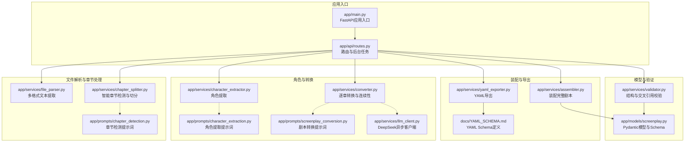
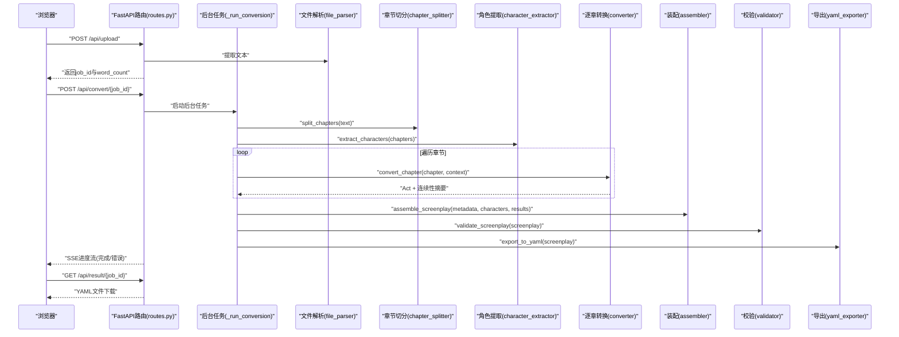
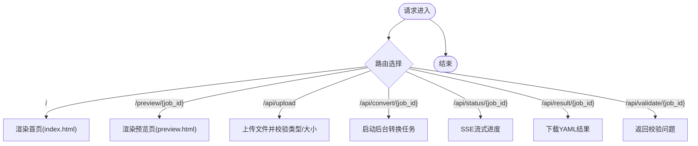
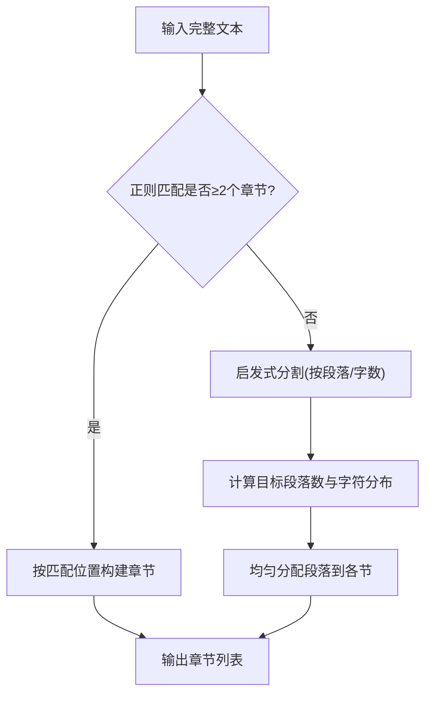
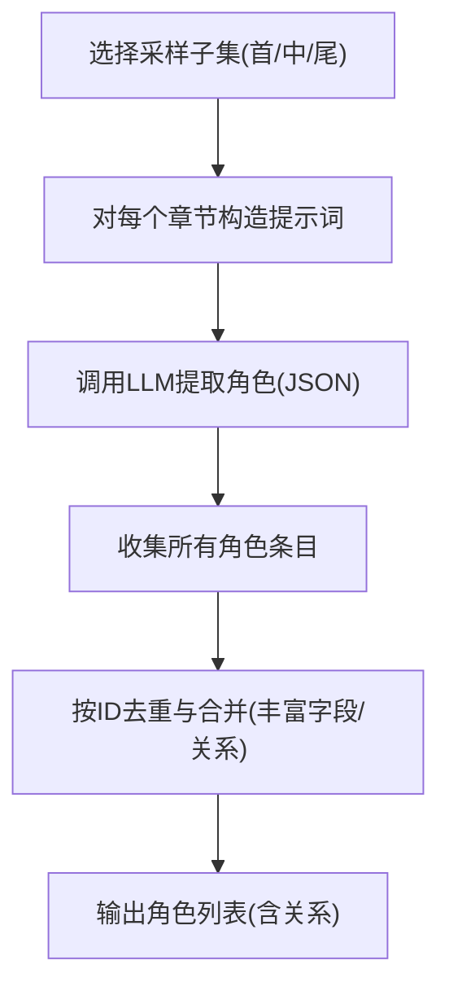
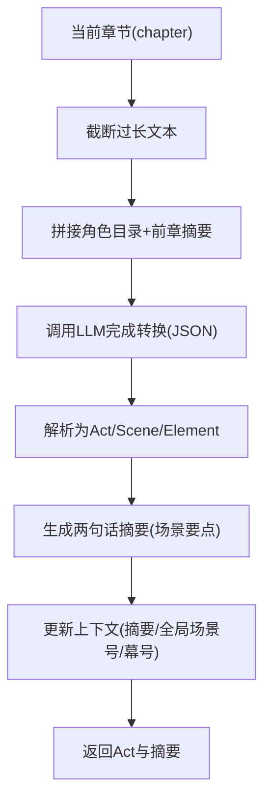
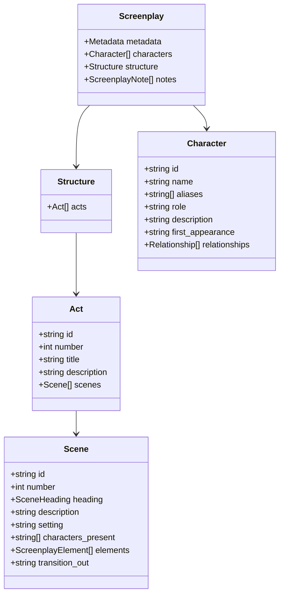
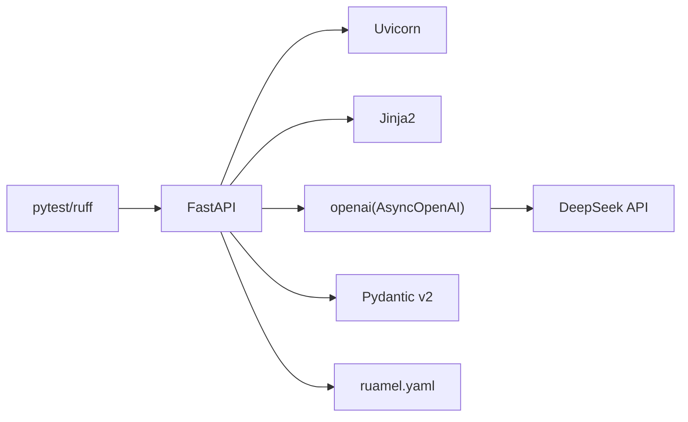

# 项目介绍

<cite>
**本文档引用的文件**
- [README.md](file://README.md)
- [app/main.py](file://app/main.py)
- [pyproject.toml](file://pyproject.toml)
- [app/models/screenplay.py](file://app/models/screenplay.py)
- [app/services/converter.py](file://app/services/converter.py)
- [app/prompts/chapter_detection.py](file://app/prompts/chapter_detection.py)
- [app/prompts/character_extraction.py](file://app/prompts/character_extraction.py)
- [app/prompts/screenplay_conversion.py](file://app/prompts/screenplay_conversion.py)
- [app/services/chapter_splitter.py](file://app/services/chapter_splitter.py)
- [app/services/character_extractor.py](file://app/services/character_extractor.py)
- [app/api/routes.py](file://app/api/routes.py)
- [app/services/llm_client.py](file://app/services/llm_client.py)
- [app/services/assembler.py](file://app/services/assembler.py)
- [app/services/validator.py](file://app/services/validator.py)
- [docs/YAML_SCHEMA.md](file://docs/YAML_SCHEMA.md)
</cite>

## 目录
1. [引言](#引言)
2. [项目结构](#项目结构)
3. [核心组件](#核心组件)
4. [架构总览](#架构总览)
5. [详细组件分析](#详细组件分析)
6. [依赖分析](#依赖分析)
7. [性能考虑](#性能考虑)
8. [故障排除指南](#故障排除指南)
9. [结论](#结论)
10. [附录](#附录)

## 引言
本项目是一个“小说转剧本”工具，旨在通过AI技术大幅降低将小说文本改编为结构化剧本的门槛，显著提升创作效率。它面向编剧、导演、制片人以及文学爱好者，提供从多格式小说输入到结构化YAML剧本输出的完整工作流，具备智能章节检测、角色提取、逐章剧本转换、结构验证与导出等能力。

项目的核心价值主张：
- 降低改编成本：通过自动化处理减少人工拆分、角色梳理与初稿撰写的工作量
- 提升创作效率：以秒级响应完成章节切分、角色提取与逐章转换，支持实时进度反馈
- 保障质量稳定：基于结构化Schema与跨引用校验，确保角色引用一致、编号连续、场景完整
- 保持创作自由：生成的YAML既可被LLM友好解析，也可在任意文本编辑器中直接修改

## 项目结构
项目采用前后端分离的模块化架构，后端基于FastAPI，前端使用Jinja2模板与原生JS，核心处理逻辑集中在服务层与提示词模板中。

图表来源
- [app/main.py:1-46](file://app/main.py#L1-L46)
- [app/api/routes.py:1-313](file://app/api/routes.py#L1-L313)
- [app/services/chapter_splitter.py:1-163](file://app/services/chapter_splitter.py#L1-L163)
- [app/services/character_extractor.py:1-154](file://app/services/character_extractor.py#L1-L154)
- [app/services/converter.py:1-218](file://app/services/converter.py#L1-L218)
- [app/services/assembler.py:1-101](file://app/services/assembler.py#L1-L101)
- [app/services/validator.py:1-111](file://app/services/validator.py#L1-L111)
- [docs/YAML_SCHEMA.md:1-496](file://docs/YAML_SCHEMA.md#L1-L496)

章节来源
- [README.md:77-108](file://README.md#L77-L108)
- [pyproject.toml:1-47](file://pyproject.toml#L1-L47)

## 核心组件
- Web界面与API：提供拖拽上传、实时进度、YAML预览与下载功能
- 文件解析：支持TXT、Markdown、DOCX、PDF四种格式的文本提取
- 章节检测：正则+启发式+LLM三阶段检测，自动识别章节边界
- 角色提取：从样本章节抽取角色清单，去重合并并生成关系网络
- 逐章转换：基于“滑动窗口+记忆”的策略，结合前章摘要保证多章节一致性
- 装配与校验：统一编号、填充出场角色、设置首次出场场景，并进行结构与交叉引用校验
- YAML导出：生成符合行业标准的结构化YAML，便于编辑与后续渲染

章节来源
- [README.md:5-14](file://README.md#L5-L14)
- [app/api/routes.py:51-206](file://app/api/routes.py#L51-L206)
- [app/services/chapter_splitter.py:42-163](file://app/services/chapter_splitter.py#L42-L163)
- [app/services/character_extractor.py:21-154](file://app/services/character_extractor.py#L21-L154)
- [app/services/converter.py:36-218](file://app/services/converter.py#L36-L218)
- [app/services/assembler.py:18-101](file://app/services/assembler.py#L18-L101)
- [app/services/validator.py:11-111](file://app/services/validator.py#L11-L111)
- [docs/YAML_SCHEMA.md:1-496](file://docs/YAML_SCHEMA.md#L1-L496)

## 架构总览
系统采用“请求-后台任务-状态流式推送”的模式，前端通过Server-Sent Events实时接收转换进度，后台按阶段执行解析、章节切分、角色提取、逐章转换、装配、校验与导出。

图表来源
- [app/api/routes.py:114-313](file://app/api/routes.py#L114-L313)
- [app/services/chapter_splitter.py:42-163](file://app/services/chapter_splitter.py#L42-L163)
- [app/services/character_extractor.py:21-154](file://app/services/character_extractor.py#L21-L154)
- [app/services/converter.py:36-218](file://app/services/converter.py#L36-L218)
- [app/services/assembler.py:18-101](file://app/services/assembler.py#L18-L101)
- [app/services/validator.py:11-111](file://app/services/validator.py#L11-L111)

## 详细组件分析

### Web应用与API路由
- 应用入口负责初始化FastAPI、挂载静态资源、注册路由与生命周期管理
- 路由提供页面渲染、文件上传、转换启动、进度流、结果下载与校验查询等接口
- 使用内存字典存储作业状态，支持SSE与JSON两种进度查询方式

图表来源
- [app/main.py:14-46](file://app/main.py#L14-L46)
- [app/api/routes.py:53-206](file://app/api/routes.py#L53-L206)

章节来源
- [app/main.py:1-46](file://app/main.py#L1-L46)
- [app/api/routes.py:1-313](file://app/api/routes.py#L1-L313)

### 章节检测与切分
- 采用“正则检测 → LLM辅助 → 基于段落的启发式分割”的三级策略
- 支持中英文章节标题、罗马数字、Markdown标题、编号段落等多种格式
- 在正则无法识别时，自动退化为按字数目标与段落边界的启发式切分

图表来源
- [app/services/chapter_splitter.py:42-163](file://app/services/chapter_splitter.py#L42-L163)
- [app/prompts/chapter_detection.py:1-39](file://app/prompts/chapter_detection.py#L1-L39)

章节来源
- [app/services/chapter_splitter.py:1-163](file://app/services/chapter_splitter.py#L1-L163)
- [app/prompts/chapter_detection.py:1-39](file://app/prompts/chapter_detection.py#L1-L39)

### 角色提取
- 从首三章及中间/末尾章节采样，避免全量处理带来的开销
- 通过LLM提示词提取角色清单，随后进行去重与合并，保留更丰富的描述与关系
- 生成稳定的ID并规范化别名，确保后续转换与校验的一致性

图表来源
- [app/services/character_extractor.py:21-154](file://app/services/character_extractor.py#L21-L154)
- [app/prompts/character_extraction.py:1-47](file://app/prompts/character_extraction.py#L1-L47)

章节来源
- [app/services/character_extractor.py:1-154](file://app/services/character_extractor.py#L1-L154)
- [app/prompts/character_extraction.py:1-47](file://app/prompts/character_extraction.py#L1-L47)

### 逐章剧本转换与连续性
- 使用“滑动窗口+记忆”策略：每章转换后生成两句话的场景摘要，作为下章上下文传入
- 对超长章节进行截断，避免超出Token预算
- 将LLM输出解析为结构化Act/Scene/Element，自动填充场景编号与ID

图表来源
- [app/services/converter.py:36-218](file://app/services/converter.py#L36-L218)
- [app/prompts/screenplay_conversion.py:1-91](file://app/prompts/screenplay_conversion.py#L1-L91)

章节来源
- [app/services/converter.py:1-218](file://app/services/converter.py#L1-L218)
- [app/prompts/screenplay_conversion.py:1-91](file://app/prompts/screenplay_conversion.py#L1-L91)

### 装配与校验
- 统一重编号：确保Act与Scene的全局连续编号
- 填充出场角色：从对话元素反推场景出场角色，或使用LLM提供的列表
- 设置首次出场：根据最早出现的场景ID回填角色的首次出场字段
- 结构校验：检查元数据完整性、Act/Scene编号连续性、场景元素非空、角色引用有效性等

图表来源
- [app/models/screenplay.py:161-167](file://app/models/screenplay.py#L161-L167)
- [app/models/screenplay.py:145-147](file://app/models/screenplay.py#L145-L147)
- [app/models/screenplay.py:134-141](file://app/models/screenplay.py#L134-L141)
- [app/models/screenplay.py:120-130](file://app/models/screenplay.py#L120-L130)
- [app/models/screenplay.py:50-63](file://app/models/screenplay.py#L50-L63)

章节来源
- [app/services/assembler.py:18-101](file://app/services/assembler.py#L18-L101)
- [app/services/validator.py:11-111](file://app/services/validator.py#L11-L111)
- [app/models/screenplay.py:1-167](file://app/models/screenplay.py#L1-167)

### YAML Schema与导出
- 采用三层结构：metadata、characters、structure（acts → scenes → elements）
- 字段设计遵循“可往返、LLM友好、人类可编辑”的原则，支持渲染与二次编辑
- 导出时严格遵循Schema，确保版本、时间戳、生成器等元信息完整

章节来源
- [docs/YAML_SCHEMA.md:1-496](file://docs/YAML_SCHEMA.md#L1-L496)
- [app/models/screenplay.py:161-167](file://app/models/screenplay.py#L161-L167)

## 依赖分析
- 后端框架：FastAPI + Uvicorn
- LLM服务：DeepSeek API（OpenAI兼容）
- 前端：Jinja2模板 + Tailwind CSS + 原生JS
- 解析库：python-docx、pdfplumber
- 序列化与校验：ruamel.yaml、Pydantic v2
- 测试与规范：pytest、pytest-asyncio、ruff

图表来源
- [pyproject.toml:13-25](file://pyproject.toml#L13-L25)
- [app/services/llm_client.py:18-103](file://app/services/llm_client.py#L18-L103)

章节来源
- [pyproject.toml:1-47](file://pyproject.toml#L1-L47)

## 性能考虑
- Token预算控制：为系统提示、角色目录、前章摘要、章节文本与输出JSON分配固定预算，避免超限
- 长章节截断：超过阈值的章节会被截断并提示，确保LLM响应稳定
- 分阶段进度：通过SSE流式返回进度，避免长时间阻塞
- 批量采样：角色提取仅对代表性章节调用LLM，减少API调用次数
- 缓存与复用：装配阶段统一编号与出场角色，避免重复计算

## 故障排除指南
- 上传失败：检查文件类型与大小限制；确认环境变量中的最大上传大小配置
- 转换失败：查看SSE流中的错误信息；确认DeepSeek API密钥与基础URL正确
- 校验失败：根据返回的校验问题修正角色引用、编号连续性或场景元素缺失
- 下载为空：确认转换已完成且已成功导出YAML

章节来源
- [app/api/routes.py:68-206](file://app/api/routes.py#L68-L206)
- [app/services/validator.py:11-111](file://app/services/validator.py#L11-L111)

## 结论
本项目通过“多格式输入 + 智能章节检测 + LLM驱动的角色提取与逐章转换 + 结构化装配与校验 + YAML导出”的完整流水线，有效降低了小说改编为剧本的人工门槛与时间成本。其可扩展的Schema与严格的校验机制，既满足了创作初期的快速产出需求，也为后续的专业修订提供了坚实基础。

## 附录
- 目标用户：编剧、导演、制片人、文学爱好者
- 应用场景：文学作品影视化改编、短剧/短视频脚本初稿、教学演示与创意练习
- 使用建议：优先使用结构清晰的小说文本；必要时手动调整章节边界与角色关系；利用YAML的可编辑性进行二次创作