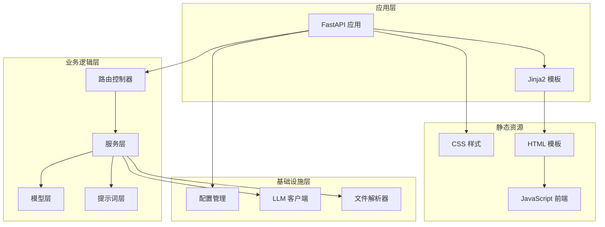
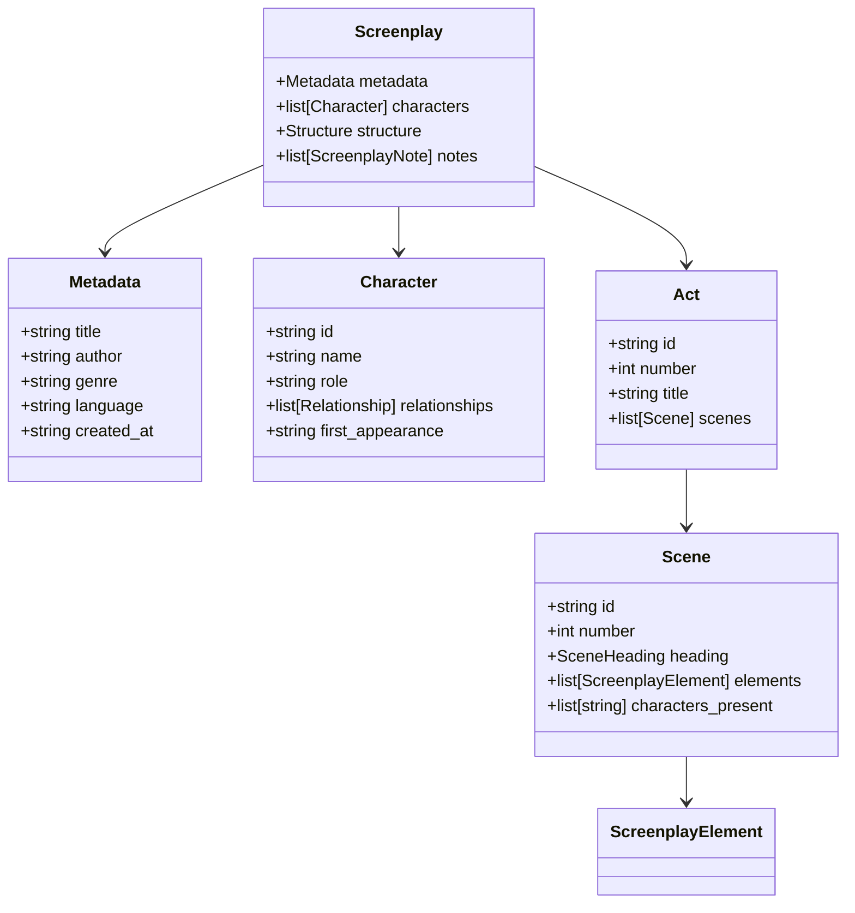
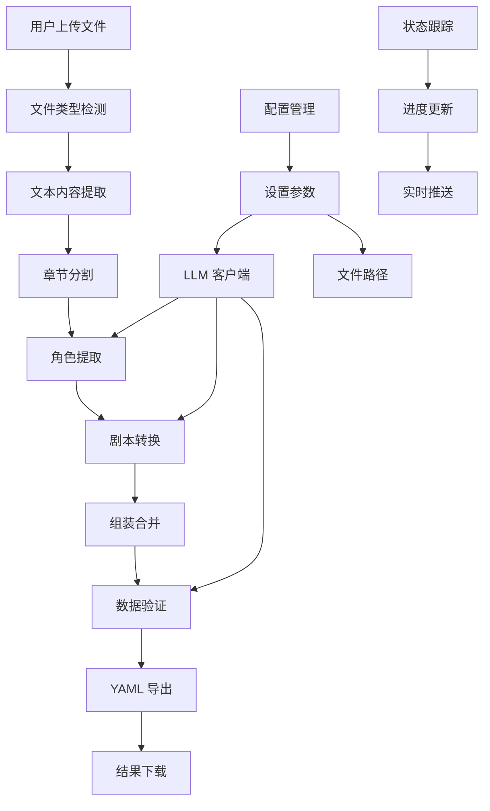
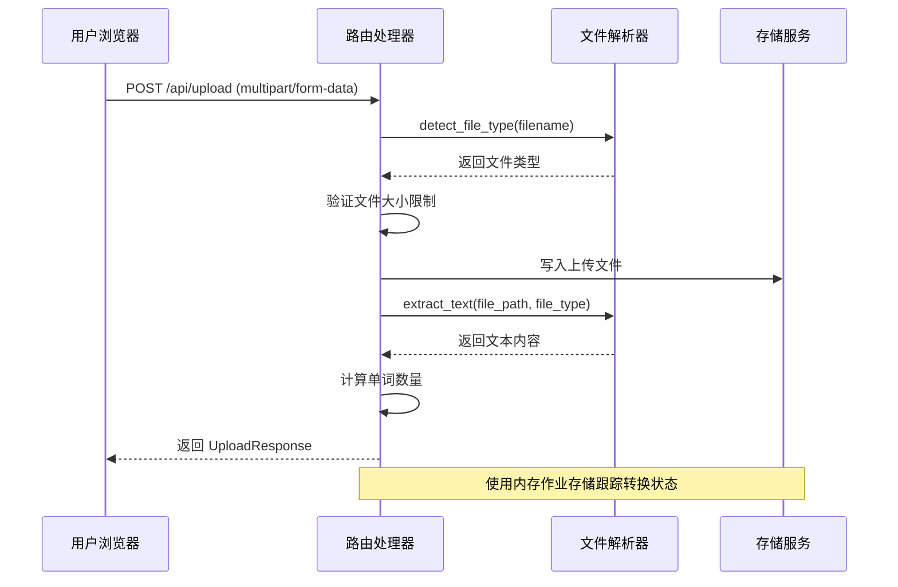
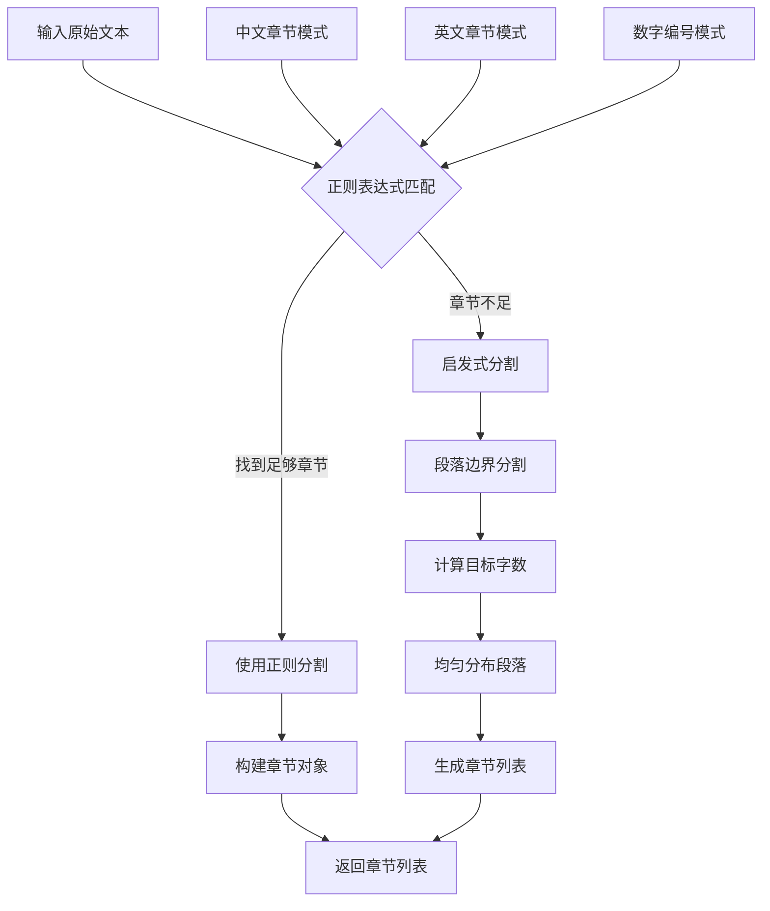
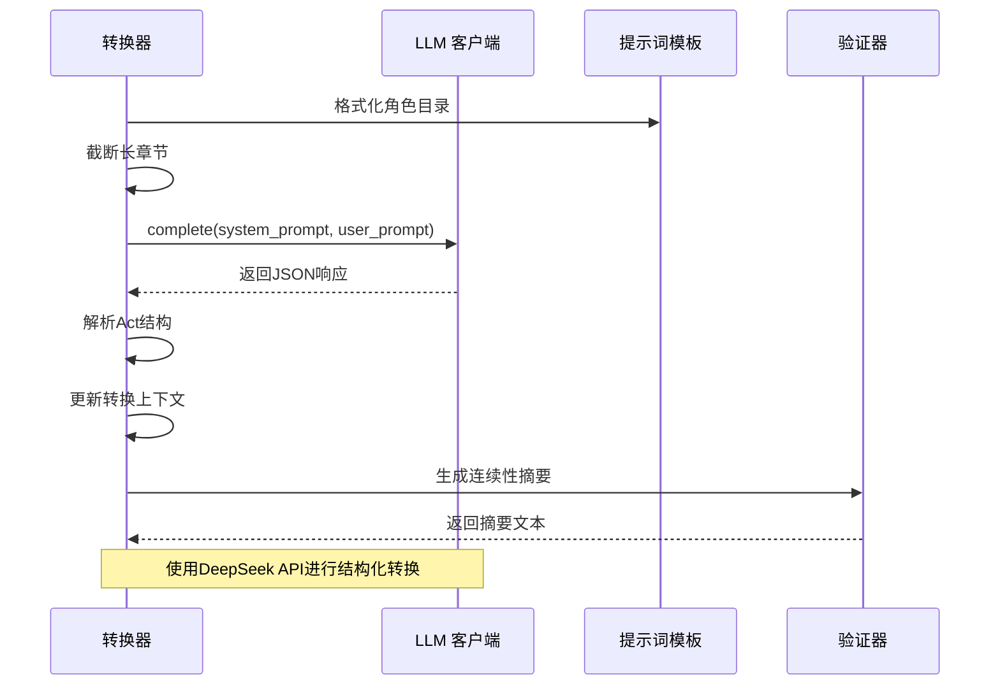
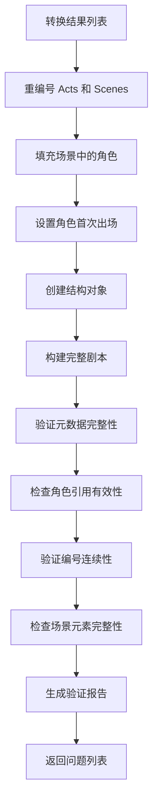
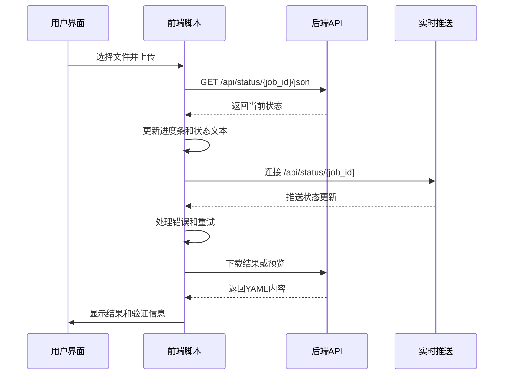
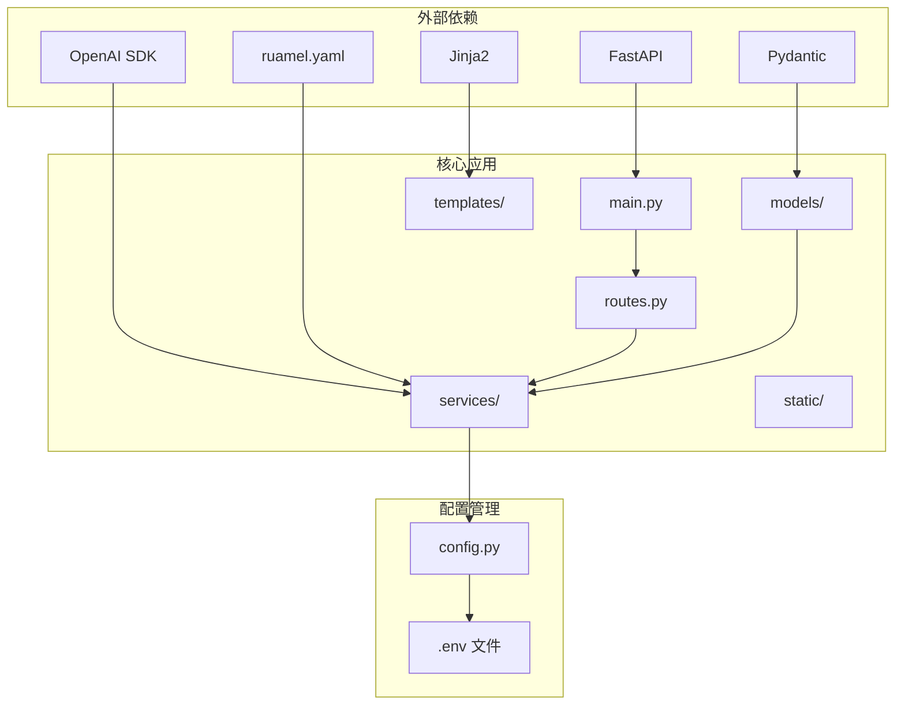

# 项目架构概览

<cite>
**本文档引用的文件**
- [app/main.py](file://app/main.py)
- [app/api/routes.py](file://app/api/routes.py)
- [app/config.py](file://app/config.py)
- [app/models/screenplay.py](file://app/models/screenplay.py)
- [app/models/enums.py](file://app/models/enums.py)
- [app/services/chapter_splitter.py](file://app/services/chapter_splitter.py)
- [app/services/converter.py](file://app/services/converter.py)
- [app/services/assembler.py](file://app/services/assembler.py)
- [app/services/validator.py](file://app/services/validator.py)
- [app/services/yaml_exporter.py](file://app/services/yaml_exporter.py)
- [app/services/llm_client.py](file://app/services/llm_client.py)
- [app/prompts/screenplay_conversion.py](file://app/prompts/screenplay_conversion.py)
- [app/templates/index.html](file://app/templates/index.html)
- [app/static/js/conversion.js](file://app/static/js/conversion.js)
- [pyproject.toml](file://pyproject.toml)
</cite>

## 目录
1. [简介](#简介)
2. [项目结构](#项目结构)
3. [核心组件](#核心组件)
4. [架构总览](#架构总览)
5. [详细组件分析](#详细组件分析)
6. [依赖关系分析](#依赖关系分析)
7. [性能考虑](#性能考虑)
8. [故障排除指南](#故障排除指南)
9. [结论](#结论)

## 简介

本项目是一个基于AI的小说转剧本工具，采用前后端分离架构：FastAPI后端提供RESTful API和Server-Sent Events实时状态推送，Jinja2模板引擎渲染Web界面，原生JavaScript实现前端交互。系统通过管道模式将文件上传、文本提取、章节检测、角色提取、剧本转换、数据验证到YAML导出的完整流程串联起来，支持DeepSeek等大模型服务进行智能转换。

## 项目结构

项目采用按功能模块组织的分层架构：

**图表来源**
- [app/main.py:1-46](file://app/main.py#L1-L46)
- [app/api/routes.py:1-313](file://app/api/routes.py#L1-L313)

**章节来源**
- [app/main.py:1-46](file://app/main.py#L1-L46)
- [pyproject.toml:1-47](file://pyproject.toml#L1-L47)

## 核心组件

### 后端服务架构

系统采用FastAPI作为核心框架，提供以下关键能力：

- **RESTful API**: 提供完整的文件上传、转换、状态查询、结果下载接口
- **实时通信**: 支持Server-Sent Events和轮询两种方式的状态推送
- **静态文件服务**: 托管CSS样式和JavaScript前端资源
- **模板渲染**: 使用Jinja2渲染HTML页面

### 数据模型体系

系统定义了完整的剧本数据模型，确保输出格式的一致性和可验证性：

**图表来源**
- [app/models/screenplay.py:161-167](file://app/models/screenplay.py#L161-L167)
- [app/models/screenplay.py:17-39](file://app/models/screenplay.py#L17-L39)
- [app/models/screenplay.py:50-63](file://app/models/screenplay.py#L50-L63)
- [app/models/screenplay.py:134-141](file://app/models/screenplay.py#L134-L141)
- [app/models/screenplay.py:120-130](file://app/models/screenplay.py#L120-L130)

**章节来源**
- [app/models/screenplay.py:1-167](file://app/models/screenplay.py#L1-L167)

## 架构总览

系统采用管道模式实现端到端的数据处理流程：

**图表来源**
- [app/api/routes.py:208-313](file://app/api/routes.py#L208-L313)
- [app/services/chapter_splitter.py:42-64](file://app/services/chapter_splitter.py#L42-L64)
- [app/services/converter.py:36-85](file://app/services/converter.py#L36-L85)
- [app/services/assembler.py:18-51](file://app/services/assembler.py#L18-L51)

## 详细组件分析

### 文件处理与上传组件

文件上传组件负责处理多种格式的文件输入，包括TXT、Markdown、DOCX、PDF等：

**图表来源**
- [app/api/routes.py:68-112](file://app/api/routes.py#L68-L112)
- [app/api/routes.py:34-49](file://app/api/routes.py#L34-L49)

**章节来源**
- [app/api/routes.py:68-112](file://app/api/routes.py#L68-L112)

### 章节检测与分割服务

章节检测采用多策略融合的方法，确保对不同语言和格式的小说都能准确识别：

**图表来源**
- [app/services/chapter_splitter.py:42-64](file://app/services/chapter_splitter.py#L42-L64)
- [app/services/chapter_splitter.py:66-97](file://app/services/chapter_splitter.py#L66-L97)
- [app/services/chapter_splitter.py:99-135](file://app/services/chapter_splitter.py#L99-L135)

**章节来源**
- [app/services/chapter_splitter.py:1-163](file://app/services/chapter_splitter.py#L1-L163)

### 剧本转换核心服务

转换服务是整个系统的核心，负责将小说章节转换为标准剧本格式：

**图表来源**
- [app/services/converter.py:36-85](file://app/services/converter.py#L36-L85)
- [app/services/converter.py:100-158](file://app/services/converter.py#L100-L158)
- [app/prompts/screenplay_conversion.py:1-91](file://app/prompts/screenplay_conversion.py#L1-L91)

**章节来源**
- [app/services/converter.py:1-218](file://app/services/converter.py#L1-L218)

### 组装与验证服务

组装服务负责将多个章节的转换结果合并为完整的剧本，并执行严格的数据验证：

**图表来源**
- [app/services/assembler.py:18-51](file://app/services/assembler.py#L18-L51)
- [app/services/assembler.py:53-101](file://app/services/assembler.py#L53-L101)
- [app/services/validator.py:11-111](file://app/services/validator.py#L11-L111)

**章节来源**
- [app/services/assembler.py:1-101](file://app/services/assembler.py#L1-L101)
- [app/services/validator.py:1-111](file://app/services/validator.py#L1-L111)

### 前端交互与状态管理

前端采用原生JavaScript实现，提供直观的用户界面和实时状态反馈：

**图表来源**
- [app/static/js/conversion.js:30-72](file://app/static/js/conversion.js#L30-L72)
- [app/static/js/conversion.js:90-114](file://app/static/js/conversion.js#L90-L114)
- [app/templates/index.html:136-140](file://app/templates/index.html#L136-L140)

**章节来源**
- [app/static/js/conversion.js:1-130](file://app/static/js/conversion.js#L1-L130)
- [app/templates/index.html:1-140](file://app/templates/index.html#L1-L140)

## 依赖关系分析

系统采用清晰的分层依赖结构，各层职责明确：

**图表来源**
- [pyproject.toml:13-25](file://pyproject.toml#L13-L25)
- [app/main.py:5-11](file://app/main.py#L5-L11)

**章节来源**
- [pyproject.toml:1-47](file://pyproject.toml#L1-L47)

## 性能考虑

系统在设计时充分考虑了性能优化：

- **异步处理**: 所有Llm调用和文件操作均采用异步模式
- **缓存机制**: 配置参数使用LRU缓存减少重复读取
- **内存管理**: 使用内存作业存储避免数据库依赖
- **流式传输**: YAML导出支持流式写入，减少内存占用
- **重试机制**: LLM客户端实现指数退避重试
- **超时控制**: 统一的请求超时和连接池管理

## 故障排除指南

### 常见问题及解决方案

1. **文件上传失败**
   - 检查文件大小是否超过限制
   - 验证文件格式是否受支持
   - 确认磁盘空间充足

2. **转换过程卡住**
   - 检查API密钥配置
   - 验证网络连接稳定性
   - 查看LLM服务可用性

3. **结果验证失败**
   - 检查角色ID一致性
   - 验证场景元素完整性
   - 确认编号连续性

**章节来源**
- [app/api/routes.py:210-313](file://app/api/routes.py#L210-L313)
- [app/services/validator.py:11-111](file://app/services/validator.py#L11-L111)

## 结论

本项目通过精心设计的分层架构和管道模式，成功实现了从小说到剧本的自动化转换。系统具备良好的可扩展性，支持多种文件格式和语言，通过模块化的服务设计便于功能扩展和维护。前后端分离的架构模式确保了用户体验和开发效率的平衡，为未来的功能增强奠定了坚实基础。