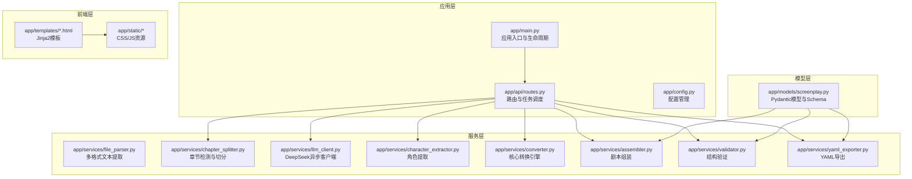
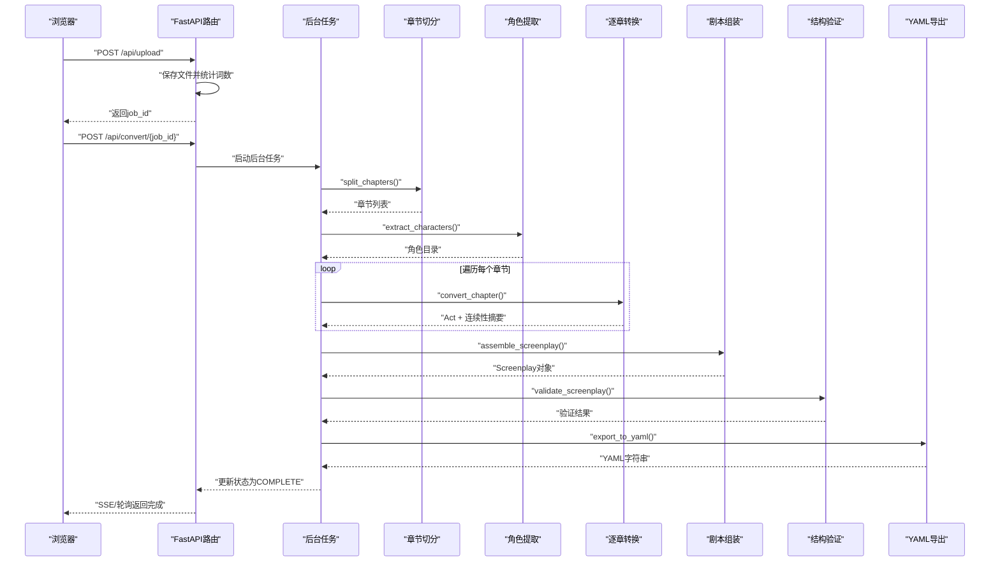
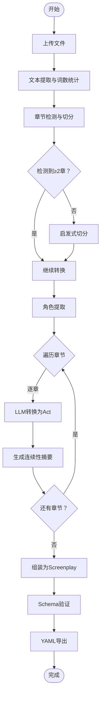
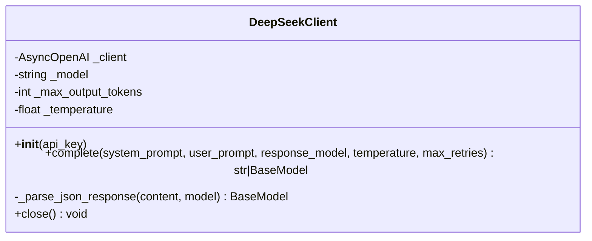
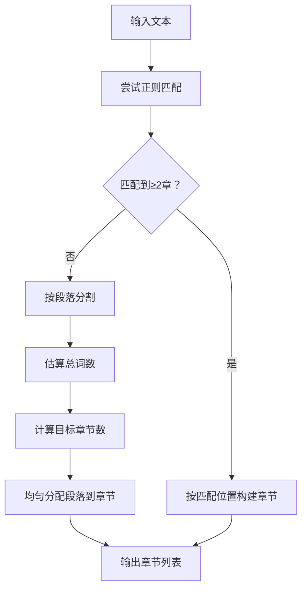
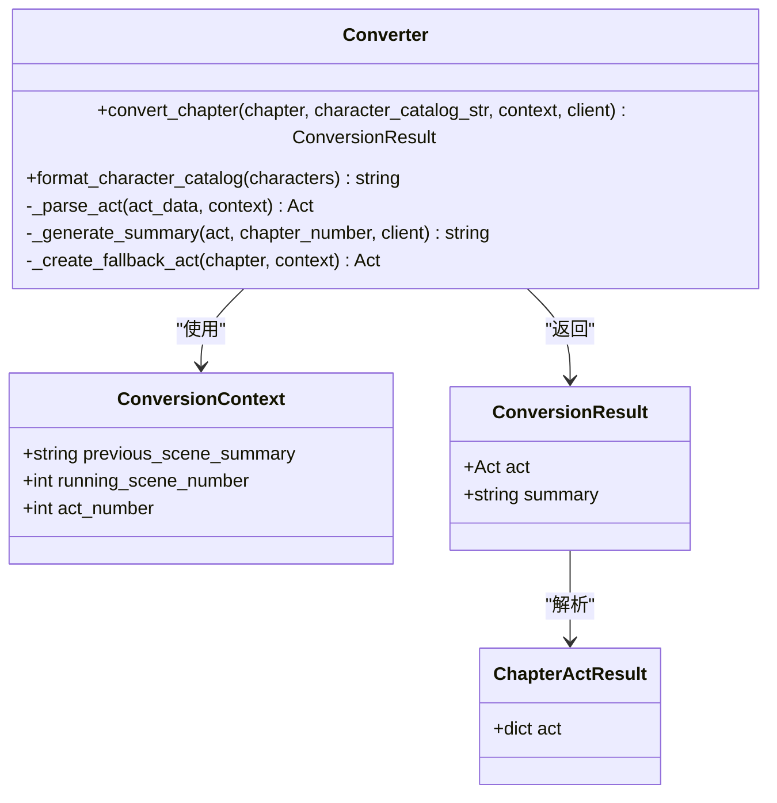
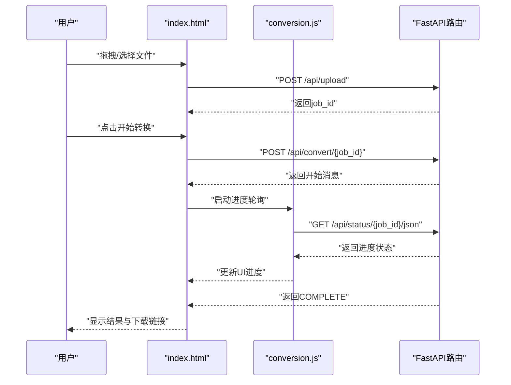
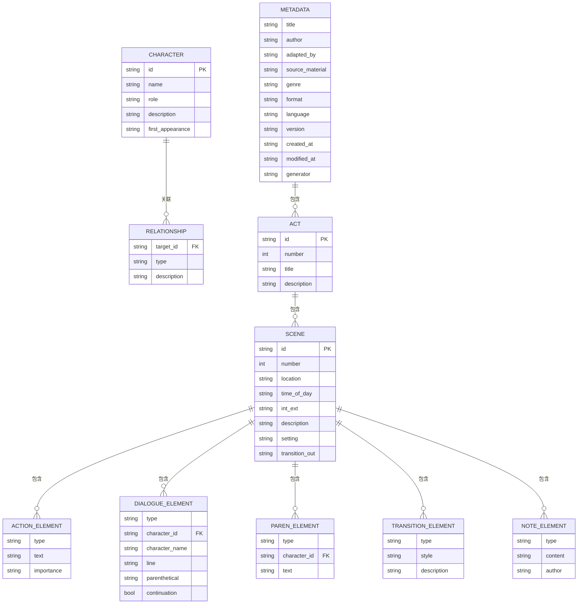
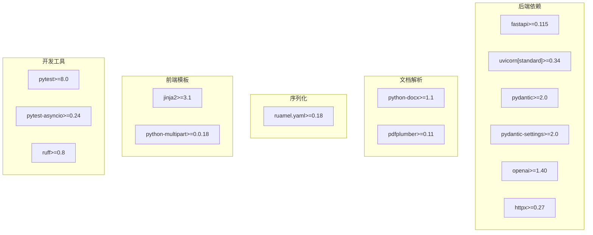

# 项目概述

<cite>
**本文档引用的文件**
- [README.md](file://README.md)
- [pyproject.toml](file://pyproject.toml)
- [app/main.py](file://app/main.py)
- [app/config.py](file://app/config.py)
- [app/api/routes.py](file://app/api/routes.py)
- [app/models/screenplay.py](file://app/models/screenplay.py)
- [app/services/converter.py](file://app/services/converter.py)
- [app/services/chapter_splitter.py](file://app/services/chapter_splitter.py)
- [app/services/llm_client.py](file://app/services/llm_client.py)
- [docs/YAML_SCHEMA.md](file://docs/YAML_SCHEMA.md)
- [app/templates/index.html](file://app/templates/index.html)
- [app/templates/base.html](file://app/templates/base.html)
- [app/static/js/conversion.js](file://app/static/js/conversion.js)
- [app/static/css/app.css](file://app/static/css/app.css)
- [tests/test_models.py](file://tests/test_models.py)
- [tests/test_validator.py](file://tests/test_validator.py)
</cite>

## 目录
1. [简介](#简介)
2. [项目结构](#项目结构)
3. [核心组件](#核心组件)
4. [架构总览](#架构总览)
5. [详细组件分析](#详细组件分析)
6. [依赖分析](#依赖分析)
7. [性能考虑](#性能考虑)
8. [故障排除指南](#故障排除指南)
9. [结论](#结论)
10. [附录](#附录)

## 简介
本项目是一个AI驱动的小说到剧本转换工具，旨在将小说文本自动转换为结构化的YAML剧本，显著降低改编门槛并提升创作效率。系统通过多格式输入、智能章节检测、角色目录提取、逐章剧本转换、结构化YAML输出、Web界面以及Schema验证等能力，为用户提供从上传到导出的一站式服务。

项目的核心价值体现在：
- 降低改编成本：无需从零编写剧本，AI自动完成初稿转换
- 提升创作效率：结构化输出便于后续人工润色与生产使用
- 标准化流程：统一的Schema与验证机制确保输出质量
- 易于集成：YAML格式便于与其他工具链协作

## 项目结构
项目采用前后端分离的模块化组织方式，后端基于FastAPI，前端使用Jinja2模板与Tailwind CSS，核心业务逻辑分布在独立的服务层中。

**图表来源**
- [app/main.py:1-46](file://app/main.py#L1-L46)
- [app/api/routes.py:1-313](file://app/api/routes.py#L1-L313)
- [app/config.py:1-45](file://app/config.py#L1-L45)
- [app/models/screenplay.py:1-167](file://app/models/screenplay.py#L1-L167)

**章节来源**
- [README.md:77-108](file://README.md#L77-L108)
- [pyproject.toml:1-47](file://pyproject.toml#L1-L47)

## 核心组件
- 多格式输入支持：TXT、Markdown、DOCX、PDF四种格式，结合python-docx与pdfplumber进行文本提取
- 智能章节检测：正则匹配（中/英/罗马数字章节标题）+ 启发式分段，自动识别章节边界
- 角色目录提取：通过LLM从文本中抽取完整角色列表，包含姓名、别名、角色定位与人物关系
- 逐章剧本转换：采用"滑动窗口 + 记忆"策略，每章转换后生成连续性摘要传递给下一章，保证多章节一致性
- 结构化YAML输出：生成符合行业标准的剧本YAML文件，包含metadata、characters、structure（acts → scenes → elements）三层结构
- Web界面：拖拽上传、实时进度条、YAML语法高亮预览、一键下载
- Schema验证：自动校验生成的剧本，检测角色引用错误、编号不连续等问题

**章节来源**
- [README.md:5-14](file://README.md#L5-L14)
- [README.md:110-130](file://README.md#L110-L130)

## 架构总览
系统采用异步事件驱动的后台任务模式，前端通过REST API提交任务，后端在内存中维护作业状态并通过Server-Sent Events或轮询推送进度。核心转换流水线包括：文件解析 → 章节切分 → 角色提取 → 逐章转换 → 组装 → 验证 → YAML导出。

**图表来源**
- [app/api/routes.py:114-313](file://app/api/routes.py#L114-L313)
- [app/services/chapter_splitter.py:42-64](file://app/services/chapter_splitter.py#L42-L64)
- [app/services/converter.py:36-85](file://app/services/converter.py#L36-L85)

## 详细组件分析

### 转换流水线与数据流
系统将小说文本按章节切分为多个片段，逐章调用LLM进行剧本转换，并通过连续性摘要保持跨章节一致性。最终组装为完整的Screenplay对象并进行Schema验证与YAML导出。

**图表来源**
- [app/api/routes.py:208-313](file://app/api/routes.py#L208-L313)
- [app/services/chapter_splitter.py:42-64](file://app/services/chapter_splitter.py#L42-L64)
- [app/services/converter.py:36-85](file://app/services/converter.py#L36-L85)

**章节来源**
- [README.md:110-117](file://README.md#L110-L117)

### LLM客户端与异步调用
DeepSeekClient封装了OpenAI兼容的异步客户端，支持结构化JSON输出、指数退避重试与响应解析。该组件贯穿角色提取与章节转换两个关键环节。

**图表来源**
- [app/services/llm_client.py:18-103](file://app/services/llm_client.py#L18-L103)

**章节来源**
- [app/services/llm_client.py:18-103](file://app/services/llm_client.py#L18-L103)

### 章节检测算法
章节检测采用两阶段策略：正则匹配优先，不足两章时启用启发式切分。正则规则覆盖中/英/罗马数字等多种常见章节标题格式；启发式切分根据字数与段落数量动态分配章节数量。

**图表来源**
- [app/services/chapter_splitter.py:42-64](file://app/services/chapter_splitter.py#L42-L64)
- [app/services/chapter_splitter.py:99-135](file://app/services/chapter_splitter.py#L99-L135)

**章节来源**
- [app/services/chapter_splitter.py:16-31](file://app/services/chapter_splitter.py#L16-L31)
- [app/services/chapter_splitter.py:42-64](file://app/services/chapter_splitter.py#L42-L64)

### 转换引擎与连续性管理
转换引擎以ConversionContext维护跨章节连续性，每章转换后生成两句话的场景摘要作为下一章的上下文，确保故事连贯性。同时对超长章节进行截断处理以控制Token预算。

**图表来源**
- [app/services/converter.py:16-35](file://app/services/converter.py#L16-L35)
- [app/services/converter.py:36-85](file://app/services/converter.py#L36-L85)
- [app/services/converter.py:100-158](file://app/services/converter.py#L100-L158)

**章节来源**
- [app/services/converter.py:16-85](file://app/services/converter.py#L16-L85)

### Web界面与用户交互
前端采用Jinja2模板与Tailwind CSS实现响应式界面，JavaScript负责进度跟踪与结果展示。用户可通过拖拽上传文件，实时查看转换进度，最终在线预览或下载YAML。

**图表来源**
- [app/templates/index.html:1-140](file://app/templates/index.html#L1-L140)
- [app/static/js/conversion.js:30-72](file://app/static/js/conversion.js#L30-L72)
- [app/api/routes.py:131-166](file://app/api/routes.py#L131-L166)

**章节来源**
- [app/templates/base.html:1-32](file://app/templates/base.html#L1-L32)
- [app/static/js/conversion.js:1-130](file://app/static/js/conversion.js#L1-L130)

### YAML Schema与验证
系统定义了完整的YAML Schema，涵盖metadata、characters、structure（acts → scenes → elements）等核心结构，并通过Pydantic模型实现强类型约束与自动验证。Schema设计遵循可往返、LLM友好与人类可编辑三大原则。

**图表来源**
- [app/models/screenplay.py:17-167](file://app/models/screenplay.py#L17-L167)
- [docs/YAML_SCHEMA.md:25-33](file://docs/YAML_SCHEMA.md#L25-L33)

**章节来源**
- [docs/YAML_SCHEMA.md:1-496](file://docs/YAML_SCHEMA.md#L1-L496)
- [app/models/screenplay.py:1-167](file://app/models/screenplay.py#L1-L167)

## 依赖分析
项目采用现代化Python技术栈，后端基于FastAPI提供高性能异步API，前端使用Jinja2与Tailwind CSS构建简洁界面，LLM服务通过OpenAI兼容接口对接DeepSeek。

**图表来源**
- [pyproject.toml:13-32](file://pyproject.toml#L13-L32)

**章节来源**
- [pyproject.toml:1-47](file://pyproject.toml#L1-L47)

## 性能考虑
- 异步I/O：使用async/await与异步HTTP客户端减少阻塞，提升并发处理能力
- 分块处理：对超长章节进行截断，避免Token溢出并控制响应时间
- 缓存策略：配置缓存装饰器减少重复初始化开销
- 内存管理：作业状态仅保留在内存，避免持久化带来的复杂性
- 前端优化：进度轮询替代SSE以提高兼容性，避免频繁DOM更新

## 故障排除指南
- API密钥问题：确认.env文件中的DEEPSEEK_API_KEY配置正确，必要时在UI中临时输入
- 文件过大：默认最大上传50MB，超过限制需压缩或拆分文件
- LLM调用失败：检查网络连接与API配额，系统已内置重试机制
- 验证错误：根据验证报告修正角色引用、编号连续性等问题
- 前端兼容：若SSE不可用，系统会自动降级为轮询模式

**章节来源**
- [app/api/routes.py:82-83](file://app/api/routes.py#L82-L83)
- [app/services/llm_client.py:80-86](file://app/services/llm_client.py#L80-L86)
- [tests/test_validator.py:19-63](file://tests/test_validator.py#L19-L63)

## 结论
本项目通过AI驱动的小说到剧本转换技术，有效降低了改编门槛并提升了创作效率。其模块化架构、标准化Schema与完善的验证机制确保了输出质量与可维护性。建议在实际部署中关注Token预算控制、并发连接数与存储空间规划，以获得最佳用户体验。

## 附录
- 快速开始：安装依赖、配置环境变量、启动服务后访问本地8000端口
- 开发测试：运行pytest执行全部测试，使用ruff进行代码检查与修复
- 扩展建议：可根据具体需求扩展Prompt模板、增加更多格式支持或引入更多LLM供应商

**章节来源**
- [README.md:28-68](file://README.md#L28-L68)
- [README.md:152-163](file://README.md#L152-L163)